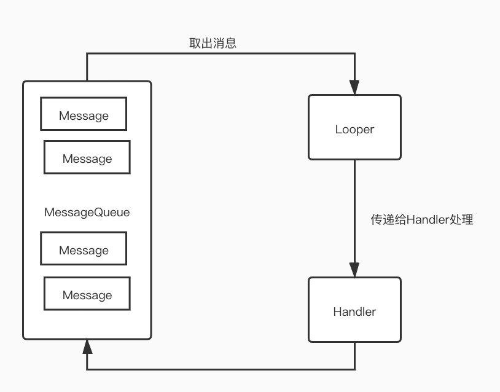
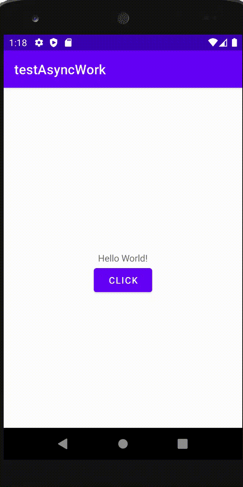

Android中可以使用异步消息处理机制来完成主线程和子线程任务调度，本文主要介绍使用Handler实现消息通信的过程。

## Handler

### 基本概念
使用Handler实现异步消息需要以下的组件:
* Message
  发送消息传递的数据对象
* Handler
  负责消息的传递和处理
* MessageQueue
  负责保存当前线程中的发送的Message，每个线程只能有一个MessageQueue
* Looper
  负责管理线程中的MessageQueue，将MessageQueue中的Message不停的取出给Handler处理。每个线程只有一个Looper  

### 例子实现
下面的例子中布局文件中定义了一个TextView和Button，在Button点击的时候通过发送Message来实现TextView内容的更新。 使用Handler处理异步消息主要有如下的步骤:
* 初始化Looper(Looper.prepare)和MessageQueue(Looper.loop)
* 根据当前的Looper创建Handler并重写handleMessage方法
* 在子线程中通过Handler发送Message传递数据
* 主线程处理数据(UI显示)
* 主线程退出后清除Handler的任务/关闭Looper  

      public class MainActivity extends AppCompatActivity {
        // 定义更新按钮文旦的标识
        public static  final  int UPDATE_TEXT = 1;
        private TextView textView;
        private Handler handler;
        private Runnable runnable;
        @Override
        protected void onCreate(Bundle savedInstanceState) {
          super.onCreate(savedInstanceState);
          setContentView(R.layout.activity_main);
          textView = (TextView) findViewById(R.id.textView);
          Button button = (Button) findViewById(R.id.button);
          if(Looper.myLooper() == null) {
            // 初始化当前线程的Looper 通过判断保证当前线程只有一个Looper
            Looper.prepare();
            // 开始线程中的MessageQueue
            Looper.loop();
          }
          // 创建Handler  创建Handler必须执行Looper
          handler = new Handler(Looper.myLooper()) {
            @Override
            public void handleMessage(@NonNull Message msg) {
              // 重写消息处理方法
              switch (msg.what) {
                case UPDATE_TEXT:
                  // 获取传递的数据
                  String content = msg.getData().getString("content");
                  textView.setText(content);
                  break;
              }
              super.handleMessage(msg);
            }
          };
          button.setOnClickListener(new View.OnClickListener() {
              @Override
              public void onClick(View v) {
                // 在子线程中通过Handler发送Message
                runnable = new Runnable() {
                  @Override
                  public void run() {
                    // 这里可以做一些耗时操作
                    Message message = new Message();
                    Bundle bundle = new Bundle();
                    bundle.putString("content", "you click me!!!");
                    message.setData(bundle);
                    message.what = UPDATE_TEXT;
                    handler.sendMessage(message);
                  }
                };
                runnable.run();
              }
          });
        }
        @Override
        protected void onDestroy() {
          // 可以在这里清除runnable/终止消息的处理
          handler.removeCallbacks(runnable);
          Looper.myLooper().quit();
          super.onDestroy();
        }
      }

  
