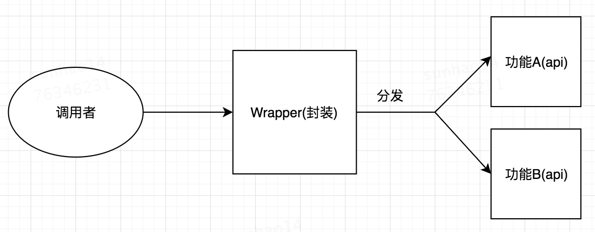
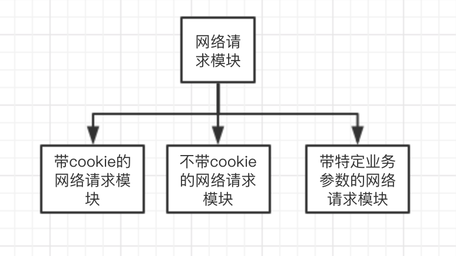
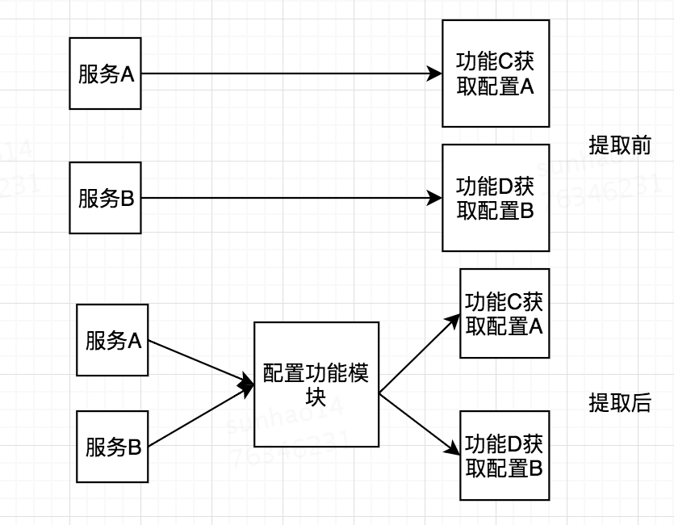
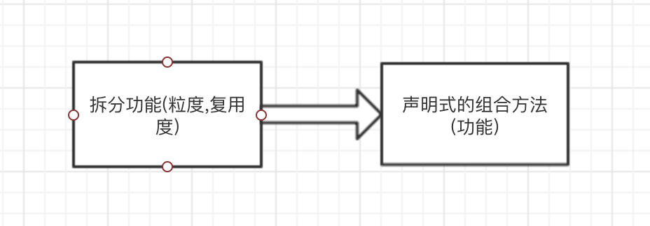

## 前言
编写和维护代码是每个软件开发者的日常.在软件的生命周期中,一个健康的软件系统在后续的维护迭代上是占很大的比重的.作为软件的开发者在编写代码的时候应该考虑如何让代码维护性更强.下面是自己在这方面的一些思考.

## 编写可维护代码的方式
### 统一的开发模式
#### 约定目录结构
对项目的目录结构进行统一的约定,例如以页面粒度生成文件夹.
#### 语义化
在定义功能的时候,要增加语义并且在适当的部位加入注释是一个不错的习惯.代码可能在之后被不同的开发者维护,将自己的思路写到注释里对后续的维护有很大的益处.
### 规范代码流程
#### 通过工具类库规范代码流程
在前端的状态管理库redux中需要派发相应的行为才能完成数据的修改,通过对redux的使用就规范了整个数据的获取、改变的流程.统一的代码开发流程能形成开发者统一的方言.
#### 通过功能封装规范代码流程
通过对多个功能的封装使上层的使用者调用的方式一致.下面的例子通过对两个相似的功能进行封装,对使用者暴露统一的交互方式.

### 减少重复工作
开发者在某种程度上要学会懒惰,让代码去做更多的事,减少重复的工作有可能是设计到具体的业务实现的.例如业务中有大致相同模式的两种行为,那么是否能通过封装来控制两种行为而不是维护两套代码.  
### 提供扩展性,面向变化  
软件的开发过程中变化是常态的,如何能将扩展性加入代码中能极大的减少后续代码维护的难度.对这方面的思考是提取固化基础的功能模块,从上层去组织业务代码来实现对应的功能.  

在做具体的业务的时候,会因为业务的需求在代码中加入相似的判断逻辑,思考如何能把这部分逻辑进行统一的提取在最外层进行分发.这样能一定程度给程序带来扩展性. 
上面的例子中通过对基础网络请求模块的提取和固化,在实现对应的业务场景中可以组装出多个类型的请求模块从而给系统带来的扩展性.  
### 统一性
在项目中如果有相同模式的行为(例如获取系统配置)思考如何将获取的方式统一化而不是分散到系统的各处.这就涉及到功能的上移提取.

### 增加可读性
在拆分功能的时候考虑拆分的粒度和复用度,在完成业务需求的时候通过声明式的功能组合完成功能,代码的阅读者能通过组合的方式对功能有一定的预测.

## 总结
代码是与机器交互的语言,也是开发者之间交流的一种方式.之所以要提倡编写可维护的代码是希望在同一个团队中形成统一的方言.这种独特的方言要在一定程度上提高开发的效率(不好的方言有可能降低开发效率).也许团队这段时间会使用这种方言,过段时间会换另一种方言.自己的建议是多思考,多想想方言之间的不同,为什么这种模式会适应现在的场景,慢慢的你就会建立一种你自己的方言或者思考问题的方式.
