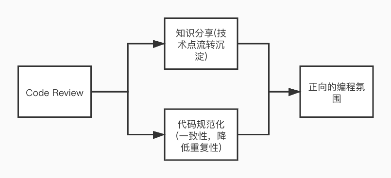
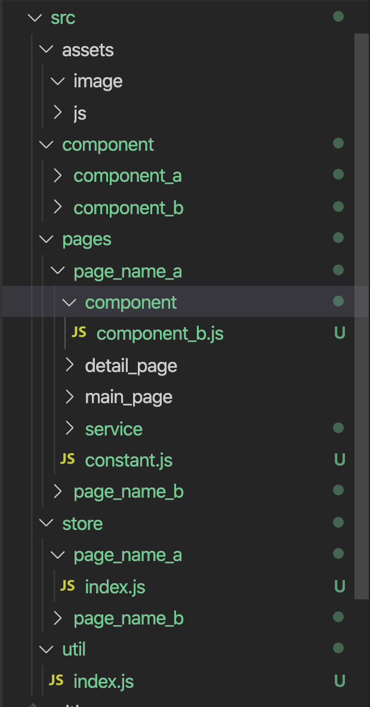

## 为什么Code Review
最近有处理过几个线上的case,仔细想下这些case是完全可以在Code Review的时候通过Review规则来避免。现在的开发环境普遍节奏较快，在代码审核的时候很难做到对每个编码细节逻辑进行Review.这个时候建立一些ReView的规则和方式能整体提高Review的效率。软件开发可以比喻成构建一栋大楼，那每一次的代码合并都是在构建大楼的一部分，举个不恰当的例子如果地基是空的，这个大楼是建不高的。通过Code Review能有效的降低整个代码仓库的熵,使代码的维护性更高.Code Review的规则跟开发的相关规范是相关的，建立Code Review规则可以是渐进的，需要结合业务来梳理特殊的Review Case。建立Code Review规则的目的是约定和审核整个代码的开发过程，输出一致性的代码。通过Code Review能建立良好的编程环境。

 

## Code Review规则(开发规范)

### 命名规范
良好的命名规范可以减少理解代码的成本。通常情况下命名推荐通过语义化并且结合一些规则如驼峰等来实现。具体涉及到一下几种场景:  
1. 分支命名. 
  * 开发分支：分支名可以git分支命名的规范上跟需求结合来实现，例如feature_brand_activity.
  * 测试分支: 当多个需求同时测试时，使用tes分支进行测试，由项目owner定期同步master代码
2. 变量,组件目录命名  
  * 推荐语义结合驼峰的命名方式，例如 task_name
3. commit规范
  * 提交类型(feat,fix,refactor,docs等) + 语义化提交信息

### 目录规范
建立目录规范是建立通用的装配方式的过程，良好的目录规范可以在不阅读代码功能的时候，了解整个业务模块的基本信息.  
  

* assets  
assets目录存放项目图片和通用js模块。  
* component  
component目录存放项目中通用的组件。  
* pages  
pages目录是项目中的页面模块，项目中的每个子页面会在pages目录下建立子目录。
* util
uitl目录存放项目中通用的工具函数。

### 引用规范
良好的引用规范可以降低代码的无序状态，规范化代码的行为。引用规范跟目录规范是相辅相成的。主要涉及到以下的几个方面:  
1. 静态资源(图片，js)的引用方式
2. 通用组件的引用方式
  * 项目级别组件统一位置引用，降低代码的重复度和维护的复杂度
  * 页面级别组件页面目录统一引用  
3. 工具函数，项目常量
  * 工具函数和常量统一在项目公用位置引用

## 如何Code Review
1. 开发者从开发分支向master提Merge Request,在Merge Request中提供基本的开发信息(开发文档，需求改动点)帮助Reviewer了解需要关注的内容  
2. Review可以采取以下两种形式:  
  * 小组集中式的Code Review,相关开发人员以会议的方式对代码进行讨论(相关技术点可以落实到文档，减少后续探索)
  * Commit方式，Reviewer结合项目相关规范，在Merge Request中对有疑问的地方进行评论并且将评论打上对应的tag.tag可以为以下几种:  
    1. [blocker]： 在评论前面加上一个[blocker]标记，表示这个代码行的问题必须要修改
    2. [optional]：在评论前面加上一个[optional]标记，表示这个代码行的问题可改可不改
    3. [question]：在评论前面加上一个[question]标记，表示对这个代码行不理解，有问题需要问，被审查者需要针对问题进行回复澄清  

    commit方式必须要解决完对应的tag才可以完成代码的合入
3. 开发者对Code Review中提出的问题解决，Reviewer对代码进行二次审查，确认符合上线规范后完成代码的合并。

### Code Review关注点
1. 在仓库使用lint工具约束基本的代码书写和排版方式
2. 语义化，禁止magic number  
3. 关注取值，判断操作  
4. 关注重复性操作(引用)  
5. 关注通用代码逻辑(沉淀)

## 参考
[Code Review最佳实践](https://zhuanlan.zhihu.com/p/73809355)

