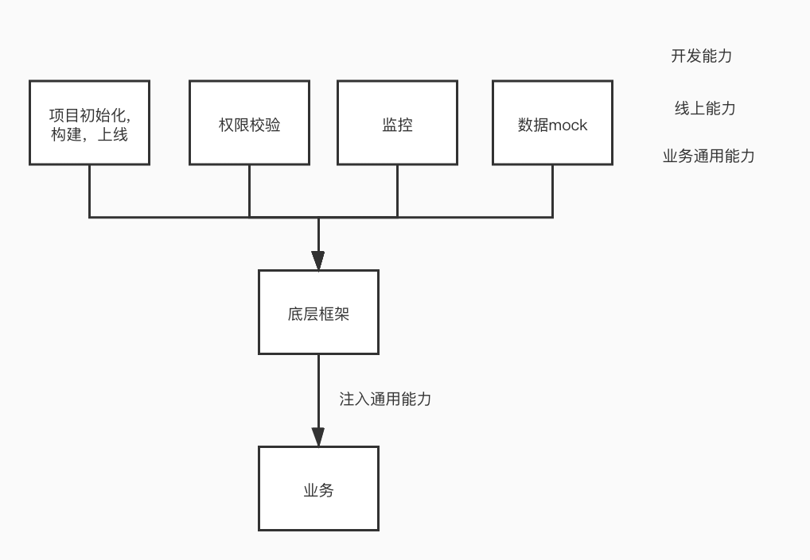

代码的维护并不是一蹴而就的,在业务的维护阶段如果不能对项目代码进行有效的治理,就会导致业务代码逐渐臃肿可维护性降低.
## 功能分离&整合
在业务发展的过程中最初单一的功能衍生出不同的业务模式和逻辑.通过对发展中的代码有序的梳理能更好的帮助后续的迭代降低维护成本.
1. 相同(类似)功能提取工具包,屏蔽底层调用逻辑.
2. 代码仓库(功能)要进行合理的划分(划分维度 业务相关性/技术栈形式),防止不同业务间的互相干扰.

## 规范建立
1. 编码规范(lint commit rule)
2. 分支规范(上线规范)
3. review机制(如何能更好的长期review而不是过场? 业务master?)
4. 目录语义化&功能化
5. 统一引用方式

## 基于业务的框架(功能复用)
造轮子是在技术/业务发展都一定阶段的诉求.通过将开发能力、线上能力、业务通用逻辑下沉到框架层,让框架去约束业务并给业务赋能.

## 参考
[代码质量与规范，那些年你欠下的技术债](https://juejin.im/post/5b3ae175f265da63252c2f21)  
[好的提高代码质量的方法有哪些](https://www.zhihu.com/question/20017545)