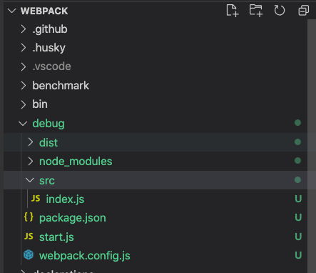
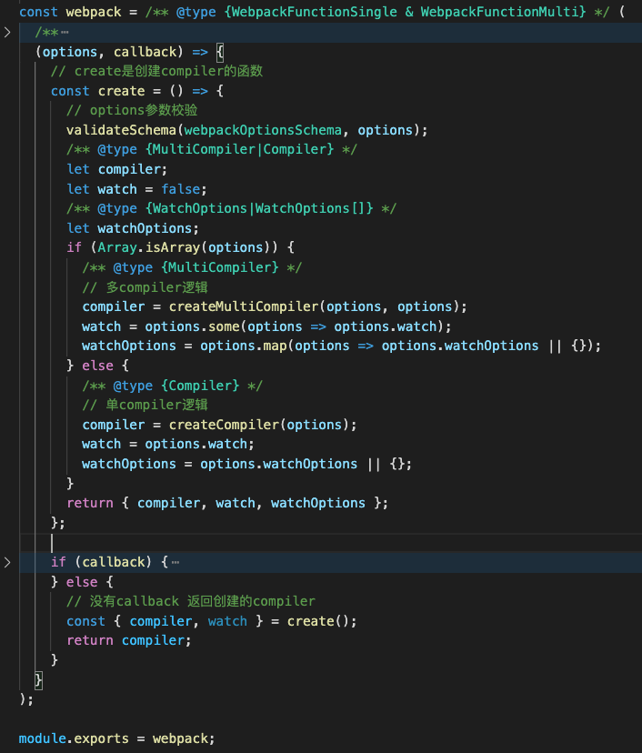
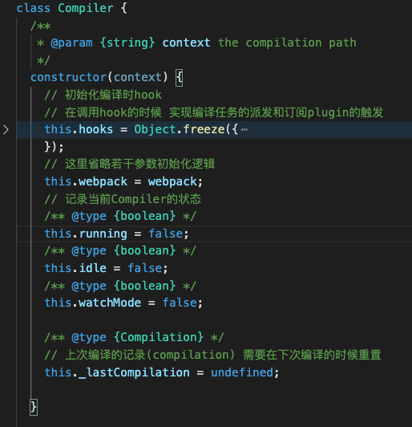
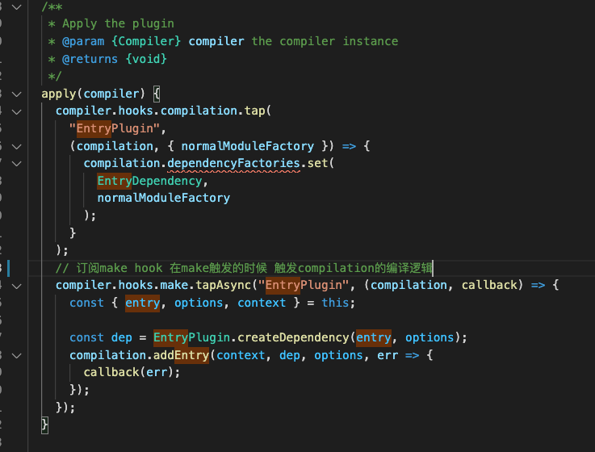
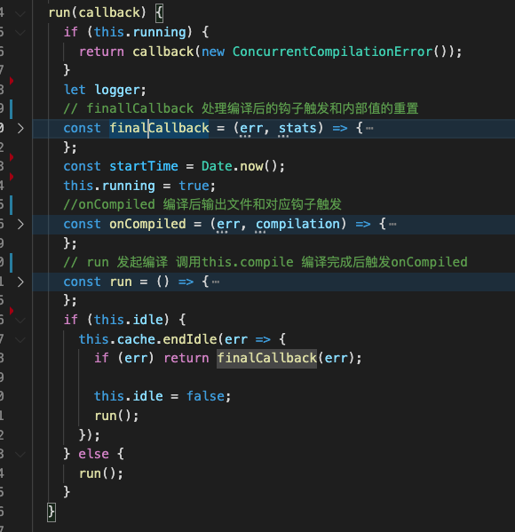
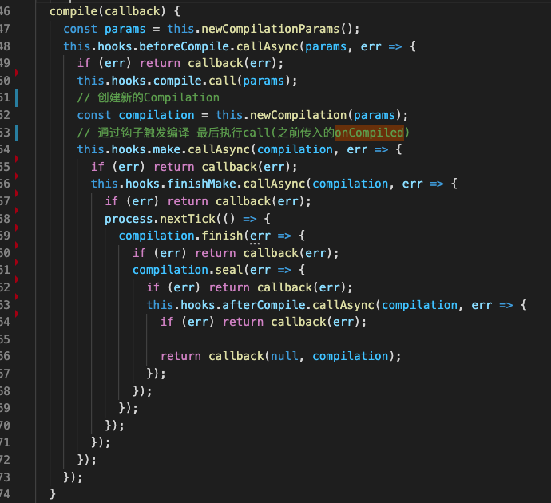
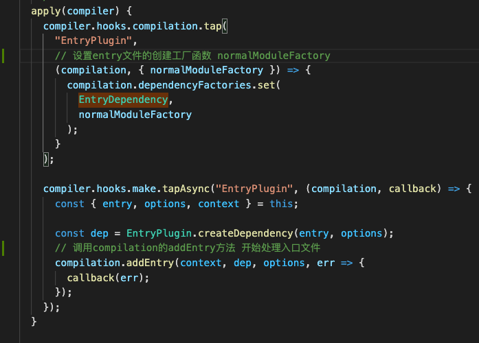
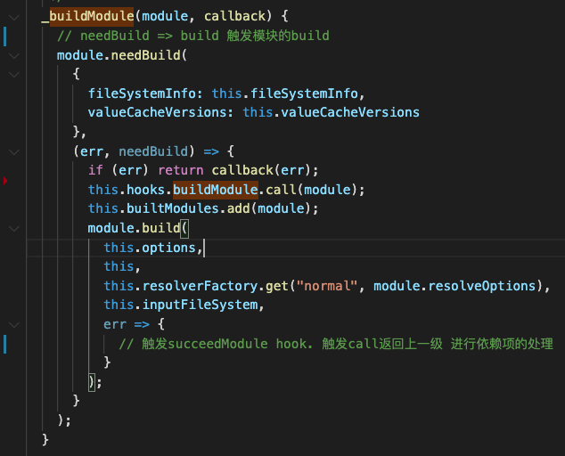
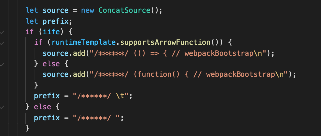

在[深入浅出webpack-Tapable](https://icantunderstand.cn/2021/04/06/webpackTapable/)源码解析中,我们了解到webpack是基于Tapable来实现打包的任务调度,本文基于webpack的源码梳理打包的实现流程.在源码分析中会主要关注以下几点:  
1. webpack启动过程(compiler compilation的生成过程)
2. 入口文件的解析过程
3. loader调用过程
4. plugin的调用过程(webpack实现任务调度拆分的方式)
5. 文件的输出过程

## 前置知识

### Tapable
webpack基于tapable来实现任务调度和代码逻辑的拆分.[深入浅出webpack-Tapable](https://icantunderstand.cn/2021/04/06/webpackTapable/)

### webpack基础
webpack是前端的打包工具,通过loader实现了文件转化能力、plugin实现了打包阶段的介入能力(编译能力增强,任务拆分).  
compiler在webpack启动编译后生成的对象,它负责把控整个webpack的打包构建  
compilation对象是每一次构建的上下文对象包含当次构建的所有信息.

## 源码解读
以下源码解读基于webpack当前master代码.我们在webpack源码下创建如下的目录结构:  
  

    // 启动文件 通过compiler.run开启编译
    const webpack = require('../lib/index.js')
    const config = require('./webpack.config')
    const compiler = webpack(config)
    compiler.run((err, stats) => {
      console.log(stats)
    })

    // webpack.config.js 配置文件
    // 添加入口文件 配置了解析的loader
    const path = require('path')
    module.exports = {
      context: __dirname,
      mode: 'development',
      // 入口文件
      entry: './src/index.js',
      devtool: 'source-map',
      output: {
        path: path.join(__dirname, './dist'),
      },
      module: {
        rules: [
          {
            test: /\.js$/,
            use: ['babel-loader'],
            exclude: /node_modules/,
          }
        ]
      }
    }

    // 入口文件
    import is from 'object.is'
    console.log(is(1,1))  

在上面的代码中指定了配置文件和编译的目标文件,通过node --inspect-brk start.js结合chrome的inspect就可以对webpack的源码进行调试了.  

### webpack的启动过程
启动文件执行webpack(config)是通过配置生成Compiler的过程,下面梳理源码创建Compiler的过程.
启动文件使用的webpack实际是引用的[lib/webpack.js](https://github.com/blob/cde1b73e12eb8a77eb9ba42e7920c9ec5d29c2c9/lib/index.js#L94)  
在[webpack.js构造函数](https://github.com/blob/cde1b73e12eb8a77eb9ba42e7920c9ec5d29c2c9/lib/webpack.js#L97)中会根据入参来创建compiler.
  
在[createCompiler](https://github.com/blob/cde1b73e12eb8a77eb9ba42e7920c9ec5d29c2c9/lib/webpack.js#L58)中主要做了:
1. 入参处理 
2. 创建Compiler
3. 订阅Plugin
4. 根据入参加载不同的能力和应用webpack内置的插件体系(WebpackOptionsApply) 
  

#### 创建Compiler&&订阅plugin
在[Compiler的构造函数](https://github.com/blob/cde1b73e12eb8a77eb9ba42e7920c9ec5d29c2c9/lib/Compiler.js#L117)中主要对编译周期的钩子hook进行了初始化和参数的初始化.
  

#### 加载webpack内置的插件体系
通过WebpackOptionsApply加载webpack内置的插件体系,用于内部打包过程的逻辑调用.  
在[WebpackOptionsApply](https://github.com/blob/cde1b73e12eb8a77eb9ba42e7920c9ec5d29c2c9/lib/WebpackOptionsApply.js#L278)我们先只关注一个插件的处理逻辑-EntryOptionPlugin.[EntryOptionPlugin](https://github.com/blob/cde1b73e12eb8a77eb9ba42e7920c9ec5d29c2c9/lib/EntryOptionPlugin.js#L13)对不同类型的entry加载了不同的处理逻辑,在处理非函数entry的时候加载了EntryPlugin.  
  
在[EntryPlugin](https://github.com/blob/cde1b73e12eb8a77eb9ba42e7920c9ec5d29c2c9/lib/EntryPlugin.js#L13)中订阅了make的hook,在触发make钩子的时候触发compilation的编译逻辑.

### 打包过程
通过webpack(config)获取到创建的Compiler,通过调用Compiler的[run](https://github.com/blob/cde1b73e12eb8a77eb9ba42e7920c9ec5d29c2c9/lib/Compiler.js#L394)方法打包过程. 
在run方法中主要:
1. 定义了三个阶段的函数 run(开始打包) onCompiled(文件输出) finalCallback(编译后处理) 串联起调用逻辑 run => onCompiled => finalCallback
2. 调用run函数发起打包  
  

#### compilation创建 
在[newCompilation](https://github.com/blob/cde1b73e12eb8a77eb9ba42e7920c9ec5d29c2c9/lib/Compiler.js#L1012)中创建了compilation并注册了compilation hook.  
  

#### 调起打包逻辑
在[compile](https://github.com/blob/cde1b73e12eb8a77eb9ba42e7920c9ec5d29c2c9/lib/Compiler.js#L1052)中触发make钩子调起EntryPlugin的打包逻辑.  
 
上面从函数调用上打包过程的逻辑已经梳理完毕,那到底是如何触发对应文件的解析和输出的呢?

### 深入打包过程
在触发make hook的时候触发了compilation的addEntry方法开启入口代码的解析.  
  
在调用了compilation的addEntry方法后触发了如下的函数调用链路: 
[addEntry](https://github.com/blob/cde1b73e12eb8a77eb9ba42e7920c9ec5d29c2c9/lib/Compilation.js#L1762) =>  [_addEntryItem](https://github.com/blob/cde1b73e12eb8a77eb9ba42e7920c9ec5d29c2c9/lib/Compilation.js#L1797) => [addModuleTree](https://github.com/blob/cde1b73e12eb8a77eb9ba42e7920c9ec5d29c2c9/lib/Compilation.js#L1713) => [handleModuleCreation](https://github.com/blob/cde1b73e12eb8a77eb9ba42e7920c9ec5d29c2c9/lib/Compilation.js#L1445) => [factorizeModule](https://github.com/blob/cde1b73e12eb8a77eb9ba42e7920c9ec5d29c2c9/lib/Compilation.js#L1460) => [addModule](https://github.com/blob/cde1b73e12eb8a77eb9ba42e7920c9ec5d29c2c9/lib/Compilation.js#L1140) => [buildModule](https://github.com/blob/cde1b73e12eb8a77eb9ba42e7920c9ec5d29c2c9/lib/Compilation.js#L1213) => [moulde.needBuild](https://github.com/blob/cde1b73e12eb8a77eb9ba42e7920c9ec5d29c2c9/lib/Compilation.js#L1557) => [module.build](https://github.com/blob/cde1b73e12eb8a77eb9ba42e7920c9ec5d29c2c9/lib/Compilation.js#L1250) => [processModuleDependencies](https://github.com/blob/cde1b73e12eb8a77eb9ba42e7920c9ec5d29c2c9/lib/Compilation.js#L1581)  
在这一串调用逻辑中完成了:
1. 入口文件的依赖解析和打包
2. 入口文件依赖模块的解析打包过程  

#### 创建模块
在处理入口文件过程中,在调用factorizeModule的时候通过SyncQueue发起_factorizeModule的调用,在_factorizeModule主要是根据当前模块的工厂函数创建模块对象,在EntryPlugin设置的moduleFactory函数是[NormalModuleFactory](https://github.com/blob/cde1b73e12eb8a77eb9ba42e7920c9ec5d29c2c9/lib/NormalModuleFactory.js#L192).NormalModuleFactory继承[NormalModule](https://github.com/blob/cde1b73e12eb8a77eb9ba42e7920c9ec5d29c2c9/lib/NormalModule.js#L173),在NormalModule中封装了模块的build方法等供后续的调用.  
在创建完模块之后,通过调用addModule将创建的模块加入到ModuleGraph中进行存储.

#### 模块解析
在添加到ModuleGraph后,调用buildModule通过SyncQueue发起[_buildModule](https://github.com/blob/cde1b73e12eb8a77eb9ba42e7920c9ec5d29c2c9/lib/Compilation.js#L1224)的调用.在_buildModule中发起了module.build的调用开始文件的打包处理.

在module.build中发生了如下的调用:
[build](https://github.com/blob/cde1b73e12eb8a77eb9ba42e7920c9ec5d29c2c9/lib/NormalModule.js#L853) => [doBuild](https://github.com/blob/cde1b73e12eb8a77eb9ba42e7920c9ec5d29c2c9/lib/NormalModule.js#L661) => [this.parser.parse](https://github.com/blob/cde1b73e12eb8a77eb9ba42e7920c9ec5d29c2c9/lib/NormalModule.js#L984),主要完成了:  
1. 在doBuild中调用[runLoaders](https://github.com/blob/cde1b73e12eb8a77eb9ba42e7920c9ec5d29c2c9/lib/NormalModule.js#L728)调用设置的loader解析文件
2. 通过parse方法解析生成的ast 生成依赖模块的信息  
在当前Entry模块解析完毕后触发回调回到上次发起[processModuleDependencies](https://github.com/blob/cde1b73e12eb8a77eb9ba42e7920c9ec5d29c2c9/lib/Compilation.js#L1288)的调用开启依赖模块的打包.

#### 打包文件生成
上面梳理完了模块的打包过程,通过loader的转化能力和plugin的劫持能力已经将文件转化成需要的内容,它存在Compilation中.通过make 钩子触发编译逻辑之后通过调用compilation的[seal](https://github.com/blob/cde1b73e12eb8a77eb9ba42e7920c9ec5d29c2c9/lib/Compilation.js#L2141)方法生成文件.  
下面是seal中的一些关键方法的调用梳理:
[compilation.seal](https://github.com/blob/cde1b73e12eb8a77eb9ba42e7920c9ec5d29c2c9/lib/Compilation.js#L2141) => [EntryPoint](https://github.com/blob/1bfb44678e8dccba3d96614df3e12778c4675655/lib/Compilation.js#L2168) => [buildChunkGraph](https://github.com/blob/1bfb44678e8dccba3d96614df3e12778c4675655/lib/Compilation.js#L2284) => [_runCodeGenerationJobs](https://github.com/blob/1bfb44678e8dccba3d96614df3e12778c4675655/lib/Compilation.js#L2375) => [createChunkAssets](https://github.com/blob/1bfb44678e8dccba3d96614df3e12778c4675655/lib/Compilation.js#L3651) => [getRenderManifest](https://github.com/blob/1bfb44678e8dccba3d96614df3e12778c4675655/lib/Compilation.js#L3643) => [fileManifest.render](https://github.com/blob/1bfb44678e8dccba3d96614df3e12778c4675655/lib/Compilation.js#L3754)  

上面的一系列调用主要做了:
1. 根据入口创建EntryPoint 他是一个chunk group.负责维护与入口相关的依赖.  
2. buildChunkGraph 生成模块的依赖依赖结构 相关的模块会保存到一个chunk group里面
3. _runCodeGenerationJobs调用module的生成代码逻辑,生成代码
4. 最后通过getRenderManifest fileManifest.render进行最后输出文件的拼接.
比如在入口函数中会通过[this.renderMain](https://github.com/blob/1bfb44678e8dccba3d96614df3e12778c4675655/lib/javascript/JavascriptModulesPlugin.js#L546)的方式拼接代码.这样就添加了打包出文件的Bootstrap逻辑.

以上从源码的角度大致梳理了webpack整个构建的流程.通过源码的阅读可以看到webpack在设计上一些可以借鉴的点:
1. webpack通过tapable实现代码的构建流程这样在实现上业务代码的职责更加单一和清晰,但是一定程度上也引入了callback的处理逻辑