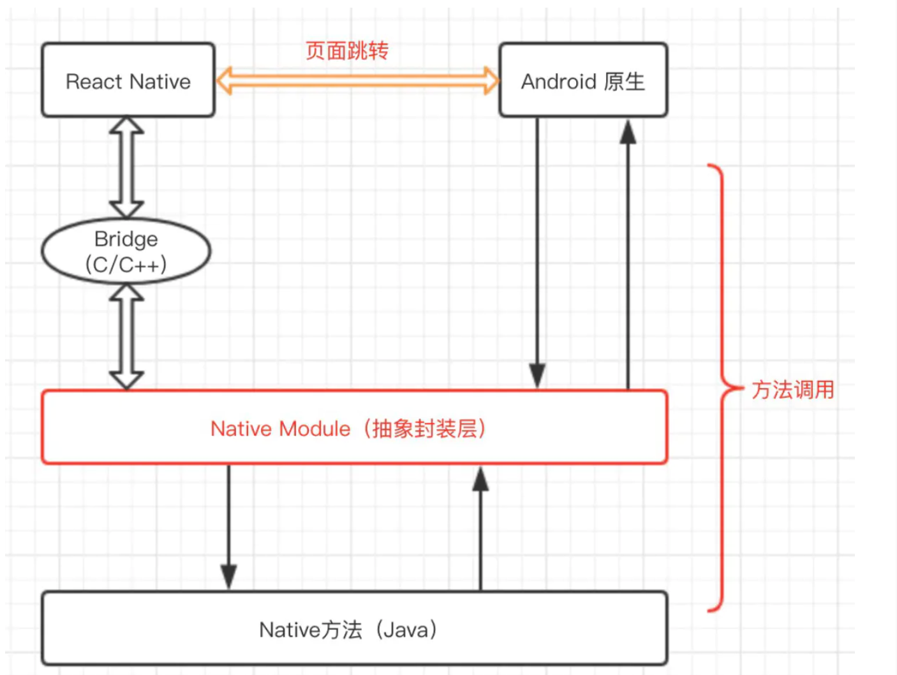

这里会系统的梳理react native的基础原理 react native未必是一个完善的跨端框架 只要是通过梳理关键点 了解跨端框架的实现方式并通过系统的梳理能对现有的框架进行优化或者在现有的技术方案上可迁移的点

React 启动流程梳理  http://www.ayqy.net/blog/react-native-architecture-overview/

## react native启动流程
1. 加载js bundle 代码
2. 初始化Native Modules  
3. 初始化 JSCExecutor
4. 创建Module配置表
5. 注入Module信息到JSCExector
6. 执行JS Bundle代码

## React Native新增一个原生组件的方式
模块需要实现RctBridgeModule 插入RCT_EXPORT_MODULE宏(收集暴露给js的类) 
* RCT_EXPORT_METHOD暴露方法
* RCT_EXPORT_VIEW_PROPERTY暴露属性

## React Native渲染过程 这里需要梳理线程相关知识
主要角色 UIManager和ShadowView 

## React Native通信过程

// 准备工作

1. 收集暴露给js的module(native module 注册表)
2. 在js context中设置nativeMoudleProxy和nativeFlushQueueImediate
3. 初始化相关的类  NativeToJsBridge JsToNativeBridge以及JSCExecutor等

// js调用native 
1. 通过NativeModules(nativeModuleProxy)调用对应的nativeModule  ModuleRegistry::getConfig->RCTNativeModule::getMethods->RCTModuleData.methods
2. 将js调用native的调用信息入队 enqueueNativeCall(moduleId, methodId来完成回调的映射) 最后通过nativeFlushQueueImediate刷新调用队列执行native方法

// native调用js
1. 通过JSCExector callFunction 启动native到js的调用(moduleId)
2. 根据moduleId从js注册的方法表中找到对应的方法执行

双方负责通信  Native的JSCExcutor和js的MessageQueue

## metro拆包
1. Resolution
2. Transformation
3. Serialization

1. 主要脚本引入主要模块 生成依赖信息

     serializer: {
        createModuleIdFactory,
        processModuleFilter
      }
2.  在业务包中排查主要的依赖 只打入当前的资源内容

# 动画

### Animated
动画值需要支持动画的组件上(Animated.createAnimatedComponent)

### 手势

    onScroll={Animated.event(
      [{nativeEvent: {contentOffset: {x: this._scrollX}}}]
      {listener},          // Optional async listener
    )

### 插值
    scroll.interpolate({
      inputRange: [],
      outputRange: [],
      extrapolate: 'clamp', 'extend'
      extrapolateRight:
      extrapolateLeft:
    })

### 基础api
    // parallel timing delay
    Animated.timing(this._animatedValue, {
      toValue: 100,
      duration: 500
    }).start()

    // 不能直接修改动画的值,只能setValue
    addListener({ value } => { })

### 布局动画LayoutAnimation

    LayoutAnimation.configureNext({
      duration: time,
      create?: Anim,
      update?: Anim,
      delete?: Anim,
    })

    const animType = PropTypes.shape({
        duration: PropTypes.number,
        delay: PropTypes.number,
        springDamping: PropTypes.number,
        initialVelocity: PropTypes.number,
        type: PropTypes.oneOf(Object.keys(Types)).isRequired,
        property: PropTypes.oneOf(
          // Only applies to create/delete
          Object.keys(Properties),
        ),
    });

## RN的通信方式

## 参考资料
[动画详解](https://future-challenger.gitbooks.io/react-native-animation/)

