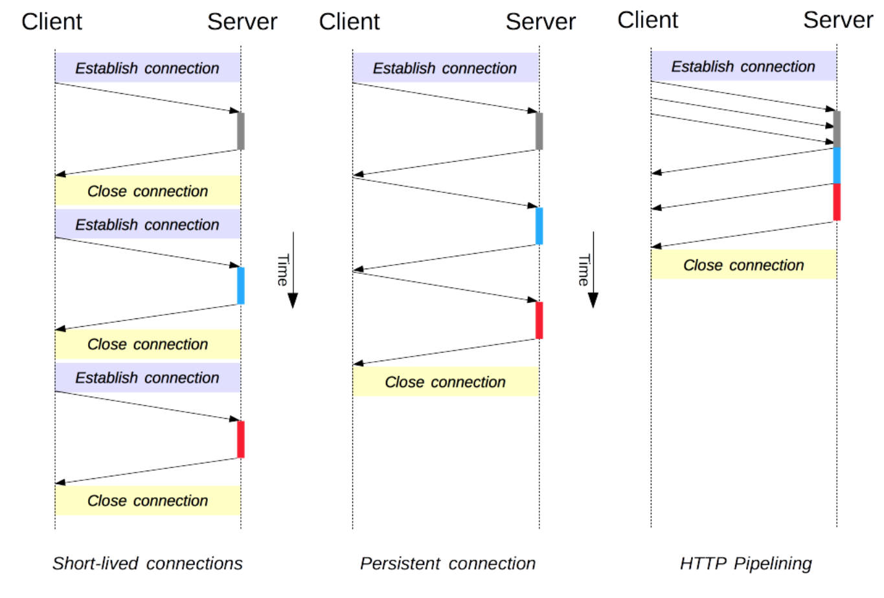
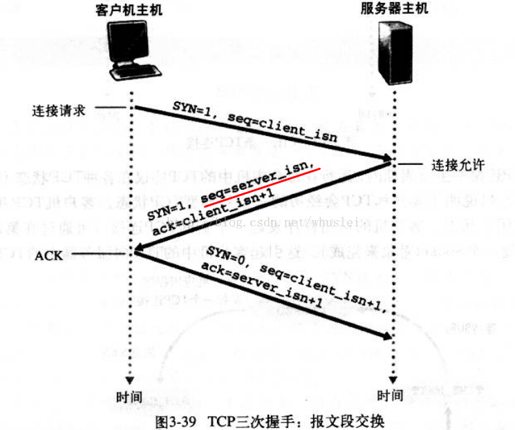
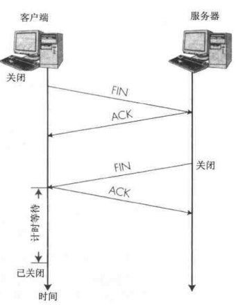

## 网络协议
### http2
1. 报头压缩 HPACK压缩 TCP初始窗口大小问题，导致TCP的传输效率’低‘。在HTTP2中使用首部表来跟踪和存储之前发送的键值对。相同的数据不会在每次请求和响应中发送，新的首部键追加到末尾或者替换之前的值。
2. 多路复用  在一个链路上处理请求和响应(同一个域名只需要建立一个TCP连接)  根据帧首部的流标识在服务端进行重组
3. 可以设置请求优先级别 每个请求都可以带一个31bit的优先值，0表示最高优先级
4. 服务端推送  
一句话概括http2: 在已建立的双向数据流中传递信息。信息是由最小单元桢组成的逻辑序列.

### http1.1

1. short-lived: Connection: close
2. Persistent Connection: keep-alive  TCP的慢启动和连接(DNS 三次握手)的建立减少请求完成的整体时间
3. http pipelining  在一个链接上发送多个请求,不必等待上一个结果的返回.返回需要按照发送的顺序返回

pipeline 模式 
1. 需要逐个响应, 存在队首阻塞
2. 占用资源,容易被攻击
3. 断开连接的处理
4. pipeline的中间的代理需要支持管道技术  

#### TCP && UDP
1. tcp是面向连接的，udp是无连接就发送数据的
2. tcp传输是可靠的 udp传输不可靠 udp相比TCP之下容易丢包，报文乱序
3. 基于tcp的应用层协议：http,https,ftp,telnet 基于udp ：dns,tftp

#### https && http
HTTPS 其实就是建构在 SSL/TLS 之上的 HTTP 协议

#### 三次握手

1. 客户端在向服务端请求连接的时候，会向服务端发送一个SYN报文段。会随机选取一个client_isn作为序号字段放置在该SYN报文中。
2. 服务端在收到该报文后，会发送给客户端一个报文并且设置TCP的缓存和变量。该报文的ack字段是client_isn + 1,序号字段为server_isn,SYN比特为设置成1.代表当前服务器已经准备接收数据
3. 客户端在接收服务端的确认报文后会创建TCP的缓存和变量并且向服务端继续发送报文(此时的报文可以携带上数据),其中ack字段是server_isn + 1,序号字段是client_isn + 1,SYN字段为0(此后的报文中SYN字段都为0).至此TCP连接建立成功。(三次握手是为了确定双方的序号)
#### 四次挥手
  
(发送方和接受方都可以中断TCP连接)
1. 终止方向另一端发送一个TCP报文，其FIN比特位被设置成1
2. 接收方回复一个ACK报文并且发送一个FIN报文
3. 终止端回复一个ACK报文，至此两方为了维持TCP连接的缓存和变量都将清除(接受FIN端需要把自己剩余的信息发送完 才能发送FIN报文)

### 协议升级
客户端和服务端可以借助已有的HTTP语法升级到其他协议.

    // 升级http2
    GET / HTTP/1.1
    Host: example.com
    Connection: Upgrade, HTTP2-Settings
    Upgrade: h2c
    // 同意升级http2
    HTTP/1.1 101 Switching Protocols
    Connection: Upgrade
    Upgrade: h2c

    // 升级websocket
    GET ws://example.com/ HTTP/1.1
    Connection: Upgrade
    Upgrade: websocket
    Origin: http://example.com
    Sec-WebSocket-Version: 13
    Sec-WebSocket-Key: d4egt7snxxxxxx2WcaMQlA==
    Sec-WebSocket-Extensions: permessage-deflate; client_max_window_bits
    // 服务端响应升级
    HTTP/1.1 101 Switching Protocols
    Connection: Upgrade
    Upgrade: websocket
    Sec-WebSocket-Accept: gczJQPmQ4Ixxxxxx6pZO8U7UbZs=

### websocket
* 建立在TCP协议之上，默认端口是80和443。握手阶段采用HTTP协议。协议标识符是ws(wss加密)
* 没有同源限制
 

## 网络优化

    // 优先完成DNS查询
    <link rel="dns-prefetch" href="//example.com">
    // 提前完成DNS的查询 + TCP握手(https的话也会完成TLS握手)
    <link rel="preconnect" href="//example.com" />  

    javascript标签
    defer 解析到defer标签后 浏览器会下载js文件 当html解析完毕后执行对应的js文件 多个defer文件按照顺序执行
    async 下载后立即执行 无顺序

## 请求头
origin 请求的源
access-control-request-method/headers
content-type text/plain text/html application/json
Accept-encoding: gzip compress
if-none-match 
if-last-modified

## xss csrf

### xss(跨站脚本攻击) 

用户将恶意代码嵌入到正常访问的页面。 没有对用户的输入做处理，将script标签引入到页面 窃取用户数据 或者注入脚本获取用户信息

### csrf(跨站请求伪造)
诱导受害者进入第三方网站，在第三方网站中向被攻击的网站发送跨站请求，利用受害者攻击网站已经获取的注册凭证绕过后台的登录验证，达到冒充用户对被攻击网站执行目中操作的目的。
1. 受害者登录a.com，并保留了登录凭证（Cookie)
2. 攻击者引诱受害者访问了b.com。
3. b.com 向 a.com 发送了一个请求：a.com/act=xx。浏览器会默认携带a.com的Cookie。
4. a.com接收到请求后，对请求进行验证，并确认是受害者的凭证，误以为是受害者自己发送的请求。
5. b.com以受害者的名义执行了act=xx。攻击完成，攻击者在受害者不知情的情况下，冒充受害者，让a.com执行了自己定义的操作。

#### csrf防护策略
1. 阻止不明外域的访问
  * 同源检测  使用请求中的Referer Header
  1. No Referrer  不携带referrer
  2. No Referer When Downgrade  协议降级的时候 不携带referrer
  3. Origin Only 
  4. Origin When Cross Origin 
  5. Unsafe Url
  <meta name="referrer"  content="origin">
  * Samesite Cookie   Strict/Lax  Strict其他第三方源的cookie不识别  Lax 当请求是改变当前页面的行为或者打开新页面的Get请求,这个cookie可以作为第三方cookie
2. 提交时附带本域才能获取到的信息 
  * CSRF Token
  1. 服务端生成 随机字符串加时间戳(加密)
  2. 再次请求的时候服务端验证Token是否生效(解密)
  

## 请求状态码
301 永久重定向 可以SEO 301重定向的结果会被浏览器缓存

  res.writeHead(301, {'Location': 'http://www.baidu.com/'});

302 临时重定向

304 缓存

201 表示请求已经成功处理并且创建了新的资源 常用作为POST请求的返回值

204 204 No Content 表示请求已经创建成功但是用户不需要离开当前页面(204可以缓存)

401 401 Unauthorized代表客户端错误,指由于缺乏目标资源要求的身份验证凭证,发送的请求未得到满足

400 Bad Request 由于语法无效,服务端无法理解该请求

405 Method Not Allowed 表明服务器禁止了使用当前HTTP方法

502 网关错误

503 Service Unavailiable 服务不可用

## get post请求
1. 语义上的区分 Get获取一个资源(理论上需要没有副作用 幂等)  Post提交修改一个资源(提交一个修改 有副作用 非幂等)
2. get数据拼接在url中 有限制 post 在请求体中  application/x-www-form-urlencoded    multipart/form-data
3. post相对安全一点 但是需要https

### 网络协议相关概念
#### CORS(跨域资源共享机制)
域名,端口,协议不同发送跨域请求,通过增加HTTP首部字段来允许服务器声明哪些源站通过浏览器有权访问哪些资源.

##### 规则
###### 简单请求 
* GET POST HEAD
* Content-Type: text/plain  multipart/form-data application/x-www-form-urlencoded
不需要发送options请求 但是跟复杂的CROS请求一致 仍然需要服务端返回首部字段来判断
###### 复杂请求
发送预检请求与服务器沟通服务端允许的请求的规则(method, headers),在发送实际的请求.
例如 options   Access-Control-Request-Method: POST, Access-Control-Request-Headers: Content-Type
Access-Control-Allow-Credentials表示是否发送cookie

服务端响应: Access-Control-Allow-Methods: POST GET Access-Control-Alllow-Headers: Content-Type

#### 网络存储
##### 对比
| 特性 | cookie | localStorage | sessionStorage   
| - | :-: | -: | -: |
| 生命周期 | 服务端生成有过期时间 | 存储在本地,长期有效存在同源策略 | 仅在当前会话有效(刷新页面有效),关闭页面失效 
| 大小 | 4K左右 | 5MB | 5MB
| 通信 | 在通信中都会携带 | 不参与服务端通信 | 不参与服务端通信 | 

##### cookie的基础知识
cookie通过服务端的set cookie来做用户信息的存储 通常的设置方式如下:

    Set-Cookie: key=value; Expires=Wed, 21 Oct 2019 07:28:00 GMT;

1. cookie可以domain  path  不同domain不可以cookie共享 相同domain的不同path 可以共享domain的cookie
2. http-only 防止被js读取
3. 在cookie设置domain和path的时候 只有相同domain和path的请求会携带cookie  
4. 在跨域请求的时候 设置withCredential: true的时候 会携带cookie，服务端需要设置响应头Access-Control-Allow-Credentials: true 才能拿到响应

##### cookie操作

    // 获取cookie
    const getCookies = (name) => {
      if(document.cookie.length > 0) {
        const cookieStr = document.cookie;
        const exist = cookieStr.indexOf(`${name}=`);
        if(exist !== -1) {
          const start = exist + name.length + 1;
          let end = cookieStr.indexOf(';', start);
          if(end === -1) {
            end = cookieStr.length;
          }
          return cookieStr.substring(start, end)
        }
      }
      return '';
    }
    // 设置cookie
    const setCookie = (name, value , expireDays) => {
      const exDate = new Date();
      exDate.setDate(exDate.getDate() + expireDays);
      document.cookie = `${name}=` + value + ( (expireDays === null) ? '' : `;expires=${exDate.toUTCString()}`);
    }

## 浏览器渲染原理  

### 时间线
1. 导航(navigation)
2. DNS查询
3. 建立TCP连接(三次握手)
4. TLS协商(可选)  四次握手 
  1. ClientHello 客户端向服务端发送请求告知服务端自己支持TLS的协议，加密算法，压缩方法，一个随机数用于生成对话密钥
  2. ServerHello 确定加密通信协议，加密方法，服务端证书，一个服务端随机数用于生成对话密钥
  3. 客户端回应 验证证书(服务端的公钥)
    * 一个随机数 该随机数用服务端的公钥进行加密 pre master key
    * 编码改变通知 表示双方随后的信息将用双方商定的加密方法和密钥进行发送
    * 客户端握手结束通知 表示客户端握手阶段已经结束
  4. 服务端回应 服务端收到客户端的随机数，根据三个数来生成会话的密钥
    * 编码改变通知 表示随后的信息都将用双方商定的加密方法和密钥发送
    * 服务端握手结束通知
5. 响应阶段
   * TTFB  慢启动 拥塞控制等
6. 浏览器解析阶段
解析浏览器将通过网络接收到的数据转换成DOM和CSSOM的步骤，最后渲染器把DOM和CSSOM绘制到页面

1. 构建DOM树
2. 预加载扫描器 解析DOM树占用了主线程，预加载扫描器可以提前扫描解析到的内容进行资源的请求
3. 构建CSSOM树

7. 渲染阶段
将创建的CSSOM树和DOM树组合成Render树，然后计算每个可见元素的布局绘制到屏幕上
  * 某些情况下 可以合成层利用GPU渲染

回流(重排)  第一次确定节点的大小和位置称为布局。随后对节点大小和位置的重新计算称为回流
重绘  重新绘制页面
1. Style 只计算可见元素 display: none 没有 visibility: hidden 在render树上
2. Layout  从根节点开始计算布局
3. Paint 在多个层上绘制DOM元素
任何CSS属性为transform opacity filter(css) will-change的元素，还有一些其他元素。这些节点将与子节点一起绘制到它们自己的层上，除非子节点由于上述一个（或多个）原因需要自己的层。
4. Composite(渲染层合并) 
按照合理的顺序合并图层并渲染到屏幕

### 如何计算时间线
window.performance.timing
DNS解析时间： domainLookupEnd - domainLookupStart
TCP建立连接时间： connectEnd - connectStart
白屏时间： responseStart - navigationStart
dom渲染完成时间： domContentLoadedEventEnd - navigationStart
页面onload时间： loadEventEnd - navigationStart

https://developer.mozilla.org/zh-CN/docs/Web/Performance/How_browsers_work
https://lz5z.com/Web%E6%80%A7%E8%83%BD%E4%BC%98%E5%8C%96-CSS3%E7%A1%AC%E4%BB%B6%E5%8A%A0%E9%80%9F/
[面试提纲](https://juejin.cn/post/6844903574124625934)
[深大面试题](https://blog.szuea.com/)

