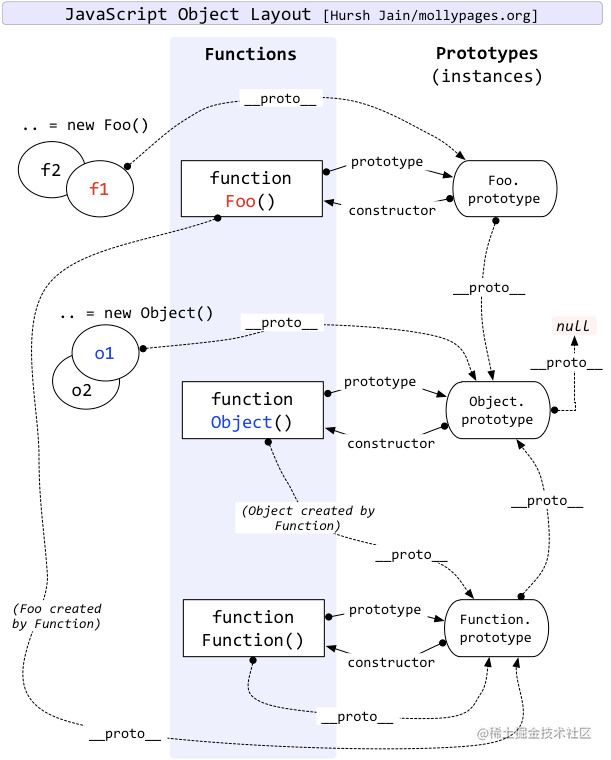

<!--
 * @Author: sunhao12 sunhao12@kuaishou.com
 * @Date: 2024-03-12 20:53:24
 * @LastEditors: sunhao12 sunhao12@kuaishou.com
 * @LastEditTime: 2024-03-14 17:28:52
 * @FilePath: /blog/src/drafts/learnStuff/interview.md
 * @Description: 这是默认设置,请设置`customMade`, 打开koroFileHeader查看配置 进行设置: https://github.com/OBKoro1/koro1FileHeader/wiki/%E9%85%8D%E7%BD%AE
-->

---
title: 复习资料总结
date: 2018-10-10 07:30:00  
tags: 
categories: 
---

## 进程和线程
1. 进程是操作系统资源调度的基本单位，线程是任务的调度执行的基本单位
2. 线程共享所属进程的资源，因此共享简单，但是同步复杂，需要用加锁等措施

## 函数节流

### 防抖函数
    
    // debounce 多次触发只有最后一次执行  
    function debounce(fn, delay, mustRun) {
      let timer = null
      let lastTime = null
      let realDelay = 0
      return function debounced(args) {
        const curr = +new Date()
        const context = this
        if(!lastTime) {
          lastTime = curr
        }
        clearTimeout(timer)
        // 增加了必须执行的逻辑
        if(curr - lastTime >= mustRun) {
          lastTime = curr
          // 这里的context重要
          return fn.apply(context, args);
        }
        timer = setTimeout(() => {
          lastTime = +new Date()
          return fn.apply(context, args)
        }, realDelay)
        // 这里是处理只点一下就执行的情况
        if(realDelay === 0) {
          realDelay = delay
        }
      }
    }

### 节流
    // 多长时间必须执行对应的函数 
    // 需要注意时间处理那块
    function throttle(func, t = 50) {
        let lastRunTime = null
        let timer = null;
        return function (...args) {
            const now = +new Date()
            const context = this
            if(!lastRunTime) {
              lastRunTime = now
            }
            if (now - lastRunTime >= t) {
                lastRunTime = now
                return fn.apply(context,args)
            } else {
                clearTimeout(timer)
                timer = setTimeout(() => {
                    lastRunTime = +new Date()
                    return fn.apply(context,args)
                }, lastRunTime + t - now)
            }
        }
    }

### 深拷贝  

    Function.prototype.clone = function clone() {
      const that = this;
      const temp = function(...args) { return that.apply(this,...args) };
      for(let key in this) {
        temp[key] = this[key];
      }
      return temp;
    }
    function deepClone(obj, hash = new WeakMap()) {
        if (obj === null) return obj; // 如果是null或者undefined我就不进行拷贝操作
        // instanceof 这里注意
        if (obj instanceof Date) return new Date(obj);
        if (obj instanceof RegExp) return new RegExp(obj);
        if(Object.prototype.toString.call(obj) === '[object Function]') return obj.clone()
        // 可能是对象或者普通的值  如果是函数的话是不需要深拷贝
        if (typeof obj !== "object") return obj;
        // 是对象的话就要进行深拷贝
        if (hash.get(obj)) return hash.get(obj);
        let cloneObj = new obj.constructor();
        // 找到的是所属类原型上的constructor,而原型上的 constructor指向的是当前类本身
        hash.set(obj, cloneObj);
        for (let key in obj) {
          if (obj.hasOwnProperty(key)) {
            // 实现一个递归拷贝
            cloneObj[key] = deepClone(obj[key], hash);
          }
        }
        return cloneObj;  
    }

## 模拟async await的实现过程

    // 通过Promise Generator来实现

    function spawn(genF) {
      return new Promise((resolve, reject) => {
        const itr = genF()
        function step(nextFn) {
            let next;
            try {
                next = nextFn()
            } catch(e) {
                reject(e)
            }
            // done的场景
            if(next.done) {
                resolve(next.value)
            }
            //  往下走的场景
            Promise.resolve(next.value).then(function(v) {
                step(function(){ return itr.next(v) });
            }, function(v) {
                step(function() { return itr.throw(v); })
            })
        }
        step(function() { return itr.next(undefined); })
      })
    }

## 实现apply call bind

### apply

    Function.prototype.myApply = function(context, args) {
      // apply接受数组
      context.fn = this;
      const result = context.fn(...args); // 已传入的context调用函数 作为调用的this
      delete context.fn;
      return result;
    }

### call 
    
    // call的性能更好 不需要处理参数转换
    Function.prototype.myCall = function(context, ...args) {
      context.fn = this;
      const result = context.fn(...args);
      delete context.fn;
      return result;
    }

### bind

    Function.prototype.myBind = function(context, ...args) {
      const fn = this;
      return function fnToBind(...restArgs) {
        if(this instanceof fnToBind) {
          return new fn(...args, ...restArgs);
        } else {
          return fn.apply(context,args.concat(restArgs));
        }
      }
    }

## 理解new操作符
1. 以构造器的原型为属性创建新对象
2. 将新对象作为this调用构造器
3. 如果构造器返回的是对象则返，否则返回第一步创建的对象

### 实现一个new

    function myNew(Con, ...args) {
      // 这里需要注意
      const obj = Object.create(Con.prototype);
      const ret = Con.call(obj, ...args);
      if(ret instanceof Object && ret !== null) {
        return ret;
      }
      return obj;
    }
    // 创建出来对象的__proto__ 是函数的prototype

    __proto__ 对象的原型
    prototype 函数的原型  Func.prototype.constructor === Func
    对象属性的获取是顺着对象__proto__沿着原型链查找

## 原型链面试问题

    Function.prototype.a = () => console.log(1);
    Object.prototype.b = () => console.log(2); 
    function A() {}
    console.log(A.__proto__ === Function.prototype) // true
    console.log(Object.__proto__ === Function.prototype) //true
    const a = new A();
    a.a(); // 无法执行 原型链顺序 A.prototype (__proto__) => Object.prototype (__proto__) => null 
    a.b();
    // 重新理解这里
    // https://juejin.cn/post/6844903839070421000

    function Function() {}
    Function.prototype (__proto__) => Object.prototype

    构造函数的__proto__(包括Function和Object)都指向Function.prototype。
    对象的__proto__都指向Object.prototype

## 实现继承的几种方式

### 原型链继承

    //原型链继承 将子类的原型指向父类的一个实例实现继承
    // 会导致父类的属性被所有实例所共享

    function Parent(age) {
      this.age = age
    }
    function Child(name) {
      this.name = name
    }

    Child.prototype = new Parent()
    Child.prototype.constructor = Child

### 借用构造函数方式

    function Parent(age) {
      // 借用构造函数方式都在父类的构造函数中定义 创建实例的时候 需要创建一遍方法
      this.name = age
      this.getName = () => {
        return this.name
      }
    }
    function Child(age) {
      Parent.call(this, age)
    }
### 组合继承

    // 组合继承 将原型链和借用构造函数技术结合在一起
    function Parent(age) {
      this.name = age
    }
    function Child(age,name) {
      Parent.call(this, age)
      this.name = name
    }

    Child.prototype = new Parent()
    Child.prototype.constructor = Child
    // 原型链上存在多余的属性
    // 调用两次构造函数

### 寄生组合式继承
    function Animal(name) {
      this.name = name;
    }

    function Cat(age) {
      // 别忘了这里的借用构造函数
      Animal.call(this,age)
      this.age = age;
    }

    Cat.prototype = Object.create(Animal.prototype, {
      constructor: {
        value: Cat,
        enumerable: false,
        writable: true,
        configurable: true,
      }
    })

## 数组操作

    function isArray(obj) {
      return Object.prototype.toString.call(obj) === '[object Array]';
    }
    // 数组的相关方法
    unshift(value) 在前面插入  shift() 在前面移除
    // 数组扁平化
    function flattenDeep(arr) {
      return arr.reduce((acc, val) => {
        if(Array.isArray(val)) {
          return  acc.concat(flattenDeep(val));
        } else {
          return acc.concat(val)
        }
      }, [])
    }

## 实现compose函数

    function compose(...funcs) {
      if(funcs.length === 0) {
        return arg => arg
      }
      if(funcs.length === 1) {
        return func[0]
      }
      return funcs.reduce((a,b) => (...args) => a(b(...args)))
    }

### 实现一个jsonp
* 标签的移除 
* callback注册到window上 需要进行移除(冲突) 和 callback的返回

    function jsonp ({url, data, callback}) {
      const container = document.getElementsByTagName('head')[0];
      const fnName = `jsonp_${new Date().getTime()}`;
      const script = document.createElement('script');
      script.src = `${url}?${objectToQuery(data)}&callback=${fnName}`;
      script.type = 'text/javascript';
      container.appendChild(script);

      window[fnName] = function (res) {   
          callback && callback(res);
          container.removeChild(script);
          delete window[fnName];
      }

      script.onerror = function() { // 异常处理，也是很多人漏掉的部分
          callback && callback(
            'something error hanppend!'
          )
          container.removeChild(script);
          delete window[fnName];
        }
    }

## promise

1. then 和 catch 期望接收函数做参数，如果非函数就会发生 Promise 穿透现象，打印的是上一个 Promise 的返回

    const promise = new Promise(function(resolve, reject){
      setTimeout(function() {
        resolve(1);
      }, 3000)
    })

    promise.then(2).then((n) => {
      console.log(n) // 输出1 
    });

## 移动端事件 
touchstart 当用户在触摸平面上放置了一个触点时触发
touchend 当一个触点被用户从触摸平面上移除（即用户的一个手指或手写笔离开触摸平面）时触发
touchmove 当用户在触摸平面上移动触点时触发
touchcancel 当触点由于某些原因被中断时触发

禁止缩放 并且是响应式可以解决
<meta name="viewport" content="user-scalable=no">
<meta name="viewport" content="width=device-width,initial-scale=1,maximum-scale=1">

fastclick的原理 是在touchend之后出发一个click事件

## js中0.1 + 0.2 !== 0.3的问题
JavaScript使用Number类型表示数字（整数和浮点数），遵循 IEEE 754 标准 通过64位来表示一个数字
0.1 + 0.2 转换成2进制 然后对阶运算

## 相关题  

    // let obj = {
	    "A.B.C.D":1,
	    "A.B.E.F":2
      }
    function parseObj(obj) {
        const ret = {}
        for(const [key, value] of Object.entries(obj)) {
            const arr = key.split('.')
            // 前面的值
            let prev = ret
            for(let i = 0; i < arr.length;i++) {
                if(i < arr.length - 1) {
                    if(prev[arr[i]]) {
                        prev = prev[arr[i]]
                        continue
                    } else {
                        prev[arr[i]] = {}
                        prev = prev[arr[i]]
                    }
                } else if(i === arr.length - 1) {
                    prev[arr[i]] = value
                }
                          
            }
        }

        return ret
    }

