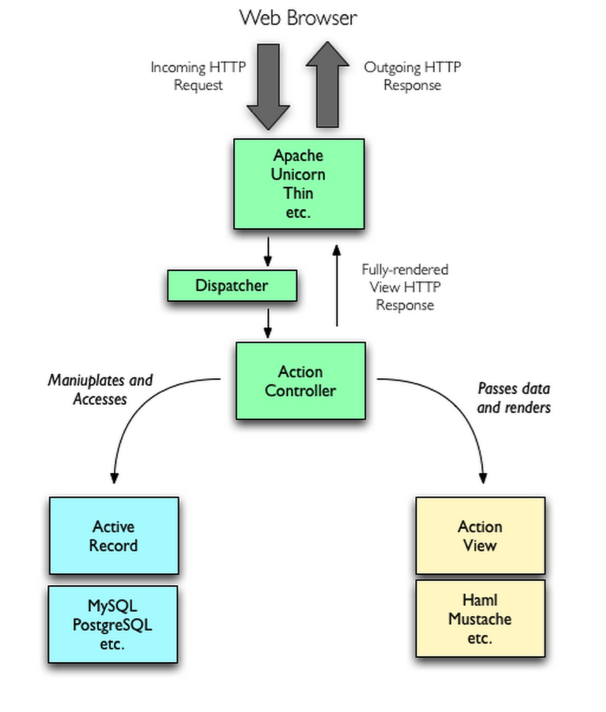
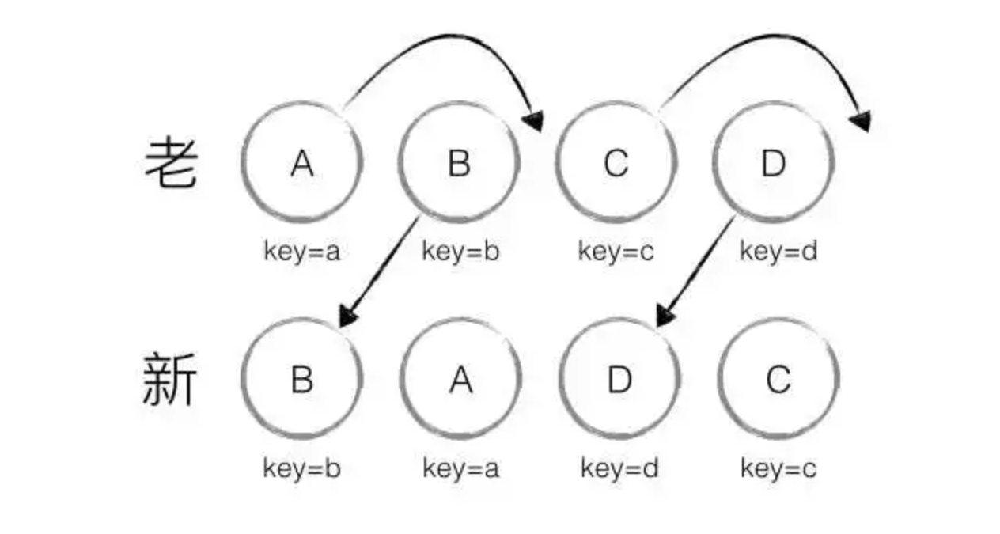

## MVC MVP MVVM概念
### MVC
#### 客户端MVC  
用户操作view后,将处理权转交给controller(pass calls)  Controller对来自view的数据进行预处理,调用model的接口,当model变更的时候通过观察者模式通知view,
view通过观察者模式收到model的消息,重新更新界面
  
### 服务端MVC
服务端收到来自客户端的请求,服务端通过路由规则把这个请求交给特定的Controller进行处理,Controller执行相应的应用逻辑,对model进行操作.model执行业务逻辑,渲染模板返回给客户端
 
### MVP(Passive View)
用户对view的操作从view转移给Presenter,Presenter会执行相应的应用程序逻辑,并且对model进行相应的操作,model执行完业务逻辑后,通过观察者模式将变更通知给Presenter.Presenter获取model的变更后通过view提供的接口更新界面.
 

### MVVM 
Model-View-ViewModel
ViewModel是model of view  包括领域模型(domain model)和视图的状态(state) ViewModel更适合描述view.
 

## react理念(我对react的一些认识)
  1. V = F(data(View Modal)) 数据驱动视图
  2. 隔离dom,通过虚拟Dom和renderer来绘制页面
  3. 组件化(抽象,组合,代码复用)
  4. 函数式编程

## React element && Component && instance
element是通过React.createElement创建的对象 包括type props children等
Component 是定义的组件 比如函数组件 或者类组件等
instance 类组件有instance 声明周期 函数式组件没有instance

## 函数组件替代类组件？？？
1. hooks更好的实现了逻辑的复用 
2. 用hooks取代生命周期 函数更加声明化(命令式编程 => 声明式编程)  类组件基于生命周期实现的逻辑不好

## react diff
react的diff基于以下三点:
1. DOM节点的跨层级的移动操作比较少
2. 拥有相同类型的两个节点会有相似的DOM结构,拥有不同类的两个组件将会生成不同的树形结构
3. 对于同一层级的一组子节点,可以通过唯一的id进行区分

针对上面的三个假设,有三种更新策略:
1. tree diff react对虚拟DOM进行分层的比较
2. Component diff  不同类型的组件直接替换 相同类型的组件可以通过showComponentUpdate来判断是否更新
3. element diff  

### 统一层级相同类别diff

### without key
当相同类别的节点没有唯一标识的时候,react会按照原来的思路进行替换操作.当在B和C中插入F的时候,C更新成F,D更新成C,E更新成D,最后插入E.  
  

### with key

## React组件生命周期
1. 挂载  

    constructor()  
    // 返回一个对象去更新state 返回null 不更新
    static getDerivedStateFromProps(props, state) {\
    }
    render()
    componentDidMount()
2. updating

    static getDerivedStateFromProps(props, state)
    shouldComponentUpdate(nextProps, nextState)
    render()
    getSnapshotBeforeUpdate(prevProps, prevState)
    componentDidUpdate(prevProps, prevState, snapshot)
3. 卸载

    componentWillUnMount()

    // 函数解释
    static getDrivedStateFromProps(prop, state) {
      return {}; // to update State  该方法无法访问this
    }
    getSnapShotBeforeUpdate(prevProps, prevState) {
      return snap;
    }
    ComponentDidUpdate(prevProps, prevState, snap) {
    }

4. 错误处理  

    componentDidCatch(error, info) {
      // info 包含组件节点的信息
      // 只能捕获到子组件的错误  不能捕获到当前组件  异步代码的错误
    }
    static getDrivedStateFromError() {
    }

5. 服务端渲染执行的周期函数
  
   constructor()
   static getDrivedStateFromProps(props, state) {}
   render() 

   Fiber的调度基于时间 SSR的调度基于工作量 
   react服务端渲染的流程
   1. 创建组件实例 constructor getDrivedStateFromProps 生命周期函数
   2. 执行render方法 依次处理child 遇到原生Dom元素则进行html字符串的生成
   3. 在进行流式数据推送的时候,会按照给定的工作量进行处理
   4. 在客户端执行hydrate  在对应的位置找到节点进行复用  在commit阶段尝试更新(完成生命周期的执行等)
  

### React 其他api

    React.createElement(
      type, 
      [props],
      [...children]
    )

## 高阶用法
### render prop
为了逻辑共享

  class Cat extends PureComponent {
    constructor(props) {
      super(props)
      this.state = { name: 111 }
    }
    render() {
      return this.props.render(this.state)
    }
  }
  class App extends Component {
    render() {
      return (
      <Cat render={params => (
{params.name}
)} />
      )
    }
  }
  export default App;

### 高阶组件

#### 属性代理

    function HOC(Wrapped) {
      return class extends Component {
        render() {
          return (<Wrapped {...this.props} />)
        }
      }
    }

#### 反向继承

    function HOC2(Wrapped) {
      return class extends Wrapped {
        render() {
          return super.render();
        }
      }
    }
#### 用处
1. 高阶组件实现对共有逻辑的提取(组合逻辑)
2. 添加新的逻辑

## react api

### react.memo
可以复用上次渲染的结果(需要包裹函数组件)

function areEqual(prevProp, nextProp) {
  return true/false // true复用上次渲染的结果 false重新渲染
}

React.memo(MyComponent, areEqual)

### createRef()

    class App extends Component {
      constructor(props) {
        super(props)
        this.myRef = createRef()
      }
      componentDidMount() {
        this.myRef.current.focus()
      }
      render() {
        return (
          

            <Child ref={this.myRef} />
          

        );
      } 
    }
### forwardRef
在高阶组件中的使用 能从外部获取内部的ref

    const FancyButton = React.forwardRef((props, ref) => (
      <button ref={ref} className="FancyButton">
        {props.children}
      </button>
    ));

    const ref = React.createRef();
    <FancyButton ref={ref}>Click me!</FancyButton>;

### React.lazy React.Suspense
    
    // 需要babel支持动态拆包 @babel/plugin-syntax-dynamic-import
    const LazyComponent = React.lazy(() => import('./hello'))

    class App extends PureComponent {
      render() {
        return 

          <Suspense fallback={
1111
}>
            <LazyComponent name={"2222"} />
          </Suspense>
        

      }
    }

### hooks

### useRef 
useRef可以保存在组件渲染的时候的一个常量
修改.current的值 并不能使组件渲染
#### useState

  // 接受一个初始值 
  const [ count, setCount ] = useState(0)

#### useEffect

1. useEffect 是componentDidMount componentDidUpdate  componentWillUnmount的结合
2. 主要为了做组件一些副作用(data fetch  subscribe )  effect hooks在每次render都会执行  return的函数会在组件下次渲染之前

useEffect(() => {
  return () => {}
}, [compare])

#### 用hooks实现一个定时器

    //注意CountDown要大写
    function CountDown(value) {
    const timer = useRef(null)
    let [ count, setCount ] = useState(value)
    const [ refresh, setFresh ] = useState(false)

    useEffect(() => {
      timer.current = setInterval(() => {
        setCount(count--)
      }, 1000)
      if(refresh) {
        setFresh(false)
      }
      return () => {
        clearInterval(timer.current)
      }
      
    }, [refresh])
    function changeRresh() {
      setFresh(true)
      clearInterval(timer.current)
      setCount(value)
    }
    return [count, changeRresh]
  }

#### useContext
通过useContext可以实现redux类的状态共享

    // 父组件  全局的state都放到外层provider 需要进行context的拆分 减少重复的渲染
    function App() {
      const [ value, setValue ]  = useState(1)
      function changeValue() {
        setValue(value + 1)
      }
      return (
        

          <MyContext.Provider value={{ changeValue, value }}>
            <ChildA />
            <ChildB />
          </MyContext.Provider>
        

      );
    }
    // 子组件
    function ChildA(props) {
      const { value, changeValue } = useContext(MyContext)
      return 

        {value}
      

    }

#### useReducer 
通过useReducer和useContext 是实现类redux的状态管理

    // reducer
    export const initValue = { value: 1 }
    export const reducer = (state, action) => {
      console.log(action)
      switch(action) {
        case 'update': 
          return { ...state, value: state.value + 1 }
        default: 
          return state
      }
    }
    // 父组件
    function App() {
      const [ state, dispatch ] = useReducer(reducer, initValue)
      return (
        

          <MyContext.Provider value={{ state, dispatch }} >
            <ChildA />
          </MyContext.Provider>
            
        

      );
    }  
    // 子组件
    function ChildA(props) {
      const { state, dispatch } = useContext(MyContext)
      return 
 { console.log('change'); dispatch('update') }}
      >
        {state.value}
      

    } 

## react 源码学习
新的架构分为3个部分:
* Scheduler(调度器)- 调度任务优先级，高优任务进入Reconciler
* Reconciler(协调器)- 找出变化的组件
* Renderer(渲染器)- 将组件渲染到界面上

### fiber
#### fiber的结构

##### 属性介绍
1. key type  type 宿主  函数 类组件
2. child sibling  child 是第一个孩子  sibling是第一个兄弟
3. return 
return是当前程序处理完需要返回的fiber节点
4. pendingProps memoizedProps  
当执行开始的时候设置pengingProps,memoizedProps是执行完进行设置的, pendingProps === memoizedProps  可以复用之前的work
6. alternate
当前显示的Fiber树为current Fiber,在内存中构建的为workInProgress Fiber.

       currentFiber.alternate === workInProgressFiber;
       workInProgressFiber.alternate === currentFiber;

#### react fiber reconciler的过程
分为render阶段 + commit阶段
1. render阶段主要构建workInprogressFiber(tag, effectList) 找出变化
2. commit阶段主要是更新阶段(tag, effectList)和执行生命周期函数 commit阶段分为三个子阶段
  * before mutation(执行DOM操作前)  
  * mutation(执行DOM操作)
  * layout阶段(执行DOM操作之后)

#### react的更新流程
* 触发状态更新
* 创建update对象
* 从当前fiber节点查询到rootFiber
* 调度更新(render阶段 + commit阶段)

### hooks的原理

#### hook的结构

    
    // 每个useState对应一个hook对象， 产生的update保存在对应的useState的hook.queue中
    hook = {
      // 保存update的queue update形成一个环状单向链表
      queue: {
        pending: null
      },
      // 保存hook对应的state
      memoizedState: initialState,
      // 与下一个Hook连接形成单向无环链表
      next: null,
      baseState: null,
      baseQueue: null,
    }
    
    // 简洁的实现流程
    // 更新产生的update通过环状单向链表维护
    // 函数组件的hook状态保存在fiber结构的memoizedState里面

    // 模拟这个实现过程
    let fiber = {}
    let workInProgressHook = null
    let isMount = true
    function schedule() {
      workInProgressHook = fiber.memoizedState

      // 触发render
      // 在render的过程中 每次遇到useState就移动workInProgress的next指针
      isMount = false
    }
    function dispatchAction(queue, action) {
      // 创建update
      const update = {
        action,
        next: null,
      }
      // update构成环状单向链表
      if(queue.pending === null) {
        update.next = next
      } else {
        update.next = queue.pending.next
        queue.pending.next = update
      }
      queue.pending = update;
      schedule()
    }
    // 计算state的改变
    function useState(initialState) {
      let hook;
      if(isMount) {
        // mount的时候直接生成hook对象
        hook = {
          queue: { pending: null },
          memoizedState: initialState,
          next: null,
        }
        if(!fiber.memoizedState) {
          fiber.memoizedState = hook;
        } else {
          workInProgressHook.next = hook;
        }
        workInProgressHook = hook
      } else {
        // update的时候 从workInProgress中获取该useState对应的hook
        hook = workInProgressHook
        workInProgressHook = workInProgressHook.next
      }

      let baseState = hook.memoizedState
      if(hook.queue.pending) {
        // 根据queue.pending中保存的update更新state
        let firstUpdate = hook.queue.pending.next
        do {
          const action = firstUpdate.action
          baseState = action(baseState)
          firstUpdate = firstUpdate.next
        } while(firstUpdate !== hook.queue.pending.next)
        // 清空queue.pending
        hook.queue.pending = null
      }
      hook.memoizedState = baseState
      return [baseState, dispatchAction.bind(null, hook.queue)]
    }
    // 所有的hooks都存在fiber的memoizedState上
    // 通过不断的位移来获取hook的queue 计算出最新的值

#### 更新流程

    // 声明阶段 会走到对应的Mount Hook处理函数 把基础的值存储起来
    // update 会创建update 并且插入对应的hook的updateQueue中 触发根组件的更新
    // 在更新的时候 执行到函数组件的时候 会执行Update Hook处理函数 将之前的update执行 返回

### 对Fiber整体架构的一些梳理
    
    // 多优先级更新架构  
      1. 同一级别优先级的更新 一起更新
    // Fiber
    // Scheduler 
    // lane模型 

#### lane模型

### React 高阶用法梳理

[React Fiber的链表结构](https://indepth.dev/posts/1007/the-how-and-why-on-reacts-usage-of-linked-list-in-fiber-to-walk-the-components-tree)
[React Fiber算法介绍](https://indepth.dev/posts/1008/inside-fiber-in-depth-overview-of-the-new-reconciliation-algorithm-in-react)
[build your own react](https://pomb.us/build-your-own-react/)
[React Concurrent Mode介绍](https://juejin.cn/post/6891848244972748807)

