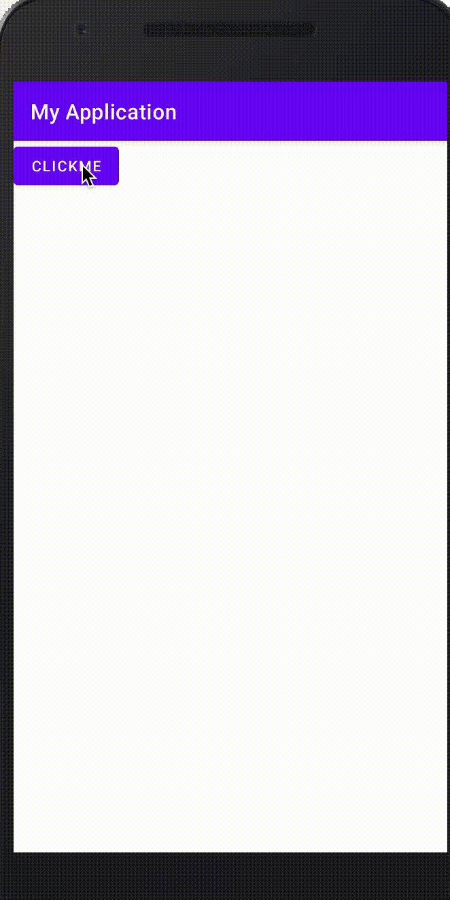
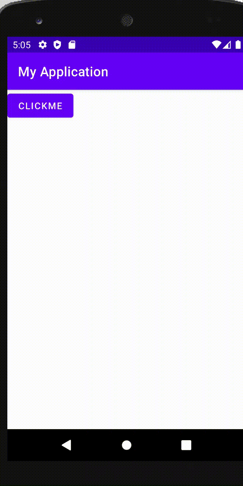

Hybrid开发模式中经常需要依赖端能力来实现业务和技术方案，前端作为端能力的调用者通过对端能力的系统学习能更好的辅助业务开发。这个系列主要是自己在学习跨端技术上的一些记录，文章会偏短小，希望尽可能覆盖更多的知识点也希望能帮助到你。

## Android项目目录介绍
  
* build.gradle 项目模块的构建脚本
* res 项目的资源目录 存放布局(lagout)、图片(drawable)、图标(mipmap)、字符串(values)等
* AndroidManifest.xml 项目的配置文件(组件声明、权限等)

## 活动创建  

活动是一种可以包含用户用户界面的组件，通过活动可以实现与用户的交互，在Android开发中创建一个活动的过程如下:
* 创建活动
* 创建布局
* 在活动关联布局  

以下的例子以创建一个展示可点击按钮的页面为例子来展开活动相关的知识点。  
  
  
上面在AndriodStudio中创建了一个空的活动并且同步创建了布局文件，设置创建的活动为应用的起始活动。  
通过查看代码Android Studio已经自动帮我们完成了布局与活动的关联。  

在AndroidManifest.xml中已经自动完成的活动的声明。

    <?xml version="1.0" encoding="utf-8"?>
    <manifest xmlns:android="http://schemas.android.com/apk/res/android"
        package="com.example.myapplication">
        <application
            android:allowBackup="true"
            android:icon="@mipmap/ic_launcher"
            android:label="@string/app_name"
            android:roundIcon="@mipmap/ic_launcher_round"
            android:supportsRtl="true"
            android:theme="@style/Theme.MyApplication">
            // 活动声明 Android Studio在创建活动时候自动在ManiFest文件中完成声明
            <activity android:name=".MainActivity">
                // 定义为启动活动
                <intent-filter>
                    <action android:name="android.intent.action.MAIN" />

                    <category android:name="android.intent.category.LAUNCHER" />
                </intent-filter>
            </activity>
        </application>
    </manifest>

### 实现按钮逻辑

#### 在创建的layout布局文件中定义一个按钮

    // activity_main.xml
    <?xml version="1.0" encoding="utf-8"?>
    <LinearLayout xmlns:android="http://schemas.android.com/apk/res/android"
        android:orientation="vertical"
        android:layout_width="match_parent"
        android:layout_height="match_parent">
        
        <Button
            // 宽高定义
            android:layout_width="wrap_content" 
            android:layout_height="wrap_content"
            // 定义按钮的id 可以在活动中通过id查找到对应的按钮
            android:id="@+id/button_1"
            // 按钮显示文字
            android:text="clickMe"
        />
    </LinearLayout>

#### 在活动中实现按钮的点击操作

    public class MainActivity extends AppCompatActivity {

        @Override
        protected void onCreate(Bundle savedInstanceState) {
            super.onCreate(savedInstanceState);
            setContentView(R.layout.activity_main);
            // 通过id查找到按钮
            Button button = (Button) findViewById(R.id.button1);
            // 定义点击事件
            button.setOnClickListener(new View.OnClickListener() {
                @Override
                public void onClick(View v) {
                    Toast.makeText(MainActivity.this,"hello", Toast.LENGTH_LONG).show();
                }
            });
        }
    }

#### 通过模拟器查看效果
通过ADV Manager创建模拟器  
  
在模拟器中启动项目  
  
在模拟器中点击按钮展示了Toast  
  

## 活动之间交互
在应用中不可避免的需要不同的活动间进行跳转和数据交互，可以通过Intent来实现活动之间的跳转。

### 使用显示Intent跳转  
通过Android Studio创建testIntent活动，在testIntent的layout文件定义文字方便识别跳转.  

    <?xml version="1.0" encoding="utf-8"?>
    <LinearLayout xmlns:android="http://schemas.android.com/apk/res/android"
        android:orientation="vertical"
        android:layout_width="match_parent"
        android:layout_height="match_parent">
        <TextView
            android:layout_width="wrap_content"
            android:layout_height="wrap_content"
            android:text="测试显示intent"
        />
    </LinearLayout>  

在MainActivity中使用intent实现跳转  

    public class MainActivity extends AppCompatActivity {

        @Override
        protected void onCreate(Bundle savedInstanceState) {
            super.onCreate(savedInstanceState);
            setContentView(R.layout.activity_main);
            // 通过id查找到按钮
            Button button = (Button) findViewById(R.id.button1);
            button.setOnClickListener(new View.OnClickListener() {
                @Override
                public void onClick(View v) {
                    // 显示的创建intent 指定当前的context MainAcxtivity  目标活动 testIntent
                    Intent intent = new Intent(MainActivity.this, testIntent.class);
                    // 启动活动
                    startActivity(intent);
                }
            });
        }
    }

 

### 使用隐式Intent跳转
区别于显示的Intent跳转，隐式Intent通过定义action和category信息让系统查到对应的活动实现跳转。  
创建testIntentImplicit，在ManiFest文件中声明action和category  

    <activity android:name=".Implicit">
        <intent-filter>
            <action android:name="com.example.myapplication.TEST_INTENT" />
            // 必须添加DEFAULT category 否则会导致通过startActivity和startActivityForResult无法识别正确的activity
            <category android:name="android.intent.category.DEFAULT" />
            <category android:name="com.example.myapplication.TEST_INTENT" />
        </intent-filter>
    </activity>

在活动中创建隐式Intent  

    public class MainActivity extends AppCompatActivity {

        @Override
        protected void onCreate(Bundle savedInstanceState) {
            super.onCreate(savedInstanceState);
            setContentView(R.layout.activity_main);
            // 通过id查找到按钮
            Button button = (Button) findViewById(R.id.button1);
            button.setOnClickListener(new View.OnClickListener() {
                @Override
                public void onClick(View v) {
                    Intent intent = new Intent("com.example.myapplication.TEST_INTENT");
                    intent.addCategory("com.example.myapplication.TEST_INTENT");
                    startActivity(intent);
                }
            });
        }
    }

 

### 传递数据给下一个活动
可以在intent中通过putExtra中传递数据。  

    public class MainActivity extends AppCompatActivity {
        @Override
        protected void onCreate(Bundle savedInstanceState) {
            super.onCreate(savedInstanceState);
            setContentView(R.layout.activity_main);
            // 通过id查找到按钮
            Button button = (Button) findViewById(R.id.button1);
            button.setOnClickListener(new View.OnClickListener() {
                @Override
                public void onClick(View v) {
                    Intent intent = new Intent("com.example.myapplication.TEST_INTENT");
                    intent.addCategory("com.example.myapplication.TEST_INTENT");
                    // 在intent中增加数据
                    intent.putExtra("extra", "传递数据");
                    startActivity(intent);
                }
            });
        }
    }

 

### 传递数据给之前的活动
通过startActivityForResult和onActivityResult可以实现传递数据到之前的活动。  

    protected void onActivityResult(int requestCode, int resultCode, Intent data) {
        // 在onActivityResult中判断requestCode是哪个activity返回的结果
        switch (requestCode) {
            case 1:
                if(requestCode == RESULT_OK) {
                    String responseData = data.getStringExtra("extra");
                    Toast.makeText(MainActivity.this, responseData, Toast.LENGTH_LONG).show();
                }
                break;
            default:
        }
    }
    @Override
    protected void onCreate(Bundle savedInstanceState) {
        super.onCreate(savedInstanceState);
        setContentView(R.layout.activity_main);
        Button button = (Button) findViewById(R.id.button1);
        button.setOnClickListener(new View.OnClickListener() {
            @Override
            public void onClick(View v) {
                Intent intent = new Intent("com.example.myapplication.TEST_INTENT");
                intent.addCategory("com.example.myapplication.TEST_INTENT");
                // 通过intent和requestCode打开活动
                startActivityForResult(intent, 1);
            }
        });
    }

在跳转的活动中通过setResult返回数据给之前的活动  

    @Override
    protected void onCreate(Bundle savedInstanceState) {
        super.onCreate(savedInstanceState);
        setContentView(R.layout.activity_implicit);
        Button button = (Button) findViewById(R.id.buttonBack);
        button.setOnClickListener(new View.OnClickListener() {
            @Override
            public void onClick(View v) {
                Intent intent = new Intent();
                intent.putExtra("extra", "数据返回");
                setResult(RESULT_OK, intent);
                finish();
            }
        });
    }

 

## 活动启动模式
安卓使用栈来管理活动的层叠关系，系统总是将位于栈顶的活动展示给用户。在声明活动时，可以定义活动的启动模式从而影响活动在栈中的表现。  
通过在声明activity中android:launchMode定义活动不同的启动模式。  

### standard
standard模式是默认模式，在standard模式下创建新活动都会在栈顶新增一个活动入栈。  
  

### singleTop
singleTop当栈顶是要打开的活动时，不会创建新的活动实例入栈。  
  

### singleTask
singleTask会复用栈内的实例，如果栈内已有实例会把实例之前的活动全部出栈。
 

### singleInstance
singleInstance会创建一个新的返回栈来管理活动，主要用于不同应用间活动的共享。在下面的例子中从活动C返回时会先返回到当前栈的活动A在返回到活动B  

## 生命状态&周期

### 活动的状态

| 状态 | 含义 |
| ------ | ------ | 
| 运行状态 | 活动处于栈顶 | 
| 暂停状态 | 活动不处于栈顶，仍然可见。系统一般不会回收 | 
| 停止状态 | 不处于栈顶，不可见 可能会被系统回收 | 
| 销毁状态 | 从活动栈中移除 | 

### 活动的生命周期

| 方法名 | 含义 |
| ------ | ------ | 
| onCreate() | 活动第一次被创建时调用 | 
| onStart() | 活动由不可见变为可见的时候调用 | 
| onResume() | 活动处于栈顶运行状态 | 
| onPause() | 系统准备去启动或者恢复另一个活动时调用,通常在这个方法中进行资源的释放和数据保存 | 
| onStop() | 活动完全不可见的时候调用 | 
| onDestroy() | 活动被销毁之前调用 | 
| onRestart() | 活动由停止状态变为运行状态之前调用 | 

  

