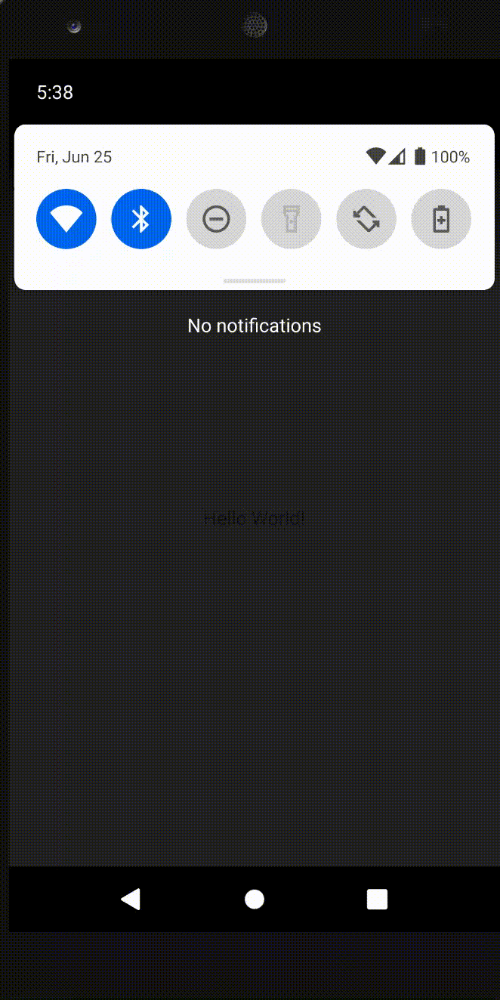

广播是安卓内的消息通知机制，通过接收广播消息应用能收到系统级的消息通知/其他应用的消息通知。

## 接收广播

### 声明接收器
声明接收器是通过在AndroidManifest.xml中声明广播的方式来实现广播的注册。这种方式在应用级别26以上不再支持。实现方式如下:  

### 创建broadcast receiver

    public class MyBroadCast extends BroadcastReceiver {
    // 创建MyBroadCast 实现onReceive 
    // 当接收到广播时 会调用onReceive
        @Override
        public void onReceive(Context context, Intent intent) {
            Toast.makeText(context, "receive broadcast", Toast.LENGTH_SHORT).show();
        }
    }

#### 在Manifest中定义receiver

    // 定义receiver
    <receiver android:name=".MyBroadCast" android:exported="true" android:enabled="true" >
        <intent-filter>
            <action android:name="android.intent.action.BOOT_COMPLETED" />
        </intent-filter>
    </receiver>
    // 权限声明
    <uses-permission android:name="android.permission.RECEIVE_BOOT_COMPLETED" />
### 上下文注册接收器

### 创建broadcast receiver
同声明接收器创建方式

### 在活动中注册broadcast receiver

    public class MainActivity extends AppCompatActivity {
        private MyBroadCast myBroadCast;

        @Override
        protected void onCreate(Bundle savedInstanceState) {
            super.onCreate(savedInstanceState);
            setContentView(R.layout.activity_main);
            // 创建广播接收器
            myBroadCast = new MyBroadCast();
            IntentFilter intentFilter = new IntentFilter();
            // 监听网络变化
            intentFilter.addAction("android.net.conn.CONNECTIVITY_CHANGE");
            // 注册广播接收器
            registerReceiver(myBroadCast, intentFilter);
        }

        @Override
        protected void onDestroy() {
          //销毁监听
          super.onDestroy();
          unregisterReceiver(myBroadCast);
        }
    }
 
 

## 发送广播
Android提供以下三种方式发送广播: 
* [sendOrderedBroadcast(Intent, String)](https://developer.android.com/reference/android/content/Context#sendOrderedBroadcast(android.content.Intent,%20java.lang.String)) 发送顺序广播，接收器顺序执行可以向下传递结果也可以中止广播。具有相同优先级的接收器按随机顺序运行。 
  

* [sendBroadcast(Intent)](https://developer.android.com/reference/android/content/Context#sendBroadcast(android.content.Intent)) 发送常规广播，会按照随机顺序向所有广播接收器发送广播，无法从其他接收器中获取传递结果和中止广播。  
  
* [LocalBroadcastManager.sendBroadcast](https://developer.android.com/reference/androidx/localbroadcastmanager/content/LocalBroadcastManager#sendBroadcast(android.content.Intent)) 本地广播，在无需跨应用广播时使用。

下面发送本地广播的实现方式:  

    public class MainActivity extends AppCompatActivity {
        private MyBroadCast myBroadCast;
        private String actionName = "com.example.broadcast.MainActivity.SHOW_TOAST";
        private LocalBroadcastManager localBroadcastManager;
        @Override
        protected void onCreate(Bundle savedInstanceState) {
            super.onCreate(savedInstanceState);
            setContentView(R.layout.activity_main);
            // 获取LocalBroadcastManager 实例
            localBroadcastManager = LocalBroadcastManager.getInstance(this);
            Button button = (Button) findViewById(R.id.broadcast);
            button.setOnClickListener(new View.OnClickListener() {
                @Override
                public void onClick(View v) {
                    // 发送广播
                    Intent intent = new Intent(actionName);
                    localBroadcastManager.sendBroadcast(intent);
                }
            });
            myBroadCast = new MyBroadCast();
            IntentFilter intentFilter = new IntentFilter();
            intentFilter.addAction(actionName);
            // 注册接收特定类型的广播
            localBroadcastManager.registerReceiver(myBroadCast, intentFilter);
        }

        @Override
        protected void onDestroy() {
            super.onDestroy();
            // 销毁广播
            localBroadcastManager.unregisterReceiver(myBroadCast);
        }
    }

