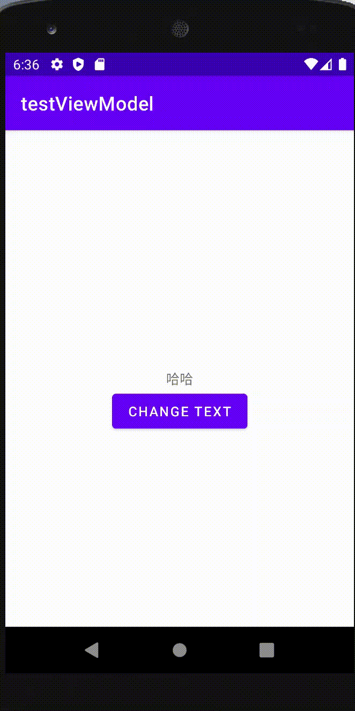

在前端页面开发中，通常会将数据层和UI层进行隔离，这样能更好的做到职责的分离。在安卓开发中ViewModel可以实现UI的数据管理能力，结合LiveData的观察通知能力可以做到页面与数据视图的更新绑定，更有效的组织页面逻辑。

## ViewModel
View能有效的做到视图和数据的分离，数据共享能力。

### ViewModel生命周期
ViewModel对象存在的时间范围是获取ViewModel时传递给ViewModelProvider的生命周期。ViewModel将一直留在内存中，直到限定其存在时间范围的Lifecycle永久消失：对于Activity，是在Activity完成时；而对于 Fragment，是在 Fragment 分离时。

## LiveData  
LiveData是一种可观察的数据存储类，它具有生命周期感知能力，可以遵循其他应用组件(如Activity、Fragment、Service)的生命周期进行数据的更新通知。使用LiveData有通常有以下的三个步骤:  
* 在ViewModel中创建LiveData实例保存数据
* 创建可以定义OnChange()方法的[Observer](https://developer.android.com/reference/androidx/lifecycle/Observer?hl=zh-cn)对象
* 在界面控制器中使用[observe()](https://developer.android.com/reference/androidx/lifecycle/LiveData?hl=zh-cn#observe(android.arch.lifecycle.LifecycleOwner,%0Aandroid.arch.lifecycle.Observer%3CT%3E))方法将创建的Observer对象附加到LiveData对象

### 添加依赖
使用LiveData需要引入ViewModel

    dependencies {
        implementation 'androidx.appcompat:appcompat:1.3.0'
        implementation "androidx.lifecycle:lifecycle-viewmodel:2.3.1"
        implementation 'com.google.android.material:material:1.3.0'
        implementation 'androidx.constraintlayout:constraintlayout:2.0.4'
        testImplementation 'junit:junit:4.+'
        androidTestImplementation 'androidx.test.ext:junit:1.1.2'
        androidTestImplementation 'androidx.test.espresso:espresso-core:3.3.0'
    }

### 在ViewModel中创建LiveData对象

    public class MyViewModel extends ViewModel {
        private MutableLiveData<String> title;
        public MutableLiveData<String> getTitle() {
            if (title == null) {
                // 网络请求、读取文件etc
                title = new MutableLiveData<String>("哈哈");
            }
            return title;
        }
    } 

### 在界面中使用LiveData数据

    public class MainActivity extends AppCompatActivity {
        private MyViewModel myViewModel;
        @Override
        protected void onCreate(Bundle savedInstanceState) {
            super.onCreate(savedInstanceState);
            setContentView(R.layout.activity_main);
            TextView textView = (TextView) findViewById(R.id.textView);
            // 获取ViewModel
            myViewModel = new ViewModelProvider(this).get(MyViewModel.class);
            // 创建Observer
            final Observer<String> titleObserver = new Observer<String>() {
                @Override
                public void onChanged(String s) {
                    textView.setText(s);
                }
            };
            myViewModel.getTitle().observe(this, titleObserver);
            Button button = (Button) findViewById(R.id.button);
            // 定义button的点击事件 更改ViewModel的数据
            button.setOnClickListener(new View.OnClickListener() {
                @Override
                public void onClick(View v) {
                    myViewModel.getTitle().setValue("我变了");
                }
            });
        }
    }

