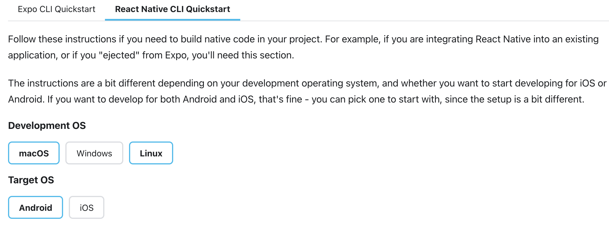
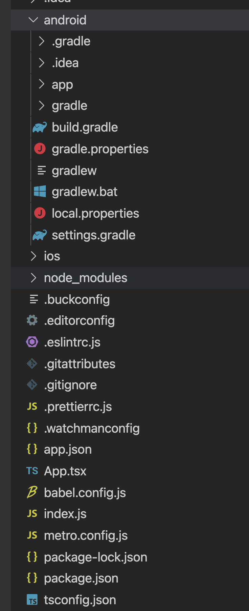
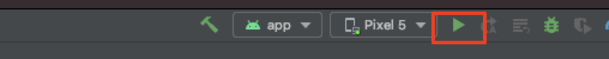
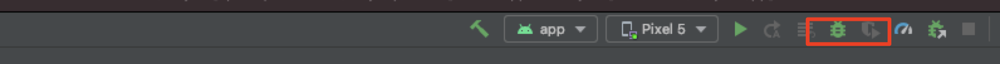
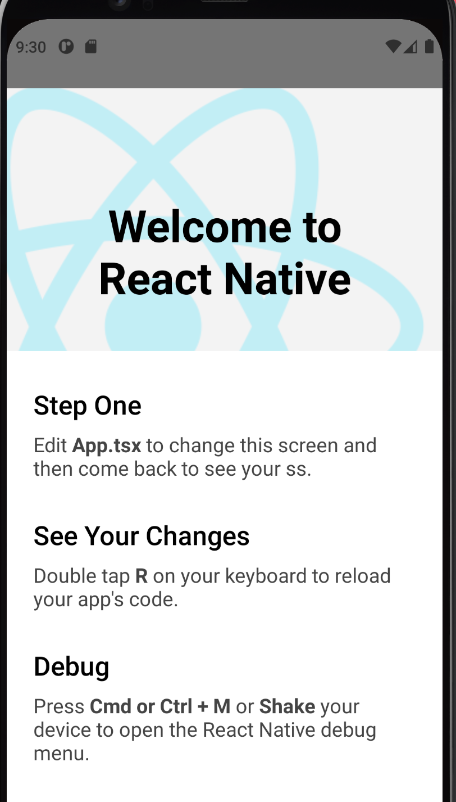

<!-- vscode-markdown-toc -->
* 1. [背景知识](#)
* 2. [RN项目初始化](#RN)
	* 2.1. [依赖安装](#-1)
	* 2.2. [cli初始项目](#cli)
	* 2.3. [使用typescript模板初始项目](#typescript)
* 3. [RN项目启动&调试](#RN-1)
	* 3.1. [启动metro](#metro)
	* 3.2. [启动项目](#-1)
		* 3.2.1. [正常模式启动项目](#-1)
		* 3.2.2. [debug模式启动项目](#debug)
* 4. [参考](#-1)

<!-- vscode-markdown-toc-config
	numbering=true
	autoSave=true
	/vscode-markdown-toc-config -->
<!-- /vscode-markdown-toc -->

在[11月的前端快报](https://icantunderstand.cn/2021-11-03)中有系列文章介绍了React Native新架构的相关概念，笔者也有一定的React Native开发经验，但是总感觉没有深入到React Native的细节实现停留到用的层面偏多，这个深入浅出React Native系列注重从源码的角度梳理RN的实现细节，希望通过这个系列能熟悉RN的细节拓展端知识，希望能跟你一起有所收获。

##  1. 背景知识
本系列基于Android代码的基础上进行源码分析，涉及到Android相关的基础知识，可以参考之前的笔记[第一行代码-Android读书笔记](https://icantunderstand.cn/android-basic)和[跨端技术](https://icantunderstand.cn/%E8%B7%A8%E7%AB%AF%E6%8A%80%E6%9C%AF/)

在系列文章中使用RN来指代React Native

##  2. RN项目初始化

###  2.1. 依赖安装
* Android Studio 
* [创建Android虚拟机](https://developer.android.com/studio/run/emulator)
* JDK 这里推荐自己手动[下载JDK](https://www.oracle.com/java/technologies/java8.html)进行安装并且在控制台的启动配置上配置Android和JDK配置

        // Android
        export ANDROID_HOME=$HOME/Library/Android/sdk
        export PATH=$PATH:$ANDROID_HOME/emulator
        export PATH=$PATH:$ANDROID_HOME/tools
        export PATH=$PATH:$ANDROID_HOME/tools/bin
        export PATH=$PATH:$ANDROID_HOME/platform-tools
        // Java
        export JAVA_HOME=/Library/Java/JavaVirtualMachines/jdk1.8.0_311.jdk/Contents/Home
        export PATH=$JAVA_HOME/bin:$PATH
        export CLASS_PATH=$JAVA_HOME/lib  

* node watchman 
    node推荐使用[nvm](https://github.com/nvm-sh/nvm)进行安装 
    watchman使用[Homebrew](https://brew.sh/)

###  2.2. cli初始项目 
按照[官方文档](https://reactnative.dev/docs/environment-setup)的步骤选择配置条件，这里使用Cli初始项目  
  

###  2.3. 使用typescript模板初始项目

使用typescript初始化项目

    npx react-native init AwesomeTSProject --template react-native-template-typescript  
项目目录如下:  
  
* android目录对应当前项目安卓代码的位置
* index.js是项目RN的入口文件(在MainApplication的ReactNativeHost的getJSMainModuleName方法关联指定入口)

##  3. RN项目启动&调试

###  3.1. 启动metro
[metro](https://developer.android.com/studio/run/emulator)是react native的打包,通过启动metro server才能在项目中访问对应打包好的入口文件

    npx react-native start

###  3.2. 启动项目
在Android Studio导入刚才初始化项目的android目录，

####  3.2.1. 正常模式启动项目  
  
####  3.2.2. debug模式启动项目  
  

 
这样我们基于官方的教程就完成了RN项目的初始化和启动过程了，接下来就可以进入的源码来看RN的加载流程了！！！

##  4. 参考
[Setting up the development environment](https://reactnative.dev/docs/environment-setup)
[调试应用](https://developer.android.com/studio/debug)