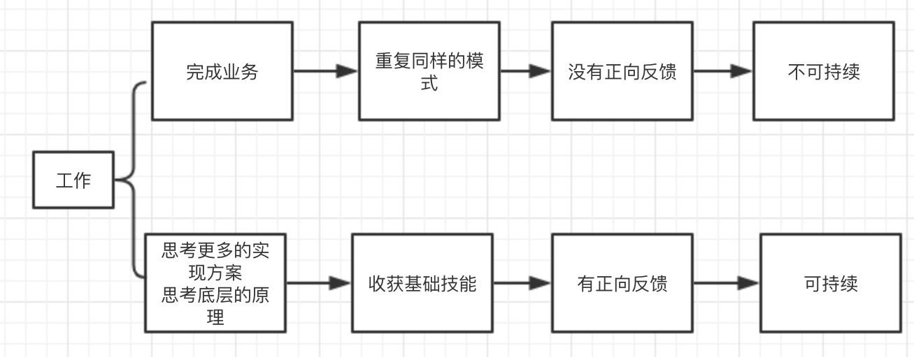

## 前言
  在开发公司内部web版聊天工具的时候,用户联系人数目是100+的.最近在思考如果每次都把100+的联系人进行渲染并且更新,这种实现是过度的.用户可能只操作20个联系人,浏览器却要为此付出多余的渲染性能.因此考虑通过虚拟列表来实现这个功能.虚拟列表只渲染可视区域,这样一定程度上降低了性能的消耗.本文主要通过react代码来描述如何实现一个简单的虚拟列表,在实际的生产环境还是推荐使用比较成熟的包,例如react-virtualized.在最后分享下自己在工作中的一点想法.
## 虚拟列表的简单实现
  使用虚拟列表的前提是容器的高度是固定的,渲染的每个条目的高度也是相对固定的,这样就能计算出容器能渲染出的条目.下面是页面的结构:  

    import React, { Component } from 'react';
    const allData = Array(1000).fill({ title: 'sss' }); //所有的渲染条目
    const styles = {
      container: {   // 外层容器样式
        height: '400px',
        border: '1px solid black',
        position: 'relative',
        overflow: 'auto',
      },
      openContainer: {  // 容器内通过定义一个空元素 高度为所有条目的高度,撑起父元素显示滚动条
        position: 'absolute',
        height: allData.length * 40 + 'px',
        left: 0,
        right: 0,
        top: 0,
        zIndex: -1,  //显示在列表条目下面
      },
      listContainer: {  // 列表容器
        position: 'absolute',
        left: 0,
        right: 0,
        top: 0,
      },
      listItem: {  // 列表条目
        height: '40px',
        lineHeight: '40px',
      },
    }
    class VirtualList extends Component {
      constructor(...args) {
        super(...args);
        this.state = {
          visibleData : [],  // 实际显示的条目
          visibleCount: 0,   // 显示的数据
          start: 0,  // 显示条目的起始位置
          end: 0,  //   显示条目的末位置
          itemHeight: 40, // 条目的高度
        };
      }
      render() {
        return (
        

          
 this.container = container} // 外层容器
            onScroll={(e) => {this.scrollHandle(e)}}
            style={styles.container}
          >
            

 // 撑起父容器,父元素展示滚动条
            
 this.listContainer = listContainer}>
                {this.state.visibleData && this.state.visibleData.map((item, index) => (
                

                  {item.title}
                
))}
            

          

        
);
      }
    }; 
接下来在组件挂载的时候,计算出容器可以显示的列表条目和初始显示的数据  

    componentDidMount() {
        const visibleCount = Math.ceil(this.container.clientHeight / this.state.itemHeight); // 计算实际应该显示的条目数
        const end = this.state.start + visibleCount; // 计算位置
        const visibleData = allData.slice(this.state.start, end);  // 计算应该展示的条目
        this.setState({ end, visibleCount, visibleData }); // 更新状态
      }  

在父容器绑定滚动事件,在滚动列表的时候,计算实际需要渲染的条目并且列表的位置.  

    scrollHandle(e) {
        const scrollTop = this.container.scrollTop;
        const fixedScrollTop = scrollTop - scrollTop % this.state.itemHeight;  // 计算到父容器顶部的距离
        this.listContainer.style.webkitTransform = `translate3d(0, ${fixedScrollTop}px, 0)`;  // 移动列表
        const start = Math.floor(scrollTop / this.state.itemHeight);
        const end = start + this.state.visibleCount;  
        const visibleData = allData.slice(start, end); // 重新计算需要显示的元素
        this.setState({ start, end, visibleData }); // 更新状态
    }

## 一些想法
在最近学习和工作的思考中,产生了几个想法:
1. 学习是一个需要渐进坡度的过程.在我刚开始工作的时候,自己还没有接触react并且对MVVM等概念也不是很明确.在对一些类库的使用之后比自己之前直接去看相应的文章更加能理解文章的意图.学习的坡度最好是渐进的.
2. 在工作上,在完成业务要求的时候的同时个人应该有更多的思考.让自己有一个正向的工作模式.

  

