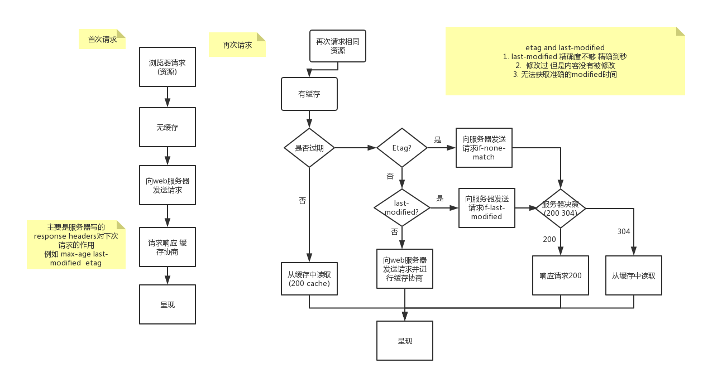

跨端开发中h5加载性能优化是一个老生常谈的问题。h5在开发上有着迭代快、试错成本低的优势，但是h5的性能问题也是一个无法绕过的问题。加载慢、体验差是通常在考虑技术选型时候的一个顾虑点。本系列会以Webview性能优化为切入点尝试了解跨端开发中的技术方案来更好的辅助业务的开发。

充分利用Webview的缓存(存储)机制能有效的提升h5的加载速度,通常有如下的方案可以实现缓存的过程:
* h5缓存机制
* Application Cache
* 浏览器存储

## h5缓存机制
h5缓存是指浏览器根据文件网络传输中的一些字段来确认是否使用已经缓存的文件，具体可以参考[缓存那些事](https://icantunderstand.github.io/blog/web-store)  

## Application Cache
Application Cache主要是做应用的离线化配置，它跟h5通过缓存头实现的缓存机制相对独立。通过在html中引入manifest属性开启Application Cache.

    <html manifest="example.appcache">
    ...
    </html>

    CACHE MANIFEST
    # Version 1
    // CACHE下声明的文件将在首次加载后进行缓存
    CACHE:
    script/scriptfilename1.js
    css/cssfilename.css
    images/imagename1.png
    images/imagename2.jpg
    images/imagename3.png
    // FALLBACK定义离线状态下的规则 
    FALLBACK:
    // images下的资源都将使用images/imagename4.png替代
    images/ images/imagename4.png
    // 缓存白名单 应用对Network下的请求都会绕过缓存请求服务器
    NETWORK:
    images/imagename5.png

    // 端侧在初始化Webview的时候开启Application Cache 
    WebSettings webSettings = webView.getSettings();
    // 允许执行JS
    webSettings.setJavaScriptEnabled(true);
    webSettings.setAppCacheEnabled(true);

在使用Application Cache需要注意以下几点:
* 有同源限制，缓存大小限制(5MB)
* 需要更新缓存文件的时候，需要同步更新manifest文件
* manifest声明中的文件无法下载时会导致无法更新到最新的缓存，浏览器将使用旧的缓存文件(推荐一些几乎不更新的文件使用Application Cache)
* 可以在业务代码中通过window.applicationCache相关api实现缓存资源的手动触发更新

## 浏览器存储
通过浏览器提供的api实现数据的存储和缓存功能。
### Dom Storage
Dom Storage指的是LocalStorage和SessionStorage。LocalStorage是持久存储，SessionStorage是会话存储。他们都通过key-value的方式来对简单的数据进行存储。Dom Storage存储空间为5MB有同源限制。

    WebSettings webSettings = webView.getSettings();
    webSettings.setJavaScriptEnabled(true);
    webSettings.setAppCacheEnabled(true);
    // Webview初始化开启Dom Storage
    webSettings.setDomStorageEnabled(true);

    // javascript
    // 设置键值
    window.localStorage.setItem('name', 'haha')
    // 读取键值
    window.localStorage.getItem('name')  // 返回"haha"
    
### IndexedDB
IndexedDB可以通过数据库的方式对数据进行存储，它的存储空间相对于Dom Storage大很多。通常可以基于封装IndexedDB的库来实现数据的存储。IndexedDB的使用方式可以参考[浏览器数据库 IndexedDB 入门教程](https://www.ruanyifeng.com/blog/2018/07/indexeddb.html)

## 参考
[ApplicationCache](https://webplatform.github.io/docs/apis/appcache/ApplicationCache/)  
[应用缓存初级使用指南](https://www.html5rocks.com/zh/tutorials/appcache/beginner/)  
[浏览器数据库 IndexedDB 入门教程](https://www.ruanyifeng.com/blog/2018/07/indexeddb.html)  