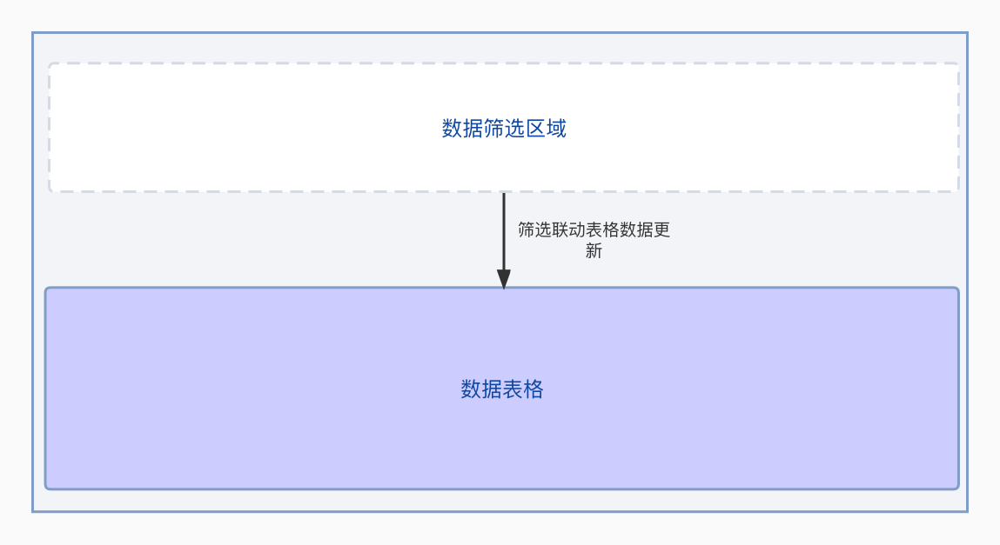
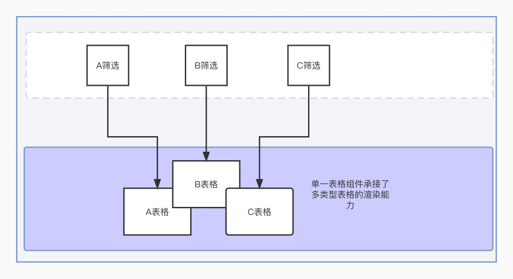
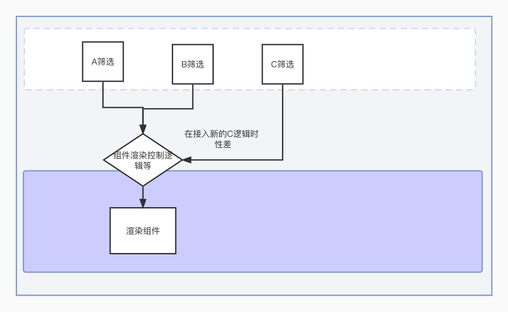
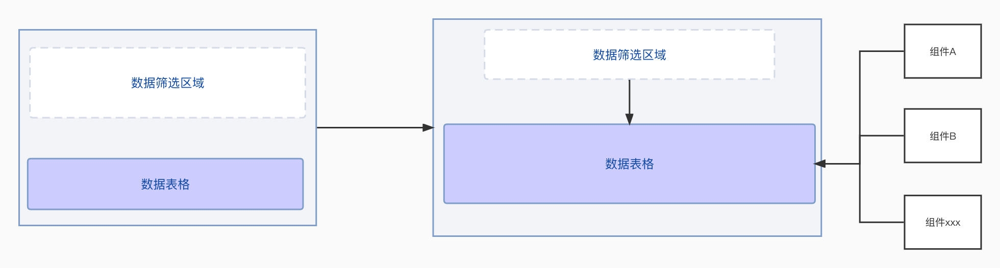
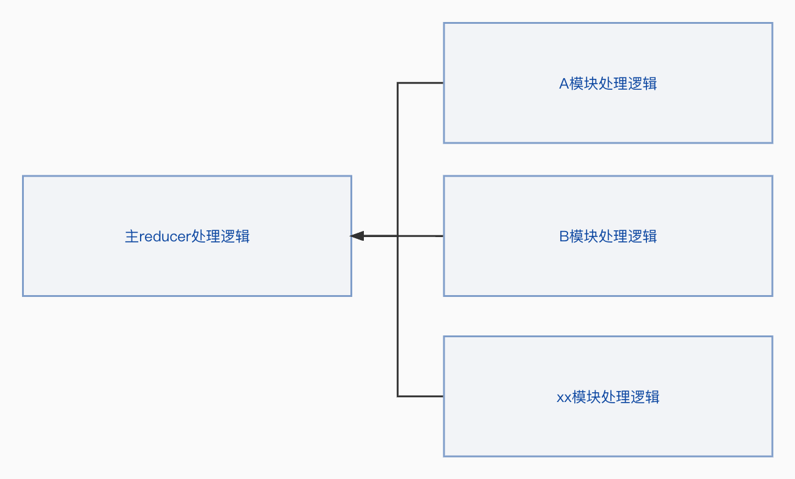
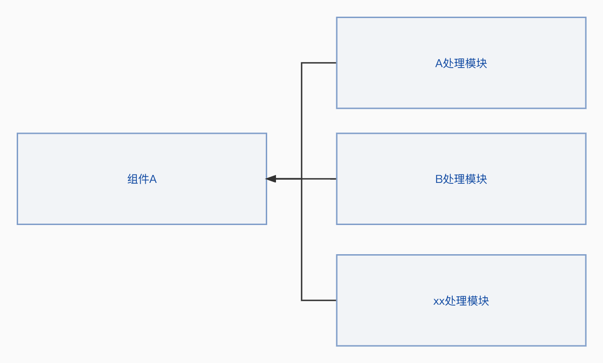
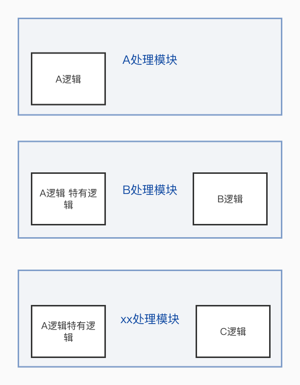

本文整体记录自己在优化项目代码的思路和实现过程，主要从以下的方面展开: 
* 项目背景(技术方案，迭代上遇到的问题) 
* 使用的优化方式
* 过程的总结思考

## 项目背景  
页面的整体结构可以简化成如下的结构:
* 顶部数据筛选区, 筛选数据变化触发表格数据更新
* 数据表格渲染区域
  
数据渲染区域有比较复杂的渲染逻辑，需要根据顶部的筛选区域做数据条目的渲染，因此之前的方案通过useReducer引入全局的store做数据的存储和处理。useReducer的方案在当时看并没有问题，但是随着业务的发展遇到了如下的问题，对业务的迭代产生了一些限制:
1. 表格组件存在一对多问题，随着业务的发展顶部的筛选区域会产生更多业务类型的表格，导致单一组件中存在较多的"非"业务相关处理逻辑 => 页面渲染逻辑不清晰、组件渲染逻辑复用度低
   
2. 在业务迭代中引入了新的概念去实现业务功能，这些概念在业务迭代过程中变得不在适用或者很难维护 => 提前封装

在上图中引入了一个统一的渲染处理逻辑,这个逻辑可以演化成字段、函数等，在业务的迭代中该业务逻辑可维护性差  
3. 代码组织结构混乱。部分文件超过千行难以维护。useReducer相当于低配版的redux，新功能的增加需要添加更多的模板代码 => 功能&代码组织缺少梳理

## 优化思路&思考
### 功能模块化&组件化
#### 组件化
在部分渲染逻辑上，依赖useReducer返回的全局store和dispatch方法触发action。这样有个问题是无法解耦业务组件与表格组件，表格组件和业务组件的逻辑不能有效的分离。代码缺少组件化，页面渲染逻辑不清晰
对这部分的思考是引入useContext，通过组件内部获取到全局的store对象从而解耦了组件渲染和表格组件的绑定关系。
  
#### 功能模块化 
useReducer函数因为模板代码的问题导致代码行数逐渐增多，这样就在修改代码和熟悉业务增加了成本，降低的维护性。这里引入了combineReducers的概念，在实现新业务的时候，将对应的useReducer处理逻辑封装成独立的模块，在主useRefucer函数中引入从而使实现逻辑模块化。
  
随着业务迭代，应该适当地对组件进行隔离维持好组件单一职责的本心，如果多个模块都有类似的能力但是业务逻辑不一致就不要在一个组件中维护过多的能力。可以在上层收口在实现层分离。  
  

### 引入新的技术方案降低模板代码
useReducer可以通过action的合理设计来减少模板代码，但是在增加新功能的时候，需要声明action、reducer处理逻辑，随着业务的迭代这些模板类代码会越来越重，这里引入的mobx方案去解决这个问题

### 对封装的思考  
在业务迭代比较频繁的模块，可以通过封装简单的util函数来达到代码的复用能力。随着业务迭代，直接对整体业务模块的封装会导致代码的可理解性、可维护性下降。（这里讨论的问题并不是降低封装而是延迟封装）  
在下图中，有多个业务处理模块都有使用A处理逻辑，但是在后续的模块中对A逻辑的能力都有限制和修改。如果在初期就抽离出A逻辑就会导致A逻辑中引入了后续模块的特定逻辑进而降低该模块的可维护性。在进行业务修改的时候覆盖的范围也是扩大的。
  
比较好的思路是在业务比较稳定的时候在对A逻辑进行区分，在组织逻辑上通过入口划分不同的业务细节。 

以上就是自己在业务代码优化上的一些实践和思考。代码的优化并不是一蹴而就的，是渐进式的。最开始的设计相当于建筑的地基，这个地基的好坏能一定程度上为项目保驾护航。代码的优化则是自身对业务理解梳理，对功能实现的总结思考，相当于对建筑的添砖加瓦，是个有意思的过程。

