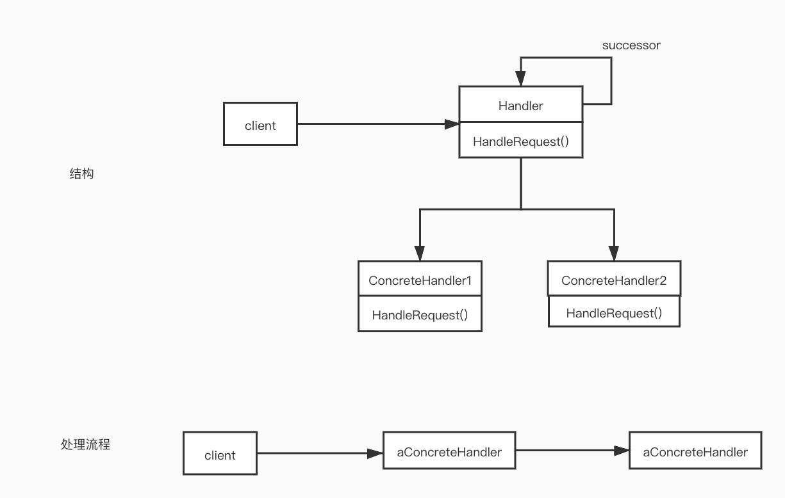

责任链模式将多个处理对象连成一条链并且沿着链传递该请求，直到有一个对象处理它为止。它实现了请求的发送者和接收者之间的解耦合。

## 结构

* Handler
定义一个处理请求的接口，实现后继链
* ConcreteHandler
实现Handler接口，如果可以处理该请求就处理否则将该请求转发给它的后继者
* Client
向链上的具体ConcreteHandler提交请求

## 适用性
* 当多个对象都可以处理请求且哪个对象处理请求是运行时刻动态确定的
* 在不想明确指定接收者的情况下，向多个对象的中的一个提交请求
* 可处理一个请求的对象集合应是动态指定的

## 优缺点
* 降低耦合度 请求对象无需知道是其他哪个对象在处理其请求
* 增强了给对象指派职责的灵活性  可以在运行中动态的对责任链中的对象进行添加或删除
* 不保证被接受  

## 实现

* 实现后继者链
* 连接后继者
* 表示请求

        class Handler {
        public:
            virtual void handleRequest(Request* theRequest)
            // _successor 实现后继链
            Handler(Handler* s) : _successor(s) {}
        private:
            Handler*  _successor
        }

        class ConcreteHandler: public Handler {
            public:
            handleRequest(Request* theRequest) {
                case:
                /* 省略若干判断*/
                default:
                /*转发给后继处理*/    
            }
        }

