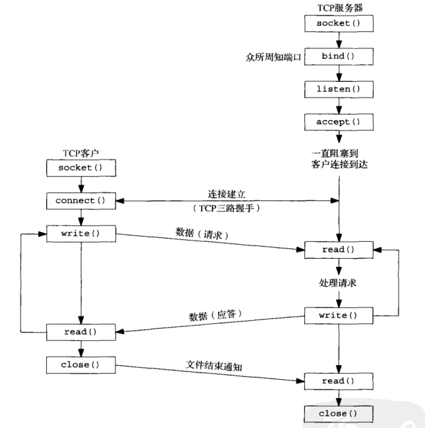

## 简介  
  网络套接字是应用层和传输层的桥梁。套接字提供了应用层与系统内核的交互的能力来完成数据的发送和接收.下面主要从套接字的几个基础api来介绍套接字并且结合tcp来理解网络应用对外提供服务的整体过程.
## 基础api
 1. 在使用套接字发送数据时将数据从应用进程的缓冲区写入到套接字的发送缓冲区，来完成数据的发送.
 2. 通过对套接字函数的调用可以获取套接口的一个描述(一个套接口可以对应多个套接字描述),当内核中不存在套接字的描述符的引用的时候,内核会触发该套接字的close.
 3. 基本TCP客户/服务器程序的套接字函数调用过程
 
  1. socket(int family, int type, int protocal) 默认产生一个主动的套接字 其中family字段指明协议族如Ipv4,Ipv6等, type为套接字类型如SOCK_STREAM(字节流套接字), SOCK_DGRAM(数据报套接字) protocal指的是由前两个参数决定的协议说明 例如tcp传输协议  UDP传输协议
  2. connect(int socket, const strcut *servaddr, socklen_t addrlen) 在TCP套接字状态下调用此方法会激发TCP的三次握手.几种常见的网络错误也是在这个阶段出现了
      * 如果发送了SYN,在经过TCP的超时重试之后仍然没有收到对应的ACK,此时显示ETIMEOUT超时
      * 收到RST(复位) 通常对应的对方没有正在监听的服务器、TCP想断开一个已有的连接、TCP收到一个不存在连接上的分节
  3. bind(int sockfd, const struct *myaddr, socklen_t addrlen)  将一个本地协议地址绑定到一个套接字
      * 在绑定地址上,在服务端上的一般都绑定到特定的端口 对IP地址进行0.0.0.0(INADDR_ANY)绑定(为了处理服务器有多个网络接口), 最后由系统内核指定IP地址  在客户端一般有内核指定IP地址和端口    
  4. listen(int sockfd, int backlog) 将一个从主动状态转为被动状态,指示内核接受指向该套接字的请求
      * backlog参数代表着未完成连接队列和已完成连接队列之和.在正常的三次握手的过程中,一个未完成连接的条目存活的时间是最后一次客户端对服务端ACK的确定(RTT)
      * 设置成较大的backlog是为了扩大为完成连接数目的队列.当为队列数目是满的时候,TCP会忽略该分组,这样TCP将重发SYN而不是显示连接错误等
  5. int accept(int sockfd, struct sockaddr *cliaddr, socklen_t *addrlen) 从已完成队列中返回一个已完成的连接
      * 区分监听套接字和已连接套接字  监听套接字在服务器的整个生命周期只存在一个,连接套接字是为每个接受的请求都会创建的
  6. fork 创建自身进程的一个副本
      * fork的调用会在父进程和子进程中进行返回,通过区分返回值来区分父进程和子进程
      * 子进程共享共享父进程fork之前的所有描述符(注意在fork的时候关闭对应的描述符)
  7. int shutdown(int sockfd, int howto) howto指明如何关闭改套接字是关闭读的部分还是写的部分,这样能防止关闭套接字时候无法处理到达的网路请求返回数据

## 相关参考链接
 [tcp backlog](http://veithen.github.io/2014/01/01/how-tcp-backlog-works-in-linux.html)
  

