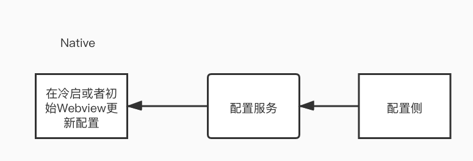
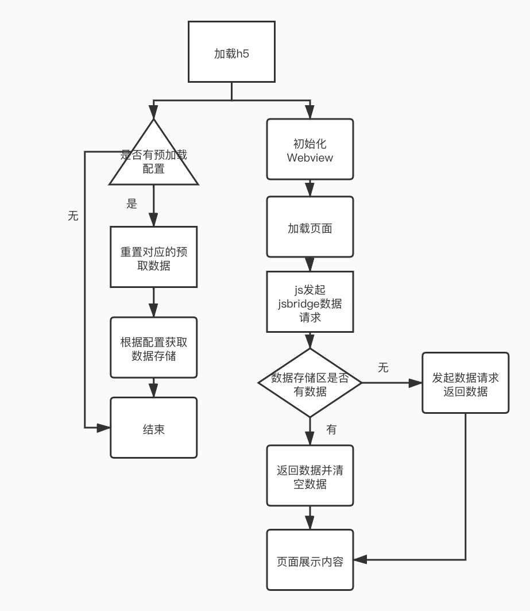

使用[缓存](https://icantunderstand.github.io/blog/webview-store)和[离线包](https://icantunderstand.github.io/blog/cross-platform-offline)可以一定程度上提前页面展示的时间，但是页面的展示依赖具体的数据加载，Webview在加载h5的时间线可以做如下简化:  
  
* Webview初始化 Webview在首次初始化会占用相对长的时间进行初始化(可以通过Webview池的方式来优化)
* DNS TCP TLS 建立与服务器的连接，可以通过html的预加载标签来优化(dns-prefetch, preconnect) 
* 数据请求响应阶段 在解析响应的html的时候会解析到js代码下载并执行发起数据请求(可以通过服务端渲染方案优化但是也增加了服务端成本需要考量)
从上面的分析可以看出在发起数据请求之前通过Native并行提前完成数据的读取就能换取页面提前展示给用户的时间，下面介绍一种可能的预取方案。

## 实现方案
本方案通过配置维护了对应url下需要预取的配置，在初始Webview的时候客户端并行完成数据获取，最后通过jsbridge获取数据。
### 预取配置
  
* 配置侧 提供配置能力，需要对配置有准入审核，管理(下线，上线)
* 服务侧 根据配置提供获取配置服务
* Native 动态拉取配置更新本地数据
### 加载流程
  
在加载h5的时候
* Native会在初始化Webview的时候并行的根据配置加载数据(动态参数根据页面url和配置完成映射)
* Webview展示的时候触发jsbridge请求，普通请求jsb与prefetch jsb的区别在于prefetch有一层从本地获取数据的步骤和数据的重置操作。

