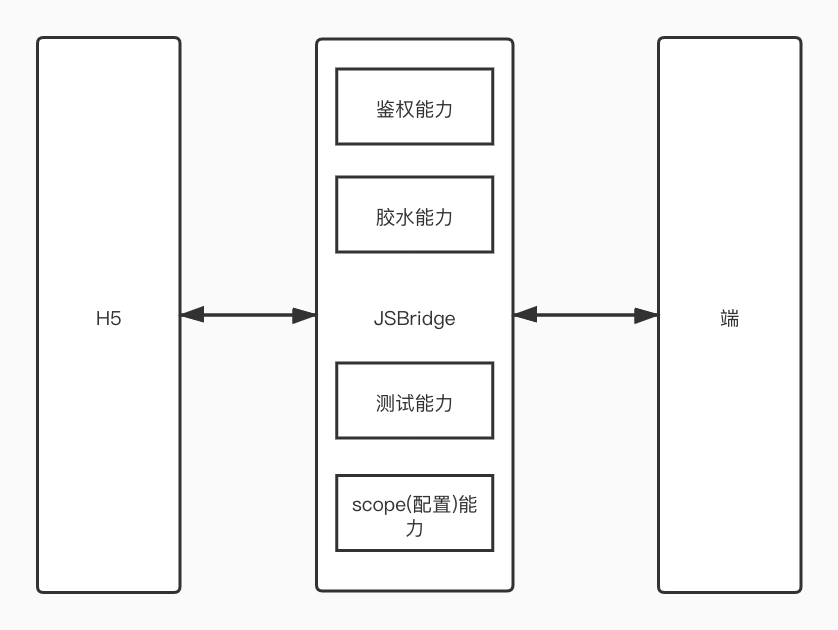
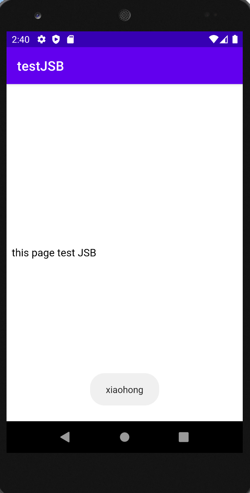
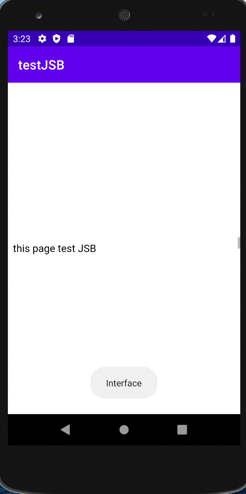
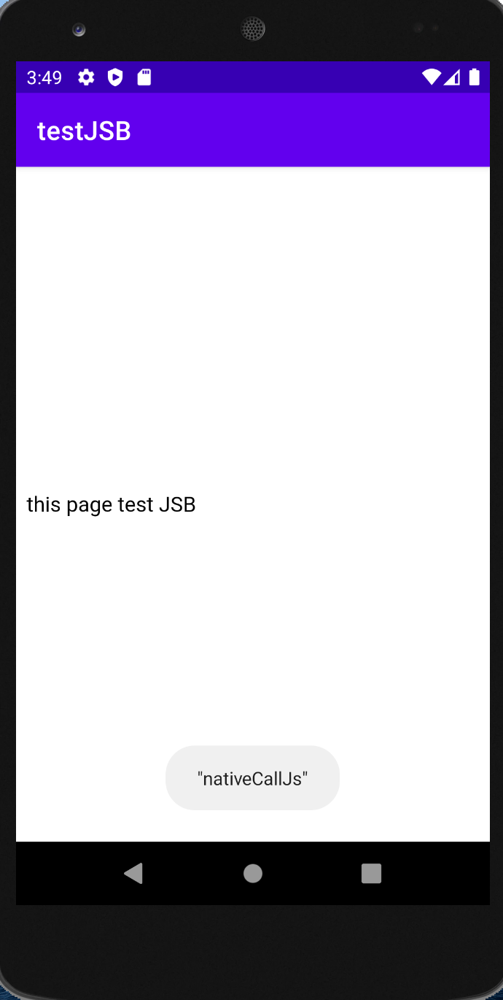

Hybrid混合开发相对于单一的客户端开发有着开发周期短，迭代快的优势，但是Hybrid模式开发的页面存在着一定的缺陷，比如性能问题、缺乏客户端能力等。通过JSBridge这个桥梁可以实现客户端能力的打通，赋予了Hybrid应用更强的端能力。
  
JSBridge作为客户端和H5的通信的桥梁，可以承接如下的能力:
* 鉴权能力 JSBridge调用能力鉴权，白名单，黑名单等
* 胶水能力 JSBridge兼容代码，做版本控制等调用透明
* 测试能力 提供测试方法，方便测试
* Scope(配置)能力 能基于配置产出精简版、目标版本JSBridge

下面以Android代码为例，介绍JSBridge的实现方式。
## Js调用Native
Js调用Native通常有如下的方案:
* 拦截请求(shouldOverrideUrlLoading/shouldInterceptRequest)
* 拦截特定方法(prompt/alert/confirm)
* 客户端注入JSBridge(addJavascriptInterface)  

### 拦截请求
在安卓初始化Wevview的时候可以设定WebViewClient，WebViewClient主要功能是处理Webview加载时的通知和请求事件等。通过重写WebViewClient的shouldOverrideUrlLoading/shouldInterceptRequest就可以实现拦截h5的请求从而实现端能力调用。
实现思路如下:
* 定义JSBridge实现Jsb方法
* 定义JSBManager管理Jsb的调用
* 实现拦截方法的重写
* H5侧调用

#### 定义JSBridge方法类  

    // 以下例子均省略import语句 
    public class JSBridge {
      // 需要考虑callback和入参一致性问题
      public void showToast(JSONObject jsonObject) {
          try {
              Toast.makeText(MainActivity.context, jsonObject.getString("content"), Toast.LENGTH_LONG).show();
          } catch(Exception e) {
          }
      }
    }
    
    
#### 定义JSBManager管理Jsb的调用 

    public class JsbManager {
      // 通过HashMap获取JSBridge定义的所有方法
      public static Map<String, Method> methodMap = new HashMap<>();
      public void init() {
          Method[] methods = JSBridge.class.getDeclaredMethods();
          for(Method method : methods) {
              methodMap.put(method.getName(), method);
          }
      }
    }

#### 实现拦截方法的重写
以下以shouldOverrideUrlLoading方法的重写为例子。在例子中定义的通信协议是myjsb://method?params。通过在拦截方法中对请求进行解析就可以实现调用对应客户端method的逻辑。 

    public class CustomWebViewClient extends WebViewClient {
        private JsbManager jsbManager = new JsbManager();
        private JSBridge jsBridge = new JSBridge();
        public void initJsb() {
            // 初始jsbManager和jsBridge实例
            jsbManager.init();
            jsBridge = new JSBridge();
        }
        @Override
        public boolean shouldOverrideUrlLoading(WebView view, WebResourceRequest request) {
            // 处理jsb 协议情况  只拦截jsb协议的url 其他放行
            Uri uri = request.getUrl();
            String scheme = uri.getScheme();
            if(scheme.equals(new String("myjsb"))) {
                // 获取方法名 入参
                String methodName = uri.getAuthority();
                String query = uri.getQuery();
                try {
                    JSONObject jsonObject = new JSONObject(query);
                    Method method = jsbManager.methodMap.get(methodName);
                    // 调用对应的客户端逻辑
                    method.invoke(jsBridge,jsonObject);
                } catch(Exception e) {
                    e.printStackTrace();
                }
            }
            return super.shouldOverrideUrlLoading(view, request);
        }
    }
    // 主活动代码逻辑
    public class MainActivity extends AppCompatActivity {
        @Override
        protected void onCreate(Bundle savedInstanceState) {
            super.onCreate(savedInstanceState);
            setContentView(R.layout.activity_main);
            // 创建WebViewClient
            CustomWebViewClient webViewClient = new CustomWebViewClient();
            // 调用JSBridge初始逻辑
            webViewClient.initJsb();
            WebView webView = (WebView) findViewById(R.id.webView);
            // 设置WebViewClient处理webviewt通知，请求等
            webView.setWebViewClient(webViewClient);
            // 开启调试功能
            webView.setWebContentsDebuggingEnabled(true);
            WebSettings webSettings = webView.getSettings();
            // 允许执行JS
            webSettings.setJavaScriptEnabled(true);
            // 这里加载项目本地的html文件方便调试
            webView.loadUrl("file:///android_asset/index.html");
        }
    }

#### H5侧调用  

        <body>
            
this page test JSB

            
        </body>

使用iframe发送消息的方式会存在消息丢失，参数限制等问题，可以通过消息队列和拦截shouldInterceptRequest方法来实现。
### 拦截特定方法
在初始化WebView的时候可以同步设置WebChromeClient，WebChromeClient主要是辅助WebView处理Js对话框，标题等操作，通过拦截WebChromeClient相应的方法同样可以实现调用端能力。 

#### 实现WebChromeClient 

    public class CustomWebChromeClient extends WebChromeClient {
        @Override
        public boolean onJsPrompt(WebView view, String url, String message, String defaultValue, JsPromptResult result) {
            // 此处举例为主 直接弹端toast
            // 实现上跟拦截url一致
            Log.d("mesage", message.startsWith("myjsb")+ "");
            if(message.startsWith("myjsb")) {
                Toast.makeText(MainActivity.context, "PropmtCall", Toast.LENGTH_LONG).show();
                // 此时js调起了 需要JsPromptResult.confirm(result)
                return true;
            } else {
                return super.onJsPrompt(view, url, message, defaultValue, result);
            }
        }
    }
    // 在初始化WebView的时候设置WebChromeClient
    CustomWebChromeClient webChromeClient = new CustomWebChromeClient();
    webView.setWebChromeClient(webChromeClient);

#### H5调用

        window.prompt('myjsb://')

### 客户端注入JSBridge
通过[addJavascriptInterface](https://developer.android.com/reference/android/webkit/WebView#addJavascriptInterface(java.lang.Object,%20java.lang.String))可以在初始化WebView的时候将客户端的调用逻辑暴露给H5。

#### 实现JSInterface

        public class JsInterface {
            private Context context;
            public JsInterface(Context context) {
                this.context = context;
            }
            // JsInterface需要用@JavascriptInterface注解才可以被调用
            @JavascriptInterface
            public void showToast(String content) {
                Toast.makeText(this.context, content, Toast.LENGTH_LONG).show();
            }
        }

        // 在初始WebView的时候注入interface
        webView.addJavascriptInterface(new JsInterface(context), "myjsb");

#### H5调用

        window.myjsb.showToast("Interface")  

## Native调用Js
Nativa调用Js通常有如下的方案:
* [loadUrl](https://developer.android.com/reference/android/webkit/WebView#loadUrl(java.lang.String))
* [evaluateJavascript](https://developer.android.com/reference/android/webkit/WebView#evaluateJavascript(java.lang.String,%20android.webkit.ValueCallback%3Cjava.lang.String%3E))

以下例子在H5中都定义了全局函数供Native调用

        function testNativeCall() {
          console.log("nativeCallJs")
          return 'nativeCallJs'
        }
### [loadUrl](https://developer.android.com/reference/android/webkit/WebView#loadUrl(java.lang.String))
可以通过webView.loadUrl("javascript: testNativeCall()")发起调用(需要等待Js执行完成)。loadUrl的方式会刷新页面且无法获取js的回调。

### [evaluateJavascript](https://developer.android.com/reference/android/webkit/WebView#evaluateJavascript(java.lang.String,%20android.webkit.ValueCallback%3Cjava.lang.String%3E))

    webView.evaluateJavascript("javascript: testNativeCall()", new ValueCallback<String>() {
        @Override
        public void onReceiveValue(String value) {
            return;
        }
    });

## 参考
[小白必看，JSBridge 初探](https://www.zoo.team/article/jsbridge)
[跨端技能必备之JSBridge](https://juejin.cn/post/6844903840588759048)
[从零开始写一个 JSBridge](https://juejin.cn/post/6844903856418062350)
