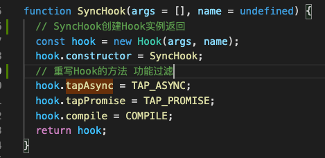
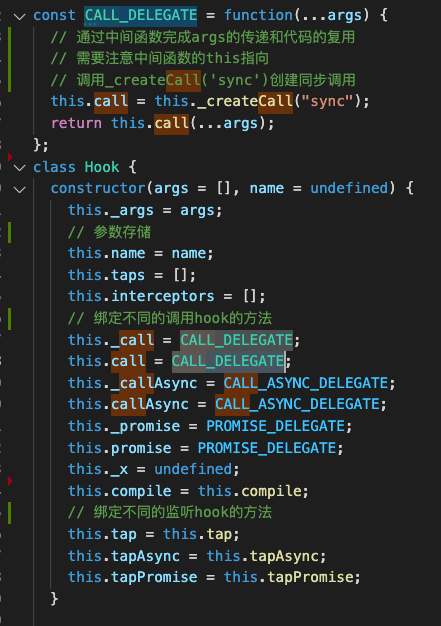
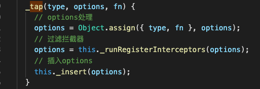
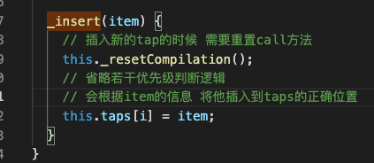
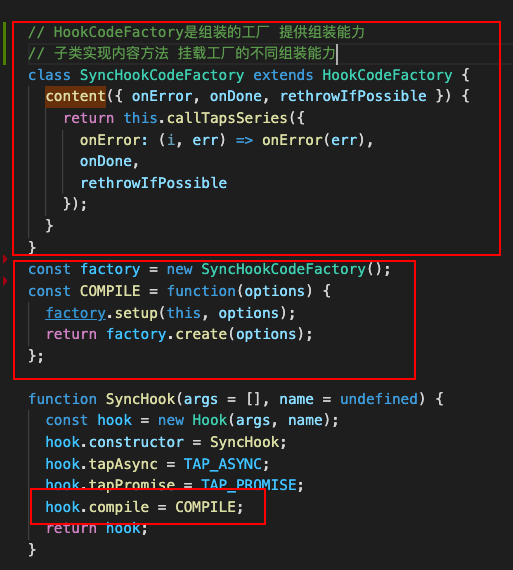
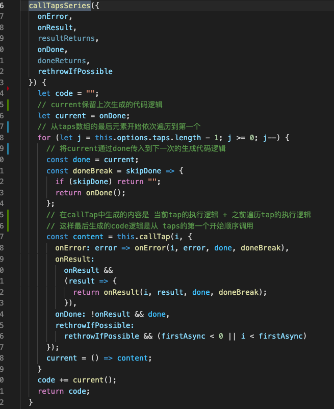

webpack是前端代码的打包工具,熟悉webpack的的工作流程和相关配置有利于在业务开发中更好的组织业务代码和实现一些特定的功能.webpack主要基于loader和plugin来实现代码打包过程:
* loader 主要提供了非js文件的处理能力 通过loader依次对目标文件进行编译
* plugin 主要通过webpack在编译期间的钩子来对编译过程进行干预  

webpack的钩子触发逻辑都是基于Tapable这个库来完成的,在深入浅出webpack这个系列文章中我们先从Tapable的源码开始逐步深入到webpack的源码中来了解webpack.

## Tapable的简单使用
Tapabel提供了多种类型的钩子和订阅钩子的触发方式,这里以SyncHook来梳理一个简单的钩子使用方式.

    const { SyncHook } = require('tapable')
    class Car {
      constructor() {
        this.hooks = {
          // 定义一个同步钩子 钩子的构造函数接受多个入参
          accelerate: new SyncHook(["newSpeed"])
        }
      }
      // 定义设置速度函数
      setSpeed(newSpeed) {
        this.hooks.accelerate.call(newSpeed)
      }
    }
    // 实例化
    const myCar = new Car()
    // 监听钩子accelerate的触发 
    myCar.hooks.accelerate.tap('acceletePlugin', (newSpeed) => { if(newSpeed > 100) {
      console.log('不能开太快呀')
    } })
    // 调用实例方法 设置速度 设置200的时候 会触发提示
    myCar.setSpeed(200)
    myCar.setSpeed(100)

通过上面的例子可以看到钩子的触发的逻辑是:  
* 创建钩子,定义钩子参数
* 订阅相应钩子的触发和拦截功能
* 触发钩子  

通过钩子的触发逻辑可以看出Tapable的实现逻辑可能是基于发布订阅的方式实现的,但是它里面对订阅的处理是怎么处理的呢、如何高效的触发呢? 这些都是成为一个优秀的库所必须要考虑的事情,我们就带着这些疑问来看Tapble的实现逻辑

## 源码逻辑
以下源码梳理以SyncHook钩子为切入点,分为以下三个模块梳理:
* 钩子的构造过程
* 订阅过程
* 触发阶段

### 钩子的构造过程
在通过new实例化[SyncHook](https://github.com/webpack/tapable/blob/acd0a66d3769120b1e9e5b66823475043237f30b/lib/SyncHook.js#L35)的时候在SyncHook的构造函数创建了底层Hook的实例并且重写了Hook的方法过滤了SyncHook不支持的功能

在底层[Hook的构造函数](https://github.com/webpack/tapable/blob/acd0a66d3769120b1e9e5b66823475043237f30b/lib/Hook.js#L25)中主要做了如下的处理:
1. 入参存储 
2. 创建不同方式钩子调起(call)逻辑
3. 创建不同方式钩子的监听(tap)逻辑  
  

### 订阅过程
在钩子实例化的过程中返回的实例绑定了不同监听钩子触发的监听函数,这里我们调用[tap](https://github.com/webpack/tapable/blob/acd0a66d3769120b1e9e5b66823475043237f30b/lib/Hook.js#L77)函数的时候,会调用内部_tap函数并且传入绑定的sync参数和入参.在_tap函数中对入参进行了处理和过滤器处理
  
在[_insert](https://github.com/webpack/tapable/blob/acd0a66d3769120b1e9e5b66823475043237f30b/lib/Hook.js#L136)中会根据当前监听项的信息将它插入到taps的正确位置.
  

### 触发过程
在触发过程中是通过调用hook实例上的call方法,这里我们先梳理出call的实现过程然后在从源码的进行分析
  
[SyncHook](https://github.com/webpack/tapable/blob/acd0a66d3769120b1e9e5b66823475043237f30b/lib/SyncHook.js#L40)实现的父类的抽象方法compile,compile方法也是基于基础类HookCodeFactory组装实现的  
  
在[HookCodeFactory的create](https://github.com/webpack/tapable/blob/acd0a66d3769120b1e9e5b66823475043237f30b/lib/HookCodeFactory.js#L14)方法中通过调用contentWithInterceptors进而调用子类SyncHookCodeFactory的content方法,在子类SyncHookCodeFactory的content绑定的SyncHook的实现逻辑callTapsSeries.
在[callTapsSeries](https://github.com/webpack/tapable/blob/acd0a66d3769120b1e9e5b66823475043237f30b/lib/HookCodeFactory.js#L276)中主要完成了订阅数组taps的代码串联逻辑最后返回new Function完成call的调用逻辑  

以上梳理了tapable中从生成钩子到触发钩子整个过程,可以看到在实现上tapable许多比较巧妙的安排
1. Hook基类实现了所有钩子的创建方式 子类可以通过组合或者过滤对应的实现来实现不同的钩子
2. 在HookCodeFactory基类定义的工厂函数的不同组装方式,子类通过父类的接口自定义了不同的实现方式
3. 在实现call方法的时候 会使用上一次创建的结果函数

