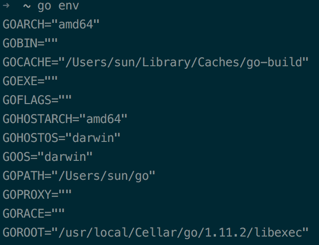
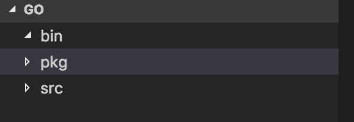

## go语言简介
go语言是一种编译型语言,在设计上融入了设计者对复杂项目中易出现问题的思考,go语言在设计上突显了简单性.这种简单性在长期来看是会为项目带来收益的.下面主要从go的环境配置开始进而通过一个简单的go程序来认识go.

## go环境配置
当go安装完毕后,可以通过go env来查看相应的环境配置,如图
    
其中GOPATH,GOROOT是我们需要关注的两个配置.GOPATH指定的工作区间的根目录,在GOPATH下通常有三个目录:

在src目录下的每个子目录是一个包.pkg子目录是构建工具存储编译后的包的位置.bin子目录放置可执行程序.GOROOT主要提供标准库的包.

### go语言的基础结构-hello world
在GOPATH下的src目录创建helloworld文件夹,在该文件夹中创建helloworld.go.(通常文件的名字都跟包名一致),通过在命令行使用go run hellowrld.go

    package main // 定义包名
    import (
      "fmt"  // 导入包
    )
    //  main函数可执行程序的主入口
    func main() {
      var a = "hello world"  // 定义变量并且在控制台输出
      fmt.Print(a)
    }
## go中的包
### 包的初始化
包的初始化从初始化包级别变量开始,按照这些变量的声明顺序进行初始化,对于一些复杂的初始化场景,可以定义init函数来初始化变量,在其他包对当前包进行引用的时候,init函数会被调用.

    var a = b + c
    c = 100
    b = f()
    func f() {
      return 1
    }  // 会按照 c b a 的顺序依次初始化
### 包的命名
在go源文件的开头都需要进行包名的声明,同一个包下的所有源文件同属一个包(有一个例外是当前go文件是一个可执行的go程序时,只能声明main包来生成可执行的文件)
### 包的引入
包是go实现代码复用的一种主要形成.在声明包名之后,可以通过import语句对需要使用的包进行引入.通常有下面几种方式导入对应的包:

    import (
      "fmt"  //正常导入
      XXX "fmt" // 别名导入 XXX可以作为fmt包的别名来使用
      _ "image/png" // 空导入 通常为了执行包的初始化函数来获取副作用
      import "github.com/xxx" // 导入远程包
    )
包的查找是先查找go的安装目录,然后GOPATH
## 声明
实体的声明主要有以下的规则:
1. 如果声明的实体在函数体内,该实体只在函数局部(存在块级作用域)有效.实体声明在函数外,该声明对当前包所有的文件可见.
2. 实体的第一个字母的大小写决定其是否可以被其他包调用  

### 变量声明  
在go语言中可以通过下面的几种方式来创建和声明变量. 
#### 常规变量声明

    var name type = expression
上面这种声明方式指定了变量的类型和初始值表达式,类型和表达式可以忽略一个:
1. 当类型忽略的时候,变量的类型会由初始化表达式的类型决定
2. 当初始化表达式忽略的时候,变量的初始值对应着相应类型的零值.
3. 当把一个类型的变量赋值给另一个类型的时候,需要通过显示转换.  

#### 短变量声明

    name := expression
上面这种方式称为短变量声明,这种方式声明的变量类型由表达式返回的类型决定.在使用短变量声明的时候,需要注意一下两点:
1. 短变量声明在左侧已经存在对应变量的声明的时候,相当于赋值
2. 短变量声明要求至少声明一个变量  

#### new操作符
new(T)创建一个未命名的T类型变量并且初始化T类型的零值,返回其地址(指针).

    p := new(int) // 初始化一个int类型的变量返回地址
    fmt.Println(*p) // 输出0
    *p = 2
    fmt.Println(*p)  // 输出2

#### 指针

    x := 1
    p := &x  // &操作符获取变量地址 复制给一个int类型的指针p
    fmt.Println(*p) // 输出1 *操作符获取指针指向的变量的值
    *p = 2 // 通过指针修改变量的值 
    fmt.Println(x) // 输出2

#### 变量的生命周期和作用域

##### 生命周期
1. 包级别变量存在于整个程序的执行时间
2. 局部变量有动态的声明周期,在执行声明语句的时候会创建一个新的实体.当局部变量不可访问时会被回收.  

        a := []int{1,2,3,4,5}
        for _, num := range a {
          fmt.Printf("%d", num)  // num变量在每次循环创建
        }  

##### 作用域
作用域指的是用到对应变量声明的源代码段。go语言中声明的作用域是词法块的，词法块决定着声明作用域的大小。
        
### 变量赋值
1. 在进行变量赋值的时候,go语言有对应的类型检测(例如你不能把一个int类型赋值给string类型的变量).
2. 支持多重赋值语法 

        x,y := 1, 2
        x, y = y, x

### 类型声明
类型声明提供了一种方式来区分底层类型的不同或者不兼容的使用方式。相同类型的值可以与其相同类型的值或者底层类型相同的未命名类型的值相比较，不同命名类型的值不能直接比较.

    type name string
    type id string

    func main() {
      var a name = ""
      var b id = ""
      fmt.Println(a == b) // 这里会报错 a b 不是相同的类型无法比较
    }

## 参考
[go命令行使用](https://golang.google.cn/cmd/go/)