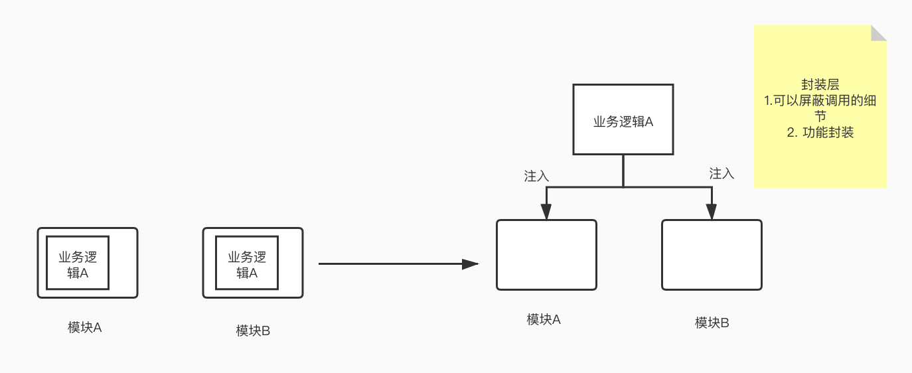
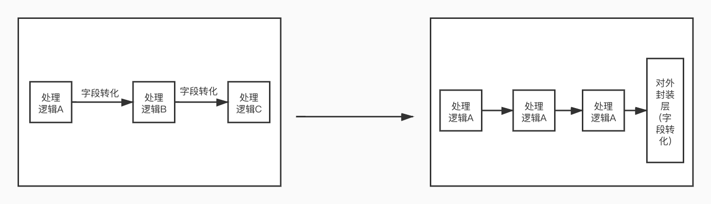
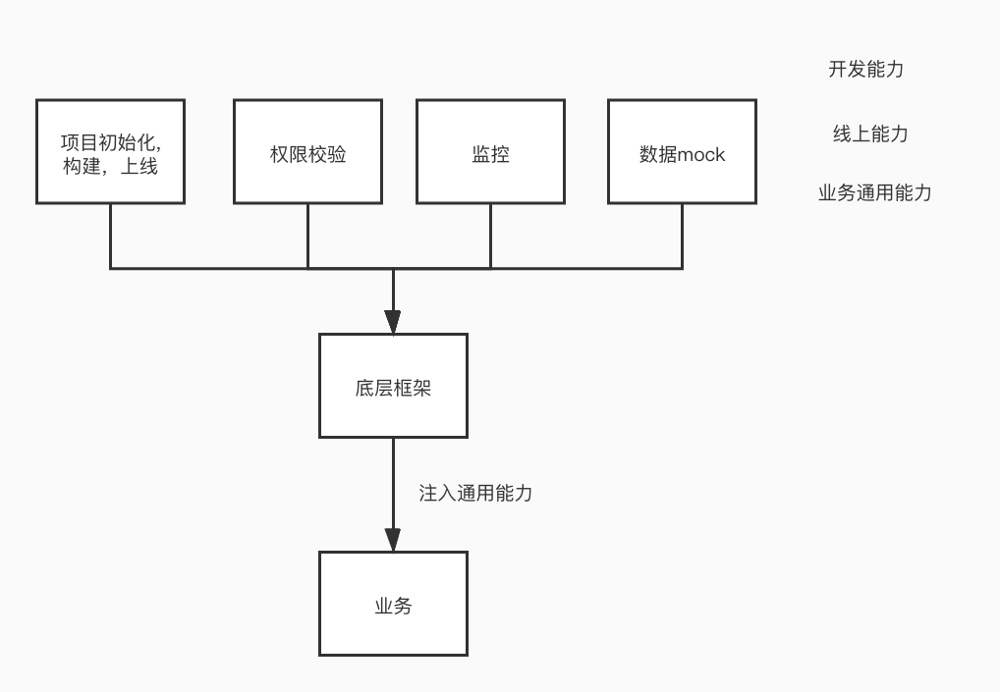

代码的维护并不是一蹴而就的,在业务的维护阶段如果不能对项目代码进行有效的治理,就会导致业务代码逐渐臃肿可维护性降低.
## 功能分离&整合
在业务发展的过程中最初单一的功能衍生出不同的业务模式和逻辑.通过对代码有序的梳理能更好的帮助后续的迭代降低维护成本.

### 功能(逻辑)聚合
1. 相同功能提取至上层(工具包)减少逻辑的分散，增加封装性  

### 功能隔离(边界划分)
1. 代码仓库(功能)要进行合理的划分(划分维度 业务相关性/技术栈形式),防止不同业务间的互相干扰.
2. 在提供业务功能的时候，内部逻辑可以减少对外层逻辑的解释，在边界出封装外层的解释逻辑。举个简单的例子比如前端在处理日期在处理Date对象构造函数new Date(year, month,day)的时候，month是0-11区间的,但是在对外提供的时候需要转化成0-12区间，那么在内部处理时可以尽量减少month的转化，保持一致的含义，在暴露出对外的接口中统一提供转化

## 规范建立
1. 编码规范(lint commit rule)
2. 分支规范(上线规范)
3. review机制(如何能更好的长期review而不是过场? 业务master?)
4. 语义化(可读性)、注释
5. 目录规范化(统一引用方式)

## 基于业务的框架(功能复用)
造轮子是在技术/业务发展都一定阶段的诉求.通过将开发能力、线上能力、业务通用逻辑下沉到框架层,让框架去约束业务并给业务赋能.

## 渐进的变化
### 延迟抽象
延迟对代码进行抽象逻辑的封装，过度的提前封装会导致封装模块不利于维护，后续不同模块功能产生分歧大的时候，进行功能的拆分也是很痛苦的。在下面的例子中初期可以只封装最底层的模块，后期在进行业务逻辑的向上封装提取

代码是与机器交互的语言,也是开发者之间交流的一种方式.之所以要提倡编写可维护的代码是希望在同一个团队中形成统一的方言.这种独特的方言要在一定程度上提高开发的效率(不好的方言有可能降低开发效率).也许团队这段时间会使用这种方言,过段时间会换另一种方言.自己的建议是多思考,多想想方言之间的不同,为什么这种模式会适应现在的场景,慢慢的你就会建立一种你自己的方言或者思考问题的方式.

## 参考
[代码质量与规范，那些年你欠下的技术债](https://juejin.im/post/5b3ae175f265da63252c2f21)  
[好的提高代码质量的方法有哪些](https://www.zhihu.com/question/20017545)  
[Goodbye, Clean Code](https://overreacted.io/zh-hans/goodbye-clean-code/)