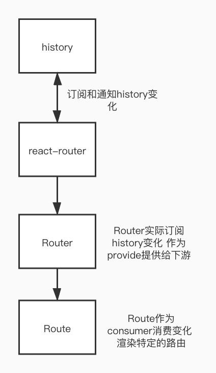

## 概要
本文主要梳理前端路由的实现方案，按照如下的逻辑进行梳理：
前置知识 => 路由方案现状 => 从源码的解读理解前端路由的实现过程

## 前置知识
### history
| 方法(属性) | 含义 |
| ------ | ------ | 
| history.length | 只读, 代表当前会话历史的长度  | 
| history.state | 只读, 代表当前会话栈顶的state |  
| history.go(number) history.forward() history.back()  | 从当前会话加载特定的页面,会触发popstate事件   | 
| pushState(state, title, url) |   在当前会话的添加一个新的记录(关联state) url参数需要保证同源策略    |
| replaceState(state, title, url) | 替换当前会话栈顶的记录(不会增加history长度,关联state) url参数需要保证同源策略    |

#### history相关事件
当用户触发浏览器动作或者js调用history.back/history.forward/history.go方法时,会触发popstate事件。

### hash相关事件
1. 当url片段标识符改变(#xxx), 会触发hashchange事件。
2. 当设置与当前不同的hash片段的时候，会在当前会话中添加一个新的记录。

## 路由方案现状
| 方案 | 原理 | 优缺点 | 
| ------ | ------ | ------ | 
| 基于history实现的路由方案 | 使用history相关事件和方法完成路由的切换  | history可以设置同源下的任意url，需要注意与服务端结合的场景，防止出现404 |
| 基于hash实现的路由方案 | 使用hash相关事件完成路由的切换 | hash只能改变当前url的#，有局限性 |

## 从源码的了解路由的实现过程
以下源码分析了history路由的实现过程,源码涉及[history](https://github.com/ReactTraining/history), [react-router](https://github.com/ReactTraining/react-router).整体的实现逻辑如下  

 

下面代码是在react项目中使用history路由实现的一个例子，它能实现根据特定的path来渲染对应的组件。

    import './App.css';
    import React from 'react'
    import {
      BrowserRouter as Router,
      Switch,
      Route,
    } from "react-router-dom";
    function App() {
      return (
        <Router >
          <Switch>
            <Route exact path="/">
                
home

              </Route>
              <Route path="/about">
                
about

              </Route>
              <Route path="/dashboard">
                
dashboard

              </Route>
          </Switch>
        </Router>
      );
    }
    export default App;

react-router/packages/react-router-dom/modules/BrowserRouter.js

    import React from "react";
    import { Router } from "react-router";
    import { createBrowserHistory as createHistory } from "history";

    class BrowserRouter extends React.Component {
      history = createHistory(this.props);

      render() {
        // 初始化browser history 可以推断出路由的切换逻辑是history与Router结合的实现
        return <Router history={this.history} children={this.props.children} />;
      }
    }
    export default BrowserRouter;
    
packages/index.ts

    // 在最后执行跳转的时候 会执行所有的listen函数
    function applyTx(nextAction: Action) {
      action = nextAction;
      [index, location] = getIndexAndLocation();
      listeners.call({ action, location });
    }
    let history: BrowserHistory = {
      // 以下为主要的跳转函数，在实现跳转逻辑的时候都调用了applyT方法。
      push,
      replace,
      go,
      back() {
        go(-1);
      },
      forward() {
        go(1);
      },
      // listion方法用于增加路由切换的监听函数
      listen(listener) {
        return listeners.push(listener);
      },
      // block方法允许传入一个block函数,在路由跳转的时候会执行所有的blocker函数
      block(blocker) {
        let unblock = blockers.push(blocker);
        if (blockers.length === 1) {
          window.addEventListener(BeforeUnloadEventType, promptBeforeUnload);
        }
        return function() {
          unblock();
          if (!blockers.length) {
            window.removeEventListener(BeforeUnloadEventType, promptBeforeUnload);
          }
        };
      }
    };
    return history;

从上面history源码看出，history这个库主要是维护history的相关状态(state, location, hash)并且增加路由跳转的告知能力.

react-router/packages/react-router/modules/Router.js

    import React from "react";
    import HistoryContext from "./HistoryContext.js";
    import RouterContext from "./RouterContext.js";
    class Router extends React.Component {
      static computeRootMatch(pathname) {
        return { path: "/", url: "/", params: {}, isExact: pathname === "/" };
      }
      constructor(props) {
        super(props);
        this.state = {
          location: props.history.location
        };
        this._isMounted = false;
        this._pendingLocation = null;
        if (!props.staticContext) {
          // 这里订阅了history的变化并且在变化的之后更新location
          this.unlisten = props.history.listen(location => {
            if (this._isMounted) {
              this.setState({ location });
            } else {
              this._pendingLocation = location;
            }
          });
        }
      }
      componentDidMount() {
        this._isMounted = true;
        if (this._pendingLocation) {
          this.setState({ location: this._pendingLocation });
        }
      }
      render() {
        return (
          // 将location作为context 在需要订阅的位置获取   Route消费location完成特定children的渲染。
          <RouterContext.Provider
            value={{
              history: this.props.history,
              location: this.state.location,
              match: Router.computeRootMatch(this.state.location.pathname),
              staticContext: this.props.staticContext
            }}
          >
            <HistoryContext.Provider
              children={this.props.children || null}
              value={this.props.history}
            />
          </RouterContext.Provider>
        );
      }
    }
    export default Router;

 

