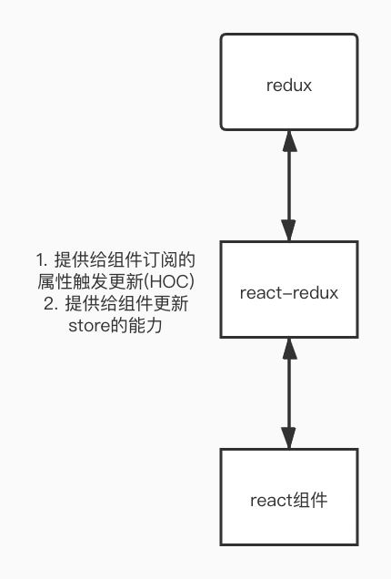
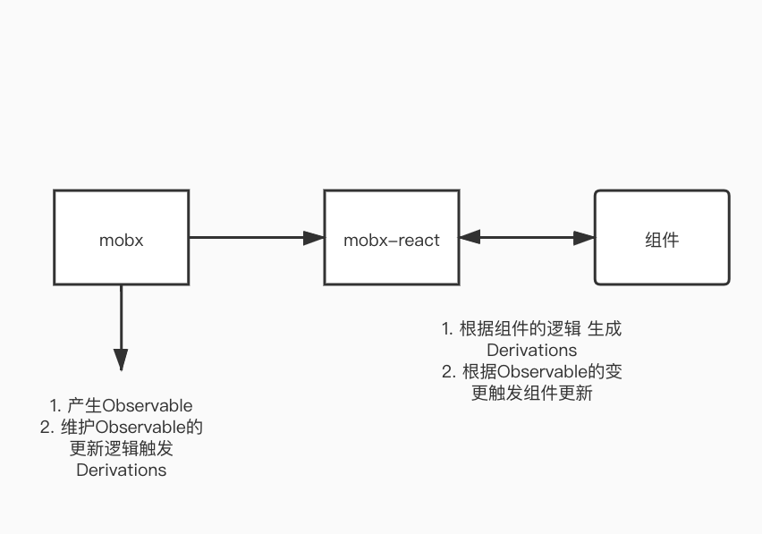

页面开发中数据在组件之间共享和同步是一个比较常见的问题，通过状态管理可以实现清晰的数据流和组件状态同步能一定程度上减少业务的复杂度。本文主要对比Redux和Mobx的实现细节来深入状态管理的技术实现，这样在做技术选型的时候能有一定的考量
##  1. [redux](https://github.com/reduxjs/redux)

###  1.1. redux的思路

1. redux通过全局的store来统一管理数据，通过订阅机制实现数据变更的通知
2. redux引入函数式编程的概念，约定通过action来触发全局store的更新，单向数据流能一定程度上降低业务的复杂度
  
###  1.2. redux简单使用  

    import { createStore } from 'redux';
    const action_type = 'test';
    const init = {
      count : 1,
    }
    const reducer = (state = init, action) => {
      switch(action.type) {
        case action_type: {
          return { count: state.count + 1  }; 
        }
        default: {
          return state;
        }
      }
    }
    const store = createStore(reducer);
    store.subscribe(() => {
      console.log(store.getState()); // { count: 2 }
    })
    store.dispatch({
      type: action_type,
    })
* redux通过createStore(reducer, preloadState, storeEnhancer)函数来生成状态管理的store.  
* store提供getState()来获取当前的状态  
* dispath(action)更新应用的状态  
* subscribe(listener)来订阅状态变更时触发的事件.
通过上面的分析可以看出redux实现了一套发布订阅的机制来实现状态的变更和通知,下面将深入redux的源码来了解redux的具体实现
###  1.3. redux源码解析
以下源码部分基于redux@4.0.1,为了整体介绍redux的整体流程,只保留了关键的部分并且进行了一部分修改.
####  1.3.1. createStore
createStore(reducer, preloadedState, enhancer)接受reducer,状态初始值,store增强函数来生成应用的store

    export default function createStore(reducer,preloadedState, enhancer) { 
      let currentReducer = reducer;
      let currentState = preloadedState;
      let currentListeners = [];
      let nextListeners = currentListeners;
      // 如果存在enhancer函数,通过enhancer函数创建store
      if (typeof enhancer !== 'undefined') {
        if (typeof enhancer !== 'function') {
          throw new Error('Expected the enhancer to be a function.')
        }
        return enhancer(createStore)(reducer, preloadedState)
      }

      // 获取当前应用的状态
      function getState() {
        return currentState;
      }
      
      // 订阅当状态更新的监听函数.
      // 返回取消当前监听函数的方法,用于取消订阅对应监听函数
      function subscribe(listener) {
        nextListeners.push(listener);
        return () {
          const index = nextListeners.indexOf(listener);
          nextListeners.splice(index, 1);
        }
      }

      // 执行action的变更并且执行监听函数
      function dispatch(action) {
        currentState = currentReducer(currenState, action);
        const listeners = (currentListeners = nextListeners)
        for (let i = 0; i < listeners.length; i++) {
          const listener = listeners[i]
          listener();
        }
        return action;
      }

      return {
        getState,
        cubscribe,
        dispatch,
      }
    }

####  1.3.2. combineReducer
combineReucer(reducer)可以将多个reducer函数组合起来,接受action并改变状态.combineReducer解决了将所有的更新逻辑写到一个文件的问题

    export default function combineReducers(reducers) {
      const reducerKeys = Object.keys(reducers);
      const finalReducers = {};
      // 生成finalReducers
      for (let i = 0; i < reducerKeys.length; i++) {
        const key = reducerKeys[i]
        if (typeof reducers[key] === 'function') {
          finalReducers[key] = reducers[key]
        }
      }
      const finalReducerKeys = Object.keys(finalReducers);
      //  返回的函数是实际调用creaStore()的第一个入参,这样就能接受action来改变应用的状态了
      return function combination(state = {}, action) {

        let hasChanged = false;
        const nextState = {};
        // 对action执行所有的传入的reducer函数
        for (let i = 0; i < finalReducerKeys.length; i++) {
          const key = finalReducerKeys[i]
          const reducer = finalReducers[key]
          const previousStateForKey = state[key]  // 对应reducer之前的state
          const nextStateForKey = reducer(previousStateForKey, action) // 对应reducer接受action之后的状态
          nextState[key] = nextStateForKey  // 将处理过后的值存储
          hasChanged = hasChanged || nextStateForKey !== previousStateForKey
        }
        // 如果改变返回nextState, 否则返回之前的状态
        return hasChanged ? nextState : state
      }
    }

####  1.3.3. applyMiddleware
applyMiddleware是redux提供对外部进行扩展的途径,通常情况下dispatch只能接受一个对象来对状态进行修改,通过添加不同的中间件,对dispatch进行增强,可以使它接受更多的类型(function, promise)和实现更多的功能, 下面先从一个使用中间件的实例来了解appleMiddleware到底做了什么.

    function thunkMiddleware({ dispatch, getState }) {
      return  next => action => {
        if (typeof action === 'function') {
          return action(dispatch, getState);
        }

        return next(action);
      };
    }
    const store = createStore(reducer, { count: 1 }, applyMiddleware(thunkMiddleware))
    store.subscribe(() => {
      console.log(store.getState());
    })
    store.dispatch(() => {
      console.log(1);
      return { type: action_type };
    });
通过上面的例子,dispatch就能接受函数类型并且执行对应的函数,下面来了解appleMiddleware的源码是怎样实现的。applyMiddleware返回的是store的enhancer,在createStore的代码部,在传入enhancer的时候,执行的是enhancer(createStore)(reducer, preloadedState).
    
    function compose(...funcs) {
      if (funcs.length === 0) {
        return arg => arg;
      }

      if (funcs.length === 1) {
        return funcs[0];
      }

      return funcs.reduce((a, b) => (...args) => a(b(...args)));
    }

    export default function applyMiddleware(...middlewares) {
      return createStore => (...args) => {
        // ..args 是传入的reducer, proloadedState 来生成store
        const store = createStore(...args);
        const middlewareAPI = {
          getState: store.getState,
          dispatch: (...args) => dispatch(...args)
        }

        // 将middlewareAPI注入到每个middleware
        const chain = middlewares.map(middleware => middleware(middlewareAPI));
        // next的注入,将多个中间件关联,返回的dispatch已经被增强
        dispatch = compose(...chain)(store.dispatch);
        return {
          ...store,
          dispatch
        }
      }
    }

####  1.3.4. redux结合react  
  
React-Redux的作用是将React组件和Redux绑定，React组件可以通过react-reudx完成数据的获取和更新。其中connect函数就是这个功能，通过下面的代码可以看出connect主要是从redux或者context中获取属性通过高阶组件的方式返回包裹组件。

    const Connect = _Connect as ConnectedComponent<
      typeof WrappedComponent,
      WrappedComponentProps
    >
    Connect.WrappedComponent = WrappedComponent
    Connect.displayName = ConnectFunction.displayName = displayName

    if (forwardRef) {
      const _forwarded = React.forwardRef(function forwardConnectRef(
        props,
        ref
      ) {
        // @ts-ignore
        return <Connect {...props} reactReduxForwardedRef={ref} />
      })

      const forwarded = _forwarded as ConnectedWrapperComponent
      forwarded.displayName = displayName
      forwarded.WrappedComponent = WrappedComponent
      return hoistStatics(forwarded, WrappedComponent)
    }

##  2. Mobx  
mobx将响应式编程的概念引入到状态管理的实现上，通过观察者模式实现组件的更新。相比redux他的优势在于:
1. 在组件更新上性能更好 redux通过发布订阅的模式会在所有的组件上进行Prop的脏检查，mbox通过proxy依赖收集能更精确的控制组件的更新
2. 长期维护上存在一定优势 mbox基于proxy内部维护了更新的机制，redux需要通过mapStateTpProps来主动告知订阅的属性存在一定维护成本

### mobx背景介绍
  
* Observable  定义可观察的值，当observable值变化的时候会触发Derivations  
* Derivations Derivations主要为Computed values和Reactions，可观察值的改变会触发对应的Derivations触发  
* Actions actions触发Observable值的更改进而触发Derivations  
### mobx简单使用

    import { observable } from "mobx";
    import { observer } from 'mobx-react'
    // 定义一个可观察的值
    var timerData = observable({
      secondsPassed: 0
    });
    // 定义了观察者 当secondsPassed发生变化的时候会触发组件更新
    const Timer = observer(({ timerData }) =>
        Seconds passed: { timerData.secondsPassed } 
    );
    setTimeout(() => { timerData.secondsPassed = 33 }, 2000)

    function App() {
      return <Timer timerData={timerData} />
    }

### mobx源码解析  
使用mobx实现组件更新的方式如下:
* mobx实现创建Observable值和触发Derivations
* mobx-react实现对react组件的封装，创建基于组件的Derivations从而在对应的Observable值修改的时候完成组件的更新
 

#### mobx生成Observable
Observable会根据传入的值类型包装生成代理，在对观察值获取和设置的时候都是调用代理的方法

    // mobx暴露的observable调用的入口函数 
    function createObservable(v: any, arg2?: any, arg3?: any) {
      // @observable someProp;
      if (isStringish(arg2)) {
          storeAnnotation(v, arg2, observableAnnotation)
          return
      }
      // 如果已经是可观察值忽略
      if (isObservable(v)) return v
      if (isPlainObject(v)) return observable.object(v, arg2, arg3)
      // 这里省略了其他数据类型的包装 
      // 调用工厂方法对不同类型的值包装成可观察值
      if (typeof v === "object" && v !== null) return v
      // anything else
      return observable.box(v, arg2)
    }
    // 观察值封装的工厂方法
    // 省略若干其他类型的封装
    object<T = any>(
        props: T,
        decorators?: AnnotationsMap<T, never>,
        options?: CreateObservableOptions
    ): T {
        return extendObservable(
            globalState.useProxies === false || options?.proxy === false
                ? asObservableObject({}, options)
                : asDynamicObservableObject({}, options),
            props,
            decorators
        )
    },
    //extendObservable通过创建一个代理(管家)来代理属性的访问和设置，这里关注在没有proxy设置的场景asObservableObject在内部创建了代理
    const adm = new ObservableObjectAdministration(
        target,
        new Map(),
        String(name),
        getAnnotationFromOptions(options)
    )
    在ObservableObjectAdministration内部维护了维护了获取属性的get和set方法
  
  
在上面的例子对观察值进行修改的时候，会最终走入observablevalue的更新值并且触发Derivations

    setNewValue_(newValue: T) {
      const oldValue = this.value_
      this.value_ = newValue
      this.reportChanged()
      if (hasListeners(this)) {
          notifyListeners(this, {
              type: UPDATE,
              object: this,
              newValue,
              oldValue
          })
      }
    }
    export function endBatch() {
      if (--globalState.inBatch === 0) {
          // 触发Derivations
          runReactions()
          // 省略若干逻辑
          globalState.pendingUnobservations = []
      }
    }

#### mobx-react生成Derivations
这里主要从包装函数式组件来看Derivations的生成过程，函数式组件的封装方法主要做了:
* 定义更新逻辑并与生成的Reaction绑定
* 通过运行函数 将observable值与Reaction绑定

      export function useObserver<T>(fn: () => T, baseComponentName: string = "observed"): T {
          const [, setState] = React.useState()
          // 定义刷新组件逻辑
          const forceUpdate = () => setState([] as any)
          const reactionTrackingRef = React.useRef<IReactionTracking | null>(null)
          if (!reactionTrackingRef.current) {
              // 创建Derivations 在设置observable的时候会触发相应的newReaction
              const newReaction = new Reaction(observerComponentNameFor(baseComponentName), () => {
                if (trackingData.mounted) {
                  forceUpdate()
                } else {
                    trackingData.changedBeforeMount = true
                }
              })
          }
          const { reaction } = reactionTrackingRef.current!
          let rendering!: T
          let exception
          // track通过运行组件 走入组件的get方法 将reaction跟observable值关联起来
          reaction.track(() => {
              try {
                  rendering = fn()
              } catch (e) {
                  exception = e
              }
          })
          return rendering
      }

这样当observable更改的时候会触发对应的Reaction执行从而达到组件刷新的目的

### mobx响应式更新与MVVM
* MVVM是一种用于构建页面的软件架构。通过ViewModel实现视图与数据模型的绑定关系，从而实现数据更新自动映射到视图层
* mobx是一个状态管理库，在与React结合的过程中通过mobx-react实现Derivations的生成，在observable值变化的时候触发Derivations的更新从而达到视图更新的目的。

在业务开发中最开始引入状态管理是为了实现组件之间的状态共享，而使用Redux或者Mobx是引入不同的编程范式来实现这种共享的行为。不同的编程范式能给予项目一定的约束从而实现业务开发的规范。但是范式的引入也一定程度上增加了项目的复杂度，比如redux的依赖管理、中间件概念、mobx跟踪性较弱的更新逻辑等。在考虑引入具体方案的时候应该考虑整个项目的现状和成本，是不是有更轻量化的实现，比如React Hooks。

##  3. 参考
[我为什么从Redux迁移到了Mobx](https://tech.youzan.com/mobx_vs_redux/)  
[react-redux](https://github.com/reduxjs/react-redux)  
[redux](https://github.com/reduxjs/redux)  
[Becoming fully reactive: an in-depth explanation of MobX](https://medium.com/hackernoon/becoming-fully-reactive-an-in-depth-explanation-of-mobservable-55995262a254)  
[mobx 源码解读（一）：从零到 observable 一个 object 如何](https://zhuanlan.zhihu.com/p/85720939)

