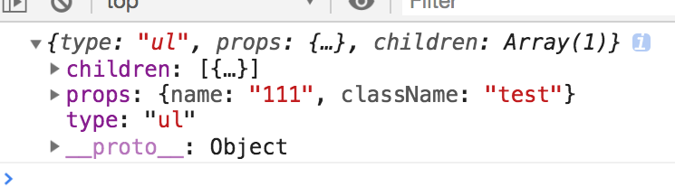
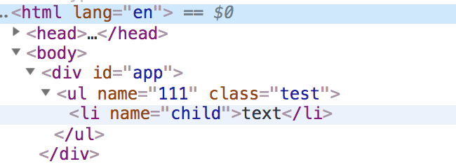

## 前言
React在处理界面更新的时候,是通过对比虚拟DOM(js对象)之间的差异来更新UI的.这种方式能一定程度上的减少对DOM的操作.通过虚拟DOM这个中间层结合多平台的renderer使React实现了跨平台.本文梳理了在medium上关于Virtual DOM的两篇文章来介绍如何简单实现一个Virtual DOM.

## 为什么虚拟DOM
1. UI = F(data)  Virtual DOM使数据,操作,属性可以集中在一起,这种方式能一定程度上降低项目长期维护的复杂性. 
2. 页面性能 通过虚拟DOM的对比,进行差异的更新能提升页面的性能.

## 如何实现虚拟DOM
虚拟DOM可以理解是真实DOM的映射,如何实现虚拟DOM主要需要考虑一下几点:
1. 如何描述虚拟DOM(create)
2. 如何绘制虚拟DOM(render)
3. 如何差异化的更新虚拟DOM并且更新UI(update)  

下面主要从上面的三点来逐步实现一个简易版的虚拟DOM实现.

### 创建Virtual DOM
DOM的节点可以通过type(节点类型),props(styles, event), children(子元素)来描述.可以通过下面的函数来创建虚拟节点.

    // 创建虚拟节点
    function h(type, props, children) {
      return { type, props: props || [], children: children || [] };
    }
    const root = h('ul', { name: 100, onClick: () => { console.log(1); } }, [
      h('li', {}, ['sss'])
    ])

### 绘制Virtual DOM
在下面的实现中,以$开头的元素指代真实的DOM节点,node指代虚拟节点.
#### 绘制元素
在绘制元素的时候,如果节点的内容是文本,就直接创建文本节点.否则就创建当前类型的DOM节点并且遍历它的children节点递归的调用自身并且添加到创建的节点.

    function createElement(node) {
      if(typeof node === 'string') {
        return document.createTextNode(node);
      }
      const $el = document.createElement(node.type);
      node.children.map(createElement).forEach($el.appendChild.bind($el));
      return $el;
    }
    const root = h("ul", { name: '111', className: 'test' }, [
      h('li', { name: 'child' }, ['text'])
    ]);
    // app是页面中已经存在的容器节点
    const container = document.getElementById('app');
    container.appendChild(createElement(root)); // 已经能绘制到页面

#### 添加属性
在添加属性的时候,有以下的节点需要注意:
* 对DOM节点上不存在的属性名字进行转换,例如ClassName
* 布尔属性值的设置
* 增加属性过滤功能来实现特有的实现  

##### 实现

    //设置布尔属性
    function setBooleanProp($target, name, value) {
      if(value) {
        $target.setAttribute(name, value);
        $target[name] = value;
      } else {
        $target[name] = false;
      }
    }
    // 属性过滤
    function isCustomProp(name) {
      return false;
    }
    // 设置所有属性的入口
    function setProps($target, props) {
      Object.keys(props).forEach(name => {
        setProp($target, name, props[name]);
      });
    }
    // 对单一属性的设置,实现过滤,转换
    function setProp($target, name, value) {
      if(isCustomProp(name)) {
        return;
      } else if(name === 'className') {
        $target.setAttribute('class', value);
      } else if(typeof value === 'boolean') {
        setBooleanProp(name, value);
      } else {
        $target.setAttribute(name, value);
      }
    }
通过将设置属性的操作加入到之前的createElement函数中,来实现DOM属性的添加.

    function createElement(node) {
      if(typeof node === 'string') {
        return document.createTextNode(node);
      }
      const $el = document.createElement(node.type);
      setProps($el, node.props);
      node.children.map(createElement).forEach($el.appendChild.bind($el));
      return $el;
    } 

通过运行之前的代码,发现属性已经添加到DOM中了.

#### 添加事件
在对事件的添加上,由于具体的事件也是在创建Virtual DOM的时候添加到props的,如果不想通过之前声明的setProps函数进行事件的处理,就需要将这些属性过滤出来,具体实现如下:

    //判断是否是event属性
    function isEventProp(name) {
      return /^on/.test(name);
    }
    // 获取属性的后缀  例如 onClick => click
    function extractEventName(name) {
      return name.slice(2).toLowerCase();
    }
    // 修改之前的过滤属性函数,加入对event属性的过滤
    function isCustomProp(name) {
      return isEventProp(name)
    }
    // 添加属性函数
    function addEventListeners($target, props) {
      Object.keys(props).forEach(name => {
        if(isEventProp(name)) {
          $target.addEventListener(extractEventName(name), props[name]);
        }
      })
    }
将添加事件的函数增加到createElement函数中,完成对事件的添加.

    function createElement(node) {
      if(typeof node === 'string') {
        return document.createTextNode(node);
      }
      const $el = document.createElement(node.type);
      setProps($el, node.props);
      addEventListeners($el, node.props);
      node.children.map(createElement).forEach($el.appendChild.bind($el));
      return $el;
    }

### 对比差异更新UI
如果完全的对比两个树形结构的差异,时间复杂度是O(n^3)的.为了一定的性能优化,可以有以下的假设:
1. 节点的类型变更,两个DOM的结构就是不同的.这种情况可以直接进行替换操作.
2. 很少存在跨层级的节点移动
3. 同一类型的节点的DOM结构是相同的  

通过对上面假设的分析,在更新Virtual DOM的时候,主要有以下几种情况
1. 对比两个node的类型不同,直接替换
2. 最新的node中没有元素和属性,需要删除对应的节点的属性
3. 最新的node中增加了元素和属性,需要添加对应的属性和节点
4. 节点类型相同,对子节点实现1 2 3的操作

#### 更新节点
    // 判断两个node是否是同一个节点
    function changed(node1, node2) {
      return typeof node1 !== typeof node2 || typeof node1 === 'string' && node1 !== node2 || node1.type !== node2.type;
    }

    function updateElement($parent, newNode, oldNode, index = 0) {
      // index是子元素的位置
      if(!oldNode) {
        // 如果不存在oldNode进行添加操作
        $parent.appendChild(createElement(newNode));
      } else if(!newNode) {
        // 在新的节点中不村存在移除
        $parent.removeChild($parent.childNodes[index]);
      } else if(changed(newNode, oldNode)) {
        // 如果节点类型改变进行替换
        $parent.replaceChild(
          createElement(newNode), $parent.childNodes[index]
        )
      } else if(newNode.type) {
        const newLength = newNode.children.length;
        const oldLength = oldNode.children.length;
        // 更新子节点
        for(let i = 0; i < newLength || i < oldLength; i++) {
          updateElement($parent.childNodes[index], newNode.children[i], oldNode.children[i], i)
        }
      }
    }

#### 更新属性  
在更新属性的时候跟更新节点的步骤类似

    // 删除布尔属性
    function removeBooleanProp($target, name) {
      $target.removeAttribute(name);
      $target[name] = false;
    }
    // 移除属性
    function removeProp($target, name, value) {
      if(isCustomProp(name)) {
        return;
      } else if(name === 'className') {
        $target.removeAttribute('class');
      } else if(typeof value === 'boolean') {
        removeBooleanProp($target, name);
      } else {
        $target.removeAttribute(name);
      }
    }
    // 当不存在newVal的时候,remove对应的属性.其他情况进行覆盖
    function updateProp($target, name, newVal, oldVal) {
      if(!newVal) {
        removeProp($target, name, oldVal);
      } else {
        setProp($target, name, newVal);
      }
    }
    function updateProps($target, newProps, oldProps = {}) {
      const props = Object.assign({}, newProps, oldProps);
      Object.keys(props).forEach(name => {
        updateProp($target, name, newProps[name], oldProps[name]);
      });
    }
    function updateElement($parent, newNode, oldNode, index = 0) {
      if(!oldNode) {
        // 如果不存在oldNode进行添加操作
        $parent.appendChild(createElement(newNode));
      } else if(!newNode) {
        // 在新的节点中不村存在移除
        $parent.removeChild($parent.childNodes[index]);
      } else if(changed(newNode, oldNode)) {
        // 如果节点类型改变进行替换
        $parent.replaceChild(
          createElement(newNode), $parent.childNodes[index]
        )
      } else if(newNode.type) {
        // 增加属性的更新
        updateProps($parent.childNodes[index], newNode.props, oldNode.props)
        const newLength = newNode.children.length;
        const oldLength = oldNode.children.length;
        // 更新子节点
        for(let i = 0; i < newLength || i < oldLength; i++) {
          updateElement($parent.childNodes[index], newNode.children[i], oldNode.children[i], i)
        }
      }
    }

#### 更新事件
函数是不好判断是否有变化的,可以通过一些参数来完成事件的更新(触发重新更新,通过节点替换来完成事件的更新这样不好)

    function changed(node1, node2) {
      return typeof node1 !== typeof node2 ||
          typeof node1 === ‘string’ && node1 !== node2 ||
          node1.type !== node2.type ||
          node1.props.forceUpdate;
    }
    function isCustomProp(name) {
      return isEventProp(name) || name === ‘forceUpdate’;
    }

### 参考
[How to write your own Virtual DOM
](https://medium.com/@deathmood/how-to-write-your-own-virtual-dom-ee74acc13060)  
[Write your Virtual DOM 2: Props & Events](https://medium.com/@deathmood/write-your-virtual-dom-2-props-events-a957608f5c76)  
[深度剖析：如何实现一个 Virtual DOM 算法](https://github.com/livoras/blog/issues/13)