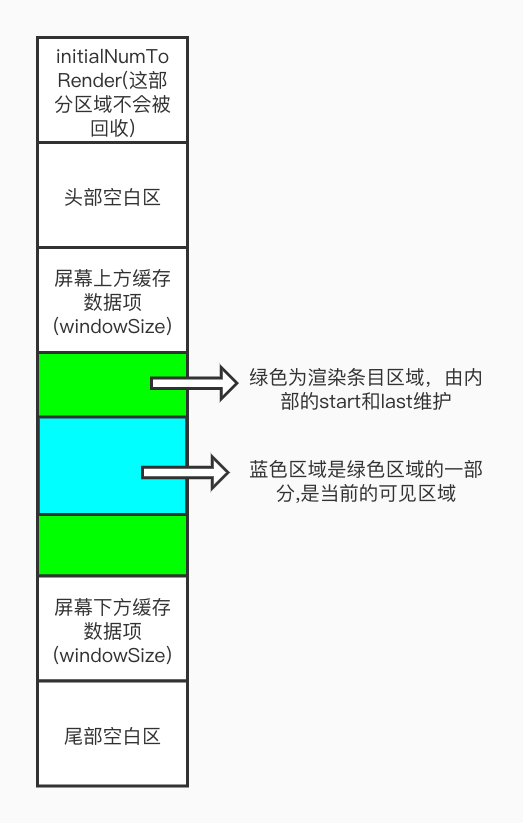

## 前言
长列表优化是一个老生常谈问题,优化的方案也是相似的(减少内存占用,复用渲染结果,可视区域渲染,预渲染),在跨端开发的React Native中列表主要有FlatList和SectionList两种,以下主要通过对FlatList的介绍来了解React Native中的长列表.

## FlatList
FlatList通过预渲染和可视区域渲染的方案,来降低列表渲染时候的内存占用从而提升页面的性能.下面从FlatList的基础使用来逐渐展开.

### 基本使用

    renderItem = ({ item, index }) => {
      return <View><Text style={{ color: 'white' }}>{item.name}</Text></View>
    }
    render() {
      return (
        <FlatList
          data={[{ name: 'a' }, { name: 'b' }, { name: 'c' }, { name: 'd' }]}
          renderItem={this.renderItem}
          keyExtractor={item => `${item.name}`}
        />
      )
    }
在上面的例子中通过设置data, renderItem(条目渲染函数)就完成了列表的渲染功能
### 结构
FlatList数据渲染的原理是通过数据项和底层容器ScrollView的布局事件计算出需要渲染的条目,在滚动过程中动态的更新渲染条目来完成列表的绘制.FlatList渲染的内部结构如下:
  

### FlatList性能优化

#### 减少更新时列表项总体数目和条目的重渲染,
1. 列表条目使用PureComponent或者shouldComponentUpdate来减少条目的更新. 
2. 调整windowSize大小(默认是21)
3. 调整maxToRenderPerBatch的大小,控制每次更新的最大条目  

#### 减少内存的占用
1. 在列表项中合理的使用缓存
2. 减少匿名函数的使用
3. 列表条目的渲染逻辑尽量简单

#### 减少渲染过程中的计算
1. 使用getItemLayout减少列表条目的计算过程
2. 调整滚动事件的触发频次(scrollEventThrottle)

