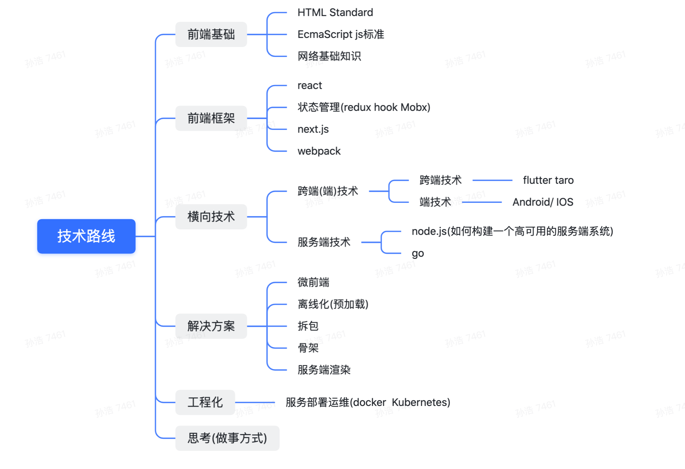

## 1.0 - 2017-02-25
>在这里记录下学习前端的过程。最近在博客园写自己之前的博客的时候，发现自己不是很善于描述东西，也发现博客园的书写体验没那么好，之前一直想弄一个这样的博客，这就算成型了。  
>希望通过这个博客来锻炼自己表达的能力同时起到督促自己目的。

## 2.0 - 2021-04-08
看到这个文档上次的修改记录已经是三年之前了,个人的博客在三年中有一直保持更新(虽然频率上😢不高).应该在去年建了一个公众号-前端小板凳和掘金账号.
小板凳的初衷是我能跟大家一起坐在板凳上一起学习进步(我要是在胖下去 小板凳要变成大板凳了➳♥゛扎心),最近重新理了下思路以后小板凳和这个博客会主要以如下的内容进行更新(虽然搞不好哪天就不更了).
  

### 前端基础
1. [HTML Standard](https://html.spec.whatwg.org/#toc-browsers) html标准
2. [javascript标准](https://tc39.es/ecma262/)
3. 网络基础知识

### 前端框架
1. react
2. 前端状态管理(redux, hook, Mobx)
3. next.js
4. webpack

### 横向技术
1. 跨端(端)技术 
  * 跨端技术 flutter taro
  * 端技术 Android/ IOS
2. 服务端技术
  * node.js egg.js(如何构建一个高可用的服务端系统)
  * go  

### 解决方案
1. 微前端方案
2. 离线化(预加载)
3. 拆包
4. 骨架
5. 服务端渲染

### 工程化
1. 服务部署运维(docker Kubernetes)

### 思考(做事方式)
这里会记录一些思考,会随着自己的认知定期修改这部分内容.一些内容会沉淀成记录
要从把事做完到做好到做广.
1. 数据 => 业务
2. 做好监控(用户行为 异常监控)
3. 如何能做到业务技术两手抓
4. 探索推进业务的方式(往前看 多聊, 视角的切换(长期短期 用户视角))
5. 先想好在做 别急 这点不容易  

希望2.0版本能把我们的知识串成一个网,一起把事做好.希望事情会因你不同.

## 3.0-2022-04-12  
距离上次更新这个文档差不多刚好一年的时间，博客的内容也大致按照之前2.0版本的内容在更新(万幸没有断更)。3.0版本的内容会在2.0的基础上更加**系统化**。这里对3.0版本的内容做下diff:
* 形式上会结合做过的事或者看过的内容，结合自己的想法总结和输出(虽然有些想法比较基础和简单)，也是想在自己这边能把一些东西揉碎想明白的一种尝试，现在主要有以下两种方式:  
  1. [**前端快报**](https://icantunderstand.cn/%E5%89%8D%E7%AB%AF%E5%BF%AB%E6%8A%A5/)收录近期阅读的前端技术类文章，月维度更新
  2. [**读书目录**](https://icantunderstand.cn/%E8%AF%BB%E4%B9%A6%E7%9B%AE%E5%BD%95/)收录自己读过的书和阅读过程中的一些想法，采取了打分推荐的方式(有个人喜好)，根据读书进度实时更新。  
