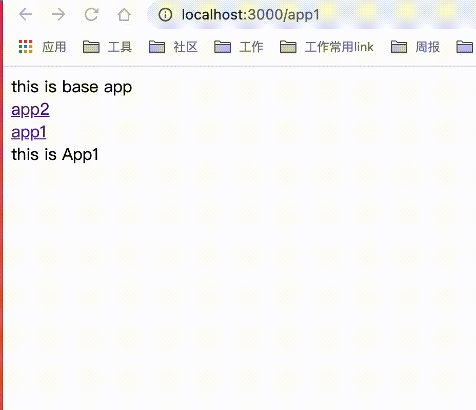

<!-- vscode-markdown-toc -->
* 1. [single-spa简单用法](#single-spa)
	* 1.1. [子应用配置](#)
	* 1.2. [主应用配置](#-1)
* 2. [single-spa源码分析](#single-spa-1)
	* 2.1. [启动](#-1)
	* 2.2. [子应用挂载/切换](#-1)
* 3. [关于微前端的一些总结思考](#-1)
* 4. [参考](#-1)

<!-- vscode-markdown-toc-config
	numbering=true
	autoSave=true
	/vscode-markdown-toc-config -->
<!-- /vscode-markdown-toc -->

微前端是应用组装的一种模式,本文从single-spa的使用方式入手逐步深入到single-spa的源码实现了解微前端的实现方式  
##  1. single-spa简单用法  
single-spa通过子应用与主应用约定交互协议实现微前端应用,在具体的交互中:
* 子应用需要暴露应用生命周期方法,例如bootstrap、mount、unmount
* 主应用与子应用约定激活规则
* 主应用根据挂载规则动态的切换应用状态并且执行对应子应用的生命周期方法  
下面的例子分别从子/主应用的角度梳理下single-spa实现微前端方案的配置方式,在例子中定义了一个主应用(baseapp), 两个子应用(app1, app2).

###  1.1. 子应用配置  
single-spa基于js Entry的方式实现微前端方案,在子应用导出的js模块中需要包含子应用的生命周期函数方法，这里的两个子应用都以create-react-app创建的react应用举例

1. 使用create-react-app创建子应用 npx create-react-app app1 
2. 进入到对应的目录 
    npm run eject // 将创建项目的配置弹出
    npm install single-spa-react -S
3. 修改项目的webpack配置,修改输出文件(这里仅为测试使用)  
  
4. 修改子应用代码 

        import React from 'react';
        import ReactDOM from 'react-dom';
        import './index.css';
        import singleSpaReact from 'single-spa-react'
        import App from './App'; // App是子应用的入口 

        // 使用single-spa-react产生子应用的生命周期方法
        const reactLifecycles = singleSpaReact({
            React,
            ReactDOM,
            rootComponent: App,
            errorBoundary(err, info, props) {
                // https://reactjs.org/docs/error-boundaries.html
                return (
                
This renders when a catastrophic error occurs

                );
            },
        });

        export const bootstrap = reactLifecycles.bootstrap;
        export const mount = reactLifecycles.mount;
        export const unmount = reactLifecycles.unmount;  

4. 构建子应用,生成入口文件，这里通过serve提供静态服务的方式提供入口js Entry的访问，在实际中可以使用nginx或者cdn的形式提供访问   

        npm run build
        serve -s -l 3001 build // 指定端口 

###  1.2. 主应用配置
1. 使用create-react-app创建主应用 npx create-react-app baseapp
2. 安装微前端依赖

    npm install single-spa react-router-dom -S  

3. 主应用增加与子应用配置代码  

        import React from 'react';
        import ReactDOM from 'react-dom';
        import { BrowserRouter as Router, Link } from 'react-router-dom'
        import history from 'history/browser';
        import './index.css';
        import { registerApplication, start } from 'single-spa'

        async function loadApp(libraryUrl, libraryName) {
            // 打包的webpack配置是umd模式 直接挂载在window上
            if(window[libraryName]) {
                return window[libraryName]
            }
            // 加载并且等待js执行
            await new Promise((resolve, reject) => {
                const script = document.createElement('script')
                script.src = libraryUrl
                script.onload = resolve
                script.onerror = reject
                document.body.appendChild(script)
            })
            return window[libraryName]
        }

        // 子应用可以通过走服务端下发配置 
        const apps = [
            {
                name: 'app1',
                // 子应用加载方法，加载对应的js Entry
                app: () => loadApp('http://localhost:3001/app1.js', 'app1'),
                // 子应用激活方法
                activeWhen: location => location.pathname.startsWith('/app1'),
                // 共享属性
                customProps: {}
            },
            {
                name: 'app2',
                app: () => loadApp('http://localhost:3002/app2.js', 'app2'),
                activeWhen: location => location.pathname.startsWith('/app2'),
                customProps: {}
            }
        ]
        // 注册子应用
        for(let i = 0; i < apps.length; i++) {
            registerApplication(apps[i])
        }
        // 启动single-spa提供微服务能力
        start()
        // 渲染主应用
        ReactDOM.render(
            

                this is base app
                <Router history={history}>
                // 子应用入口
                
<Link to="app2"  >app2</Link>

                
<Link to="app1" >app1</Link>

            </Router>
            
,
            document.getElementById('root')
        );

4. 启动主应用，就能看到两个子应用聚合成一个应用，点击对应的调整也能正常切换  
 

##  2. single-spa源码分析
single-spa的源码可以分成两个阶段来看: 启动阶段和子应用挂载(切换)阶段.下面就分别从这两个阶段看single-spa的执行过程
###  2.1. 启动
在启动主应用的时候，通过registerApplication注册子应用和start方法启动微前端
在registerApplication中主要对子应用的入参进行了格式化处理然后将子应用推入全局的数据保存，然后执行应用切换的主函数reroute做首次应用的加载逻辑

    export function registerApplication(
        appNameOrConfig,
        /** 子应用异步加载函数 需要返回带有生命周期的模块导出 */
        appOrLoadApp,
        /** 应用激活函数 */
        activeWhen,
        /** 共享属性 */
        customProps
        ) {
        // 子应用入参格式化处理
        const registration = sanitizeArguments(
            appNameOrConfig,
            appOrLoadApp,
            activeWhen,
            customProps
        );
        /** 推入全局的子应用数组 */
        apps.push(
            assign(
            {
                loadErrorTime: null,
                /** 应用状态 */
                status: NOT_LOADED,
                parcels: {},
                devtools: {
                overlays: {
                    options: {},
                    selectors: [],
                },
                },
            },
            registration
            )
        );
        if (isInBrowser) {
            ensureJQuerySupport();
            /** 执行应用切换的主函数 */
            reroute();
        }
    }

在reroute中会对子应用加载状态进行分类(appsToUnload\appsToUnmount\appsToLoad\appsToMount)然后根据是否运行过start函数走不同触发逻辑:
1. 未运行过start函数,走app初始化加载逻辑(js Entry下载)
2. 运行过start函数,走app挂载/切换逻辑

        export function start(opts) {
            // start控住通过全局变量控住整个应用挂载状态
            // 二次调用start 触发对应的子应用挂载
            started = true;
            if (opts && opts.urlRerouteOnly) {
                setUrlRerouteOnly(opts.urlRerouteOnly);
            }
            if (isInBrowser) {
                reroute();
            }
        }
        /** 执行应用切换的主函数 */
        export function reroute(pendingPromises = [], eventArguments) { 
            /** 应用处于切换状态中,推入到待处理的peopleWaitingOnAppChange 等待后续统一处理 */
            if (appChangeUnderway) {
                return new Promise((resolve, reject) => {
                peopleWaitingOnAppChange.push({
                    resolve,
                    reject,
                    eventArguments,
                });
                });
            }
            /** 获取当前子应用的状态数组 */
            /** 在getAppChanges中根据传入的activeWhen进行判断 首次应用应该处于appsToLoad数组中 */
            const {
                /** 移除状态 */
                appsToUnload,
                /** 卸载状态 */
                appsToUnmount,
                /** 加载状态 */
                appsToLoad,
                /** 即将挂载状态 */
                appsToMount,
            } = getAppChanges();
            let appsThatChanged,
                navigationIsCanceled = false,
                oldUrl = currentUrl,
                newUrl = (currentUrl = window.location.href);
            // 是否运行过start函数 走应用切换逻辑
            if (isStarted()) {
                appChangeUnderway = true;
                appsThatChanged = appsToUnload.concat(
                appsToLoad,
                appsToUnmount,
                appsToMount
                );
                return performAppChanges();
            } else {
                // 未运行过start函数走app初始化加载逻辑
                appsThatChanged = appsToLoad;
                return loadApps();
            }
            /** 省略若干代码 */
        }

loadApps通过微任务的方式加载js Entry然后在对应的app对象设置子应用的生命周期函数  

    /** 加载子应用js Entry */
    function loadApps() {
        return Promise.resolve().then(() => {
            /** 通过微任务的方式加载appsToLoad 在加载完毕后在
            * 对应的app对象上设置暴露的生命周期方法
            */
            const loadPromises = appsToLoad.map(toLoadPromise);

            return (
            Promise.all(loadPromises)
            /** 触发路由事件 首次加载可忽略这里 */
                .then(callAllEventListeners)
                // there are no mounted apps, before start() is called, so we always return []
                .then(() => [])
                .catch((err) => {
                callAllEventListeners();
                throw err;
                })
            );
        });
    }

###  2.2. 子应用挂载/切换
在single-spa启动的时候,会监听路由事件然后再触发路由事件和执行reroute方法

    /** 路由事件监听 */
    window.addEventListener("hashchange", urlReroute);
    window.addEventListener("popstate", urlReroute);
    /** patchedUpdateState也会触发urlReroute */patchedUpdateState
    window.history.pushState = patchedUpdateState(
        window.history.pushState,
        "pushState"
    );
    window.history.replaceState = patchedUpdateState(
        window.history.replaceState,
        "replaceState"
    );

    function urlReroute() {
        reroute([], arguments);
    }

所以app挂载切换的主逻辑都在reroute的performAppChanges中,主要做了:
* 派发single-spa自定义事件 
* 执行移除/卸载状态应用的生命周期函数
* 执行挂载应用的生命周期函数(依赖卸载/移除的执行tryToBootstrapAndMount)

    function performAppChanges() {

        return Promise.resolve().then(() => {
            /** 派发single-spa自定义事件 */
            /** 省略若干代码 */
            // 执行需要移除/卸载状态应用的生命周期函数并且删除对应的生命周期函数
            // 重置应用状态
            const unloadPromises = appsToUnload.map(toUnloadPromise);
            const unmountUnloadPromises = appsToUnmount
                .map(toUnmountPromise)
                .map((unmountPromise) => unmountPromise.then(toUnloadPromise));
            const allUnmountPromises = unmountUnloadPromises.concat(unloadPromises);
            const unmountAllPromise = Promise.all(allUnmountPromises);
            unmountAllPromise.then(() => {
            window.dispatchEvent(
                new CustomEvent(
                "single-spa:before-mount-routing-event",
                getCustomEventDetail(true)
                )
            );
            });

            // 子应用的加载和bootstrap生命周期函数执行
            const loadThenMountPromises = appsToLoad.map((app) => {
                return toLoadPromise(app).then((app) =>
                    tryToBootstrapAndMount(app, unmountAllPromise)
                );
            });
            // 子应用挂载和mount生命周期函数的执行
            const mountPromises = appsToMount
                .filter((appToMount) => appsToLoad.indexOf(appToMount) < 0)
                .map((appToMount) => {
                    return tryToBootstrapAndMount(appToMount, unmountAllPromise);
            });
            /** 省略若干代码 */
        });
        }
        // tryToBootstrapAndMount依赖之前需要unLoad和unMount的应用周期函数执行完毕
        function tryToBootstrapAndMount(app, unmountAllPromise) {
            if (shouldBeActive(app)) {
                return toBootstrapPromise(app).then((app) =>
                unmountAllPromise.then(() =>
                    shouldBeActive(app) ? toMountPromise(app) : app
                )
                );
            } else {
                return unmountAllPromise.then(() => app);
            }
        }

以上梳理了single-spa实现微前端的主体流程

##  3. 关于微前端的一些总结思考
在讨论使用一个技术方案的时候,主要考虑点这项技术方案是否能解决当前或者未来项目中遇到的问题,微前端的优势在于项目的组合(新老项目平滑过渡\项目功能共享\应用拆分)等但同时也增加了项目维护的一些成本,需要结合项目和业务发展方向进行探索使用

##  4. 参考
[微前端框架 之 single-spa 从入门到精通](https://juejin.cn/post/6862661545592111111)  
[微前端时代思考与实践](https://blog.yuanziwen.cn/2019/12/18/%E5%BE%AE%E5%89%8D%E7%AB%AF%E6%97%B6%E4%BB%A3%E8%90%BD%E5%9C%B0%E5%89%8D%E7%9A%84%E6%80%9D%E8%80%83/#%E9%80%82%E5%90%88%E4%BB%80%E4%B9%88%E6%A0%B7%E7%9A%84%E5%9C%BA%E6%99%AF)  
[你可能并不需要微前端](https://www.yuque.com/kuitos/gky7yw/fy3qri)  
[微前端的核心价值](https://www.yuque.com/kuitos/gky7yw/rhduwc)

