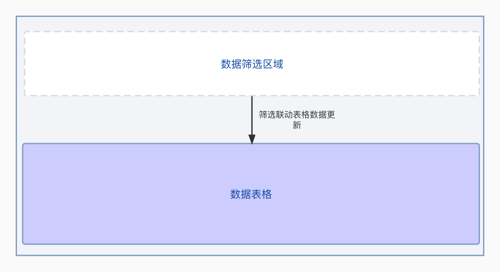

本文整体记录自己在优化项目代码的思路和实现过程，主要从以下的方面展开: 
* 项目背景(技术方案，迭代上遇到的问题) 
* 优化方法
* 过程的总结思考
## 项目背景  
页面的整体结构可以简化成如下的结构:
* 顶部数据筛选区, 筛选数据变化触发表格数据更新
* 数据表格渲染区域
  
在业务迭代中,单表格形式在承接多版本业务迭代的时候会出现以下的问题:
1. 表格组件多版本逻辑混杂且分散，缺少层次在迭代中极易出现线上case
2. 封装的组件或者业务逻辑在后续的迭代中扩展性差
3. store方案基于useReducer方案，存在模版代码重复和数据隔离差的问题

## 优化思路&思考
### 基础组件功能分层
  
在基础组件上增加一层业务处理层，对组件需要的基础属性进行分版本处理从而达到相关逻辑清晰分层

### 业务组件功能分层
  
业务组件通过组件分发逻辑达到不同版本组件的展示，从而达到

### 逻辑聚合
  
通过工具函数、关键节点(初始化入口/请求api)逻辑约束，减少业务中的数据处理转化逻辑，达到逻辑聚合的目的
### store设计
引入mobx设计新的store方案
  
store按照共享数据store、多列表store、子功能store。在列表store的设计上可以通过继承基础store来定义通过的接口,对于旧的store提供入口与新store完成信息同步

## 对封装的思考  
在业务迭代比较频繁的模块，可以通过封装简单的util函数来达到代码的复用能力。在业务初期对业务模块封装有可能导致业务迭代中代码可理解性、可维护性下降。 比较好的思路是在业务比较稳定的时候再对业务逻辑进行封装，通过入口划分不同的业务实现。 

以上就是自己在业务代码优化上的一些实践和思考。代码的优化并不是一蹴而就的，是渐进式的。最开始的设计相当于建筑的地基，这个地基的好坏能一定程度上为项目保驾护航。代码的优化则是自身对业务理解梳理，对功能实现的总结思考，相当于对建筑的添砖加瓦，是个有意思的过程。

