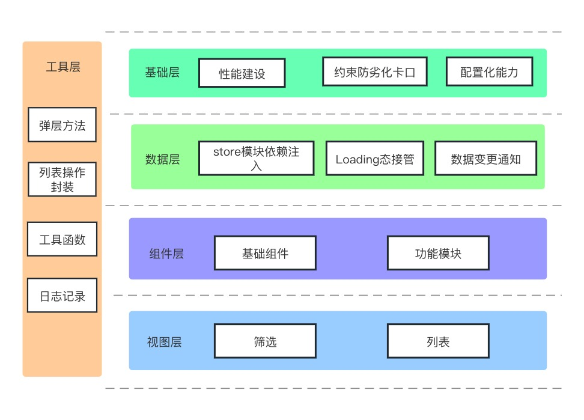

广告平台投中阶段的广告列表有着交互复杂，逻辑分散等特点，导致在长期的业务迭代中容易变成‘老大难’。在进行技术方案设计的时候需要考虑好模块之间的依赖和防劣化的能力，才能满足业务的长期发展。下面是自己在迭代过程中对技术方案设计的一些思考。

## 基础层

### 性能建设
拆包/按需加载/首屏性能问题/列表渲染次数

### 约束防劣化卡口
* 大文件强约束(max-len卡口)
* 基础组件修改代码提交提示

### 配置化能力
* 表格基础展示项配置化实现
* 文案类/筛选项下发

## 工具层

### 工具函数/getter方法
通用计算逻辑提取工具函数 
依赖数据计算逻辑提取全局getter方法

### 列表操作封装
封装列表操作相关逻辑,在视图层和数据层之间增加一个桥梁，这样数据层和视图层能相对解耦，代码逻辑清晰

### 统一弹层方法
通过统一的弹层方法，约束弹层内容的按需加载并且在方法内部管理显影状态

## 数据层

### store模块依赖注入
比较简单的方案是在模块初始化时传入依赖的模块去减少查询依赖的代码逻辑，也可以借助一些实现依赖注入的库[DI](https://github.com/wessberg/DI)等实现依赖的管理

### Loading态接管
通过[xhook](https://github.com/jpillora/xhook)对特定接口进行接管，完成自动化的loading态处理

### 数据变更通知
通过在初始化阶段

## 组件层

## 视图层

## 对封装的思考  
在业务迭代比较频繁的模块，可以通过封装简单的util函数来达到代码的复用能力。在业务初期对业务模块封装有可能导致业务迭代中代码可理解性、可维护性下降。 比较好的思路是在业务比较稳定的时候再对业务逻辑进行封装，通过入口划分不同的业务实现。 

以上就是自己在业务代码优化上的一些实践和思考。代码的优化并不是一蹴而就的，是渐进式的。最开始的设计相当于建筑的地基，这个地基的好坏能一定程度上为项目保驾护航。代码的优化则是自身对业务理解梳理，对功能实现的总结思考，相当于对建筑的添砖加瓦，是个有意思的过程。

## 2023.11.21 

* 对技术债的理解
  在引入一种新的解决方案比如useContext这种，对业务入侵很多。他虽然解决了属性跨层级传递的问题但是对组件的复用度有一定的影响。主要先要想明白A才去做B.比如先做好基础组件的拆分在这个基础上去组合技术方案
* 视图/数据层
  1. 视图层尽可能减少数据层面的操作，只要UI逻辑。操作逻辑通过封装逻辑调用数据层接口实现
  2. 数据层要做好依赖的管理和拆分，防止出现改不动的现象。通过通知或者监听变更的方式去完成视图层与数据层的解耦

