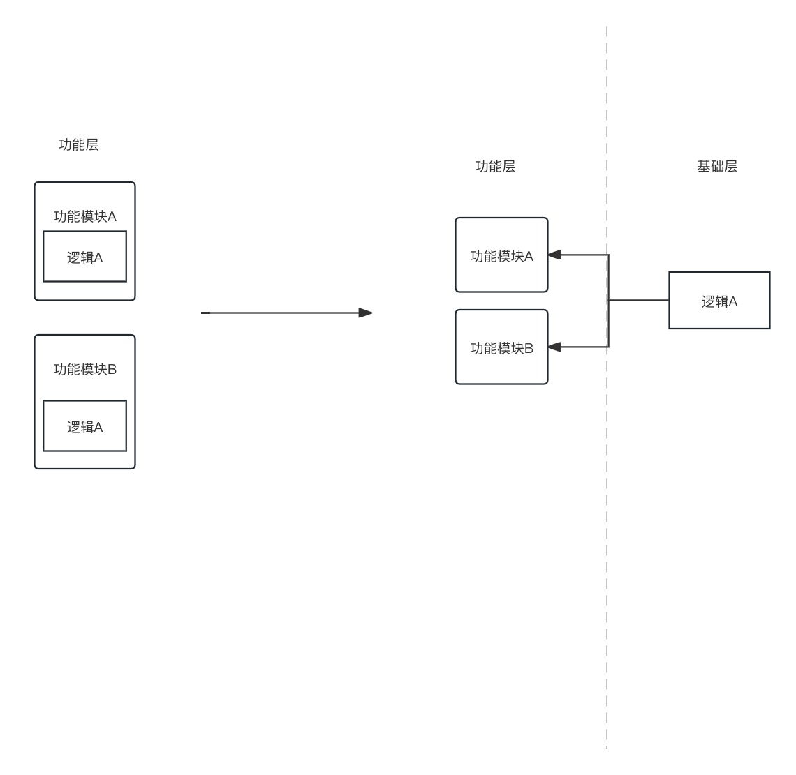
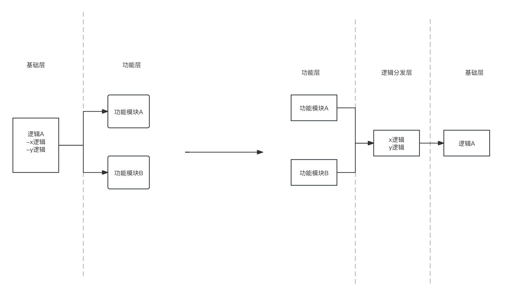

之前看过一篇文章讲代码封装的过程，下面从简述文章的内容开始梳理下自己对代码封装的一点思考.

--- 以下是之前文章内容简述 ---

在业务迭代的初期，代码中有一段业务逻辑A,由于A逻辑在项目中使用比较广泛，于是对A逻辑进行了代码逻辑的封装，包括参数的预设等  
  
随着业务的发展，又出现了B模块，B模块中几乎可以直接使用A逻辑，但是需要对A逻辑进行一些小小的改动，比如入参的调整、逻辑分支的增加  
  
这种通过修改较小范围代码就能实现功能的方式在实际开发中是很常规的操作，它并没有不好，只是当这种修改变的次数多的时候，最开始封装的逻辑A就变成了‘四不像’，它似乎可以服务于A模块，但是确有些冗余，出现了‘我好像看不懂这段代码’，‘这段代码还是别改了’，‘你改吧 我是改不了’的场景。在多次封装之后，逻辑A容易出现以下的问题
* 入参不可控
* 逻辑分支复杂，不清晰，修改范围不确定，容易对其他模块产生影响
* 复用度逐渐下降，解决方法
    1. 将就不再继续新增逻辑，变成'老大难'问题，总有爆发的一天
    2. 重写相关逻辑，功能回测范围大，影响范围不可控，容易出现漏测等

--- 以下是正文 --- 

提前封装或者过度封装对实际业务的编写都有很大影响，最实际的感受就是这段代码不好写，这个逻辑看不懂。封装的代码逻辑是结果，封装的出发点是因，从出发点去看而不是面向结果的封装似乎更能编写出可维护性的代码。以下是自己对封装的一点思考。

## 降低复杂度
  
通过对业务中分散的相似逻辑提取，就能一定程度上降低项目的复杂度和重复度的问题。在修改相应的业务逻辑时候就相对集中和可控。新增逻辑的修改也能做到应用范围的同步。

## 解耦逻辑
在设计模式中需要设计的模块尽量遵循单一职责，但是在实际编写代码的过程中很容易出现模块功能的耦合，比如常见的:
* 视图层逻辑与数据层逻辑耦合
* 非相关逻辑的入侵 比如视图的逻辑需要感知请求状态的改变做相应的逻辑处理  
通过将相关的逻辑都聚合到模块封装的内部，就能较低其他模块对不相关逻辑的感知，也就做到了解耦。在下面的例子中，通过将A逻辑的关联逻辑都封装进A模块中，降低了功能模块对封装逻辑的感知。
  
相关例子: 
* 在[ahooks](https://ahooks.js.org/hooks/use-request/index)中的useRequest中，就通过对请求状态和数据的操作进行封装，将数据相关操作做到了内聚，减轻了视图层的负担
* [Antd pro components](https://procomponents.ant.design/components/table#protable)的table

## 分层
  
在例子中，通过将逻辑A中的相关逻辑提取到上层，分层的方式实现了模块功能的内聚与解耦。在前端的MVC中就通过将相关操作封装成Controller,来完成逻辑的解耦

## 复用(一致性，可控性)
从降低复杂度、逻辑结构、分层设计最终的目标是达到封装代码的复用。通过复用能控制代码的一致性，实现修改代码行为的可控。
* 在封装的实现上 可以逐渐的从项目内共享 -> 跨项目共享等
* 在分发共享逻辑上，有[monorepo](https://zh.wikipedia.org/wiki/Monorepo)、[模块联邦](https://webpack.js.org/concepts/module-federation/)、[npm包](https://www.npmjs.com/)、[微前端](https://www.amazonaws.cn/knowledge/what-is-micro-frontends/)等方式.

-- 写在最后 --

代码的优化或者设计是应该在理解业务的基础上，从相对大的视角出发来看的。在实际做的时候容易出现缺少全局视角的设计缺失和不完善，也容易出现过度设计，需要仔细去把握这个度量。

