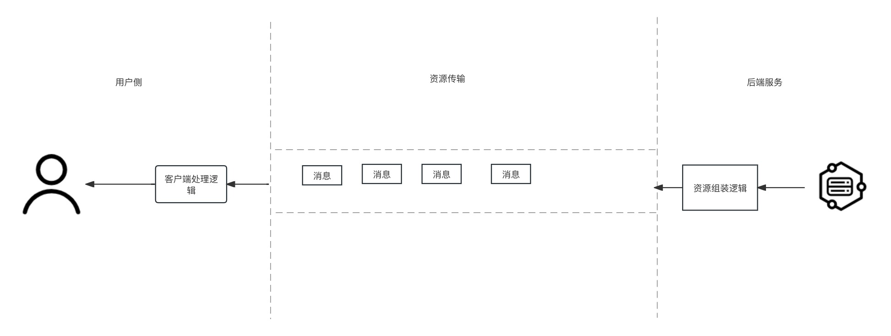
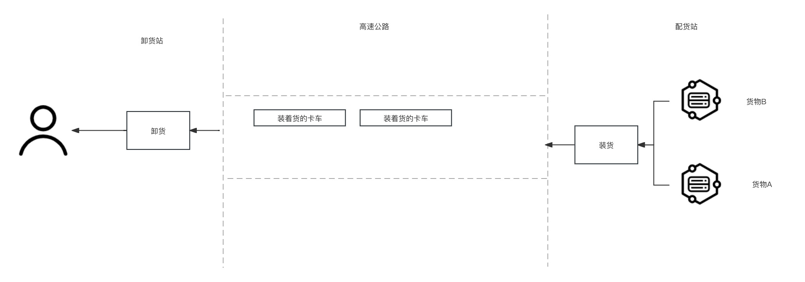

在加载web资源的时候，数据会主要经历三个阶段:
* 服务端组装阶段
* 传输阶段
* 客户端处理阶段  
在讨论资源加载优化的时候其实在讨论如何能快速的把用户需要的资源给到用户，这个就很像运输货物的过程。下面我们就以卡车司机的视角去看我们的货物如何能更好的运输。

--- 以下是故事视角叙述 

作为一个资深老司机，我驾驶着我的货车已经在这个熟悉的路线上跑了20多年了，虽然货物运输的需求一直有，随着压力的增加，货物的运输方也对我提出了更多的要求。老板希望我能尽快的把货物送到目的地，这样他就能多给我配货然后让我多赚钱养家糊口。我懂大老板的意思:你怎么能快点把货送到并且成本也能给我搞下来咱们就能长期合作，否则这个活我就安排给别人了。我坐在我的伙计上就开始琢磨怎么能达到这个目的，我想了好几天都没有想好怎么弄，这是我的一些想法大家看看帮出出主意。因为在做货车司机之前做过两年前端工程师，所以有些说法我会用前端的词汇给大家描述，这样也能证明咱除了会开车以外还有那么一点文化。

我的日常工作就是在配货站等待装货员把多样的货物装到我的huoche

## 资源传输方式

## 优先级 

## 缓存

## 预加载

## 资源体积

