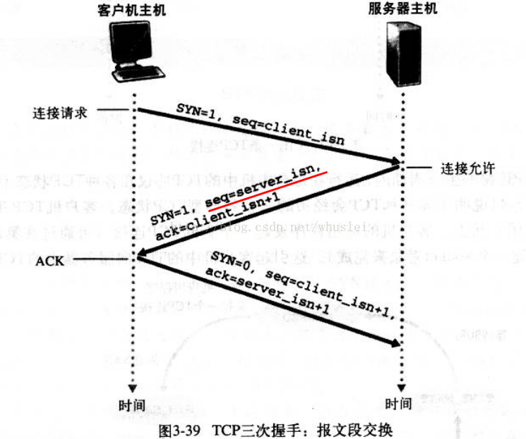
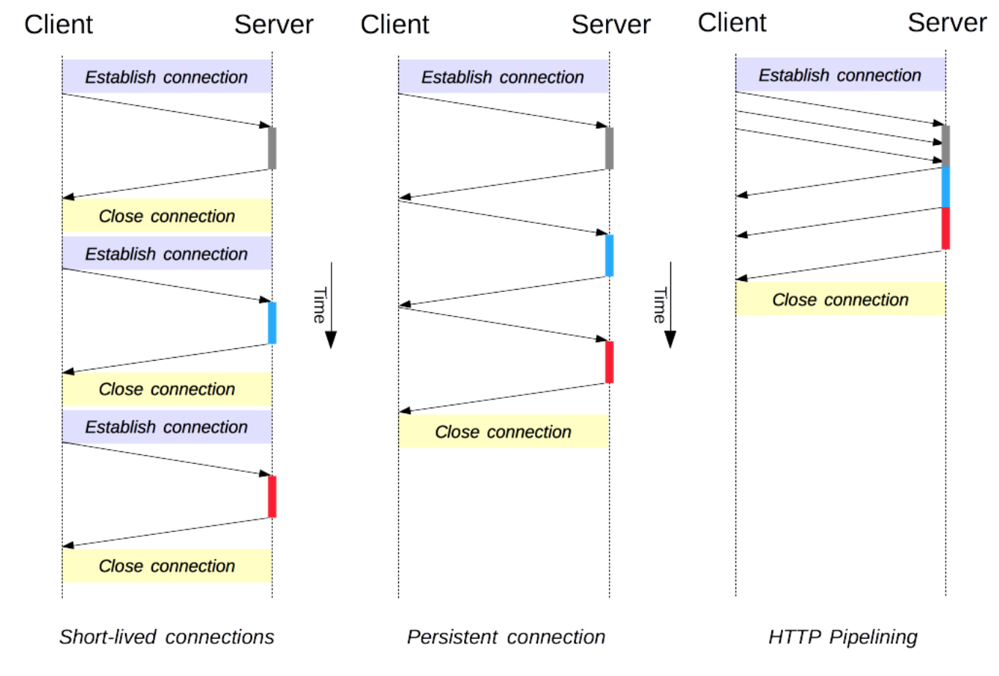

## [WebSocket](https://developer.mozilla.org/en-US/docs/Web/API/WebSocket)  
WebSocket建立在TCP协议之上，通过HTTP协议完成握手升级。默认端口80(ws)和443(wss),没有同源限制  
1. WebSocket支持双向通信，在实时性要求更高的场景更合适。
2. 二进制支持更好
3. 传输开销少，相对于HTTP传输头部数据更少
4. 支持扩展,可以实现自定义的子协议

        // 创建连接
        const socket = new WebSocket("ws://localhost:8080");
        // 监听open事件发送消息
        socket.addEventListener("open", (event) => {
            socket.send("Hello Server!");
        });
        // 监听message事件接收消息
        socket.addEventListener("message", (event) => {
            console.log("Message from server ", event.data);
        });

### websocket属性  
| 名字 | 含义 | 值 |
| ------ | ------ | ------ | 
| WebSocket.binaryType | 数据传输格式 | 'blob'(默认)/'arraybuffer' |
| WebSocket.readyState | WebSocket连接状态 | CONNECTING/0-连接中 OPEN/1-打开，可以发送消息  CLOSING/2-关闭中 CLOSED/3-关闭态或者不能被打开 |
| WebSocket.bufferedAmount | 返回没有被传输到服务端的入队数据 | 只读值 |  

### 实例方法  
| 名字 | 含义 |
| ------ | ------ |
| WebSocket.close() | 关闭连接 | 
| WebSocket.send() | 将数据送进发送队列等待发送 | 

### 事件  
| 名字 | 含义 |
| ------ | ------ |
| close | 断开连接的时候触发 | 
| error | 因为错误而断开连接出发 |
| message | 接收消息触发 |
| open | 链接建立触发 |

### 建立连接(握手过程)

1. 客户端申请协议升级

        GET ws://example.com/ HTTP/1.1  
        Connection: Upgrade  //升级协议
        Upgrade: websocket  // 升级websocket
        Origin: http://example.com  
        Sec-WebSocket-Version: 13  // 指定websocket版本 如果服务端不支持服务端会返回支持的版本
        Sec-WebSocket-Key: d4egt7snxxxxxx2WcaMQlA==  // 与服务端的返回头Sec-WebSocket-Accept相匹配，提供保护防止恶意连接等

2. 服务端响应协议升级

        HTTP/1.1 101 Switching Protocols // 101切换协议
        Connection:Upgrade
        Upgrade: websocket
        Sec-WebSocket-Accept: Oy4NRAQ13jhfONC7bP8dTKb4PTU= // 根据请求Sec-WebSocket-key生成

### 连接保持  
1. 发送方->接收方：ping
2. 接收方->发送方：pong

## 三次握手
通过三次握手建立TCP连接，三次握手为了确认双方传输的序列号
  
1. 客户端在向服务端请求连接的时候，会向服务端发送一个SYN报文段。会随机选取一个client_isn作为序号字段放置在该SYN报文中。
2. 服务端在收到该报文后，会发送给客户端一个报文并且设置TCP的缓存和变量。该报文的ack字段是client_isn + 1,序号字段为server_isn,SYN比特为设置成1.代表当前服务器已经准备接收数据
3. 客户端在接收服务端的确认报文后会创建TCP的缓存和变量并且向服务端继续发送报文(此时的报文可以携带上数据),其中ack字段是server_isn + 1,序号字段是client_isn + 1,SYN字段为0(此后的报文中SYN字段都为0).至此TCP连接建立成功。

## 四次挥手 
通过四次挥手，中断双方的TCP连接。通过四次可以确定双方都可以中断连接
  
1. 终止方向另一端发送一个TCP报文，其FIN比特位被设置成1
2. 接收方回复一个ACK报文并且发送一个FIN报文
3. 终止端回复一个ACK报文，至此两方为了维持TCP连接的缓存和变量都将清除(接受FIN端需要把自己剩余的信息发送完 才能发送FIN报文)

## TLS握手
在使用HTTPS进行通信的时候，会进行TCP握手建立TCP连接，TLS握手完成数据安全的校验才能进行通信
在TLS握手中主要进行了一下的操作
* 指定将要使用的TLS版本
* 决定将要使用哪些密码套件
* 通过服务器生成的公钥和SSL证书颁发机构的数据签名验证服务器身份
* 生成对话密钥，在握手完成后使用

### TLS握手的过程
1. 客户端问候(client hello)消息: 客户端向服务器发送问候消息开始握手，该消息包含客户端支持的TLS版本、支持的密码套件、客户端随机数(client random)
2. 服务端问候(server hello)消息: 回复客户端问候消息，内含服务端的SSL证书、服务端选择的密码套件、服务端随机数
3. 身份验证 客户端对服务端的证书进行验证
4. 预主密钥 客户端在发送一串随机字节即预主密钥(premaster secret)，预主密钥使用公钥(从服务端发送的SSL证书中获取)加密
5. 解密预主公钥 对预主密钥解密获得客户端随机数
6. 生成对话密钥 客户端和服务端均使用客户端随机数、服务端随机数和预主密钥生成对话公钥
7. 客户端就绪
8. 服务端就绪
9. 实现安全对称加密，使用对话密钥进行通信

## 图解不同协议
 

## 常用请求状态码
| 状态码值 | 含义 |
| ------ | ------ |
| 301 | 永久重定向 可以SEO，会被浏览器缓存 res.writeHead(301, {'Location': 'http://www.baidu.com/'}); | 
| 302 | 临时重定向 |
| 304 | 在缓存协商过程中，304代表客户端可以使用当前的缓存结果 |
| 201 | 表示请求已经创建成功并且创建了新的资源，通常作为POST请求的返回值 |
| 204 No Content | 表示请求已经成功，通常用在PUT请求返回中，会返回ETag并且可以被缓存 | 
| 401 Unauthorized | 客户端错误，指由于缺乏目标资源要求的身份验证凭证，发送的请求未得到满足 | 
| 403 Forbidden | 客户端错误，指服务端有能力处理请求，但是拒绝授权访问 | 
| 400 Bad Request | 客户端错误，服务端无法处理该请求 | 
| 405 Method Not Allowed | 表明服务器禁止了使用当前HTTP方法 | 
| 502 | 网关错误 | 
| 503 Service Unavailable | 服务不可用 | 

## 前端存储(cookie/localStorage/sessionStorage)
| 名称 |  生命周期  |  大小  | 传递方式  |
| ------  | ------  | ------  | ------  |
| cookie | 服务端生成有过期时间 | 4K左右 | 在通信中都会携带 |
| localStorage | 存储在本地,长期有效存在同源策略   | | 不参与服务端通信 |
| sessionStorage | 仅在当前会话有效(刷新页面有效),关闭页面失效。有同源策略  | 5MB |  不参与服务端通信  | 

### cookie基础知识
cookie通过服务端的set cookie来做用户信息的存储 通常的设置方式如下:

    Set-Cookie: name=value; Expires=Wed, 21 Oct 2019 07:28:00 GMT;

1. cookie可以设置domain和path
    * 不同domain的cookie不能共享 
    * 相同domain的不同path下设置的cookie不能共享
    * 子path可以共享根domain下的cookie
2. 设置HttpOnly能防止cookie被js读取
3. 设置SameSite可以限制cookie的发送
4. 在通过XmlHttpRequest跨域请求的时候 设置withCredential: true的时候 会携带cookie，服务端需要设置响应头Access-Control-Allow-Credentials: true 才能拿到响应

## xss(跨站脚本攻击)
xss是一种代码注入攻击。 攻击者通过在目标网站上注入恶意脚本，使之在用户的浏览器上运行。 利用这些恶意脚本，攻击者可获取用户的敏感信息如Cookie、SessionID 等，进而危害数据安全

## csrf(跨站请求伪造)
跨站请求伪造是一种挟制用户在当前已登录的Web应用程序上执行非本意的操作的攻击方法。例如:
1. 受害者登录a.com，并保留了登录凭证（Cookie)
2. 攻击者引诱受害者访问了b.com。
3. b.com 向 a.com 发送了一个请求：a.com/act=xx。浏览器会默认携带a.com的Cookie。
4. a.com接收到请求后，对请求进行验证，并确认是受害者的凭证，误以为是受害者自己发送的请求。
5. b.com以受害者的名义执行了act=xx。攻击完成，攻击者在受害者不知情的情况下，冒充受害者，让a.com执行了自己定义的操作。

### csrf的防护策略
* 令牌同步模式 服务端生成令牌Token，再次请求的时候携带Token
* 检查Referer字段
* 添加校验token 区分来源

## 单点登录(Single Sign On)
单点登录SSO指在多个应用系统中，用户只需要登录一次就可以访问所有相互信任的应用系统
SSO一般都需要一个独立的认证中心（passport），子系统的登录均得通过passport，子系统本身将不参与登录操作，当一个系统成功登录以后，passport将会颁发一个令牌给各个子系统，子系统可以拿着令牌会获取各自的受保护资源，为了减少频繁认证，各个子系统在被passport授权以后，会建立一个局部会话，在一定时间内可以无需再次向passport发起认证
 

## 跨域资源共享（Cross-origin resource sharing）
跨域资源共享是W3C标准，规定了浏览器和服务器可以通过交互来确认跨域请求是否安全的方式。

### 跨域的条件
端口、域名、协议不同为跨域请求

### 跨域请求分类  
1. 简单请求
    * 请求方法是： HEAD/GET/POST
    * 请求头是: Accept/Accept-Language/Content-Language/Content-Type（需要注意额外的限制）/Range
    * Content-Type 标头所指定的媒体类型的值仅限于: text/plain multipart/form-data application/x-www-form-urlencoded
2. 复杂请求 非简单请求，在进行跨端请求的时候 需要发送预检(OPTION)请求

### 跨域请求交互

#### 简单请求跨域交互

请求端请求头:  

    GET /resources/public-data/ HTTP/1.1
    Host: bar.other
    User-Agent: Mozilla/5.0 (Macintosh; Intel Mac OS X 10.14; rv:71.0) Gecko/20100101 Firefox/71.0
    Accept: text/html,application/xhtml+xml,application/xml;q=0.9,*/*;q=0.8
    Accept-Language: en-us,en;q=0.5
    Accept-Encoding: gzip,deflate
    Connection: keep-alive
    Origin: https://foo.example  // 标识请求来源

服务端响应头:
  
    HTTP/1.1 200 OK
    Date: Mon, 01 Dec 2008 00:23:53 GMT
    Server: Apache/2
    Access-Control-Allow-Origin: * // 告知浏览器该资源可以被哪些域名访问
    Keep-Alive: timeout=2, max=100
    Connection: Keep-Alive
    Transfer-Encoding: chunked
    Content-Type: application/xml

### 复杂请求跨域交互

请求端预检请求

    OPTIONS /doc HTTP/1.1
    Host: bar.other
    User-Agent: Mozilla/5.0 (Macintosh; Intel Mac OS X 10.14; rv:71.0) Gecko/20100101 Firefox/71.0
    Accept: text/html,application/xhtml+xml,application/xml;q=0.9,*/*;q=0.8
    Accept-Language: en-us,en;q=0.5
    Accept-Encoding: gzip,deflate
    Connection: keep-alive
    Origin: https://foo.example
    Access-Control-Request-Method: POST // 跨域请求方法
    Access-Control-Request-Headers: X-PINGOTHER, Content-Type // 跨域请求的自定义请求头

服务端响应预检请求

    HTTP/1.1 204 No Content
    Date: Mon, 01 Dec 2008 01:15:39 GMT
    Server: Apache/2
    Access-Control-Allow-Origin: https://foo.example
    Access-Control-Allow-Methods: POST, GET, OPTIONS
    Access-Control-Allow-Headers: X-PINGOTHER, Content-Type
    Access-Control-Max-Age: 86400
    Vary: Accept-Encoding, Origin
    Keep-Alive: timeout=2, max=100
    Connection: Keep-Alive

在完成预检请求后进行正常的请求交互响应

## TCP/UDP

| 名字 | 连接性 | 可靠性 | 相关协议应用层协议 |
| ------ | ------ | ------ | ------ |
| TCP| 面向连接 | 可靠 | http/https/ftp/telnet | 
| UDP | 无连接可直接发送数据 | 不可靠，容易丢包报文乱序等 | dns/tftp | 

## http2.0/http1.1

### http 1.1
超文本传输协议(HyperText Transfer Protocol-http)
http1.1三种连接方式:

* 短连接模式(Short-lived Connection): Connection: close 
* 长连接模式(Persistent Connection): 长连接模式能减少TCP传输慢启动和握手时间

        Connection: keep-alive // 长连接
        Keep-Alive: timeout=5, max=1000 // 连接时间

* 管道模式(Pipelining): 在建立的一个连接上发送多个请求不必等到上个结果返回，返回结果需要按照发送的顺序返回，Pipelining模式需要逐个响应存在队首阻塞问题、易被攻击等问题，已被http2的多路复用所替代

### http2
http2通过二进制分帧层，将需要发送的数据拆分成帧，通过帧的首部的流标识信息组装成信息。

http2对比http1.1有如下的优势:
* 报头压缩 在HTTP2中使用首部表来跟踪和存储之前发送的键值对。相同的数据不会在每次请求和响应中发送，新的首部键追加到末尾或者替换之前的值。减少冗余数据的发送
* 多路复用 在同一个连接上处理请求和响应，根据帧首部的流标识在服务端进行重组
* 可以设置请求优先级
* 可以实现服务端推送

## 浏览器渲染原理
1. 导航(navigation)
2. DNS查询
3. 建立TCP(三次握手) TLS协商(可选)
4. 响应阶段 TCP慢启动 拥塞控制等
5. 浏览器解析阶段 浏览器通过将网络接收到的数据转换成DOM和CSSOM，最后渲染器通过DOM树和CSSOM树将内容渲染到页面上
    * 构建DOM树
    * 构建CSSOM树
    * 预加载扫描器 解析DOM占用主线程，预加载扫描器可以提前扫描解析到的内容进行资源请求
6. 渲染阶段 将创建的CSSOM树和DOM树合成Render树，然后计算可见元素的布局渲染到屏幕上
    * Style 只计算可见元素 这里display:none不会被计算，visibility: hidden 在计算在render树上
    * Layout 从根节点开始计算布局
    * Paint 在图层上绘制DOM元素
    * Composite(渲染层合并) 按照顺序合并图层并渲染到屏幕上

回流(重排)指Render Tree中部分或者全部元素的尺寸发生改变，浏览器需要重新渲染部分或者全部文档的过程  
可以通过css相关属性，让对应的元素渲染在自己的图层上，减少整体的重排
## 参考
[WebSocket协议：5分钟从入门到精通 ](https://www.cnblogs.com/chyingp/p/websocket-deep-in.html)  
[渲染页面：浏览器的工作原理](https://developer.mozilla.org/zh-CN/docs/Web/Performance/How_browsers_work)  
[Web 性能优化-CSS3 硬件加速(GPU 加速)](https://lz5z.com/Web%E6%80%A7%E8%83%BD%E4%BC%98%E5%8C%96-CSS3%E7%A1%AC%E4%BB%B6%E5%8A%A0%E9%80%9F/)
