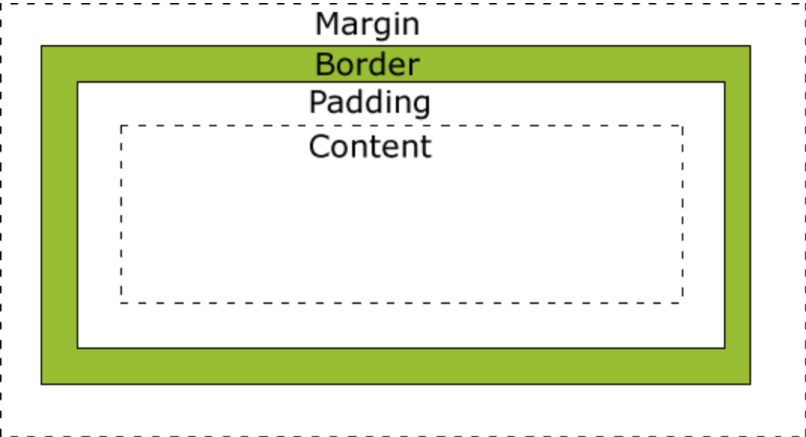

## 盒模型
  当对一个元素进行布局的时候,渲染引擎会根据CSS-Box模型(box-sizing)将对应元素表示为一个矩形盒子.理解好盒模型能让我们更好的理解生成元素的大小和布局.生成布局的盒子由以下的属性决定
   
  box-sizing是设置盒模型的属性，分为IE盒模型(border-box)和W3C标准盒模型(content-box).
   1. W3C标准盒模型(content-box): 属性width和height只包含content, 不包含 padding border, 标准盒模型的实际宽度 = border-left + padding-left + content(width) + padding-right + border-right
   2. IE盒模型(border-box):  属性width 包含content, padding, border. IE盒模型的实际宽度 = content(width)   

## 布局
### Box
Box是CSS布局的基本单位.元素的类型和display共同决定着这个Box类型.不同的Box类型会参与到不同的格式化上下文中.
* block-level: display属性为 block, table, list-item.
* inline-level: display属性为 inline-block, inline-table,inline

### 布局模式
在进行布局的时候，浏览器采用一种dirty位系统，如果某个呈现器（需要渲染布局的元素）发生了更改，将其自身或者子代标记为dirty，则需要布局，在进行布局的时候，元素会确认自己宽度和高度.
  1. 父呈现器确认自己的宽度
  2. 父呈现器依次处理子呈现器  
      1. 放置子呈现器（设置x y 坐标)  
      2. 如果有必要，调用子呈现器的布局  
  3. 父呈现器根据子呈现器的累加高度以及边距和补白的高度来设置自身高度，此值也可供父呈现器的父呈现器使用
  4. 将dirty设置为false 

### 布局上下文
布局上下文决定在渲染容器中各种盒子的布局方式,主要有以下几种:
* 块级格式化上下文(BFC) 
* 行级格式化上下文(IFC)
* 网格布局格式化上下文(GFC)
* 自适应格式化上下文(FFC)

#### BFC(Block formatting context)
BFC(块级格式化上下文)规定内部的block-level box的布局方式
##### 生成规则
1. 根元素，即HTML元素
2. float的值不为none
3. overflow的值不为visible
4. display的值为inline-block、table-cell、table-caption
5. position的值为absolute或fixed

##### 布局规则
1. 内部的Box会在垂直方向，一个接一个地放置。
2. Box垂直方向的距离由margin决定。属于同一个BFC的两个相邻Box的margin会发生重叠
3. 每个元素的margin box的左边， 与包含块border box的左边相接触(对于从左往右的格式化，否则相反)。即使存在浮动也是如此(浮动元素不会撑开父元素的高度，父元素变成BFC的时候就会包含浮动元素的高度)。
4. BFC就是页面上的一个隔离的独立容器，容器里面的子元素不会影响到外面的元素。反之也如此。不与float box重叠.
5. 计算BFC的高度时，浮动元素也参与计算 

##### 作用
* 自适应两栏布局
* 可以阻止元素被浮动元素覆盖
* 可以包含浮动元素——清除内部浮动
* 属于不同的BFC时可以阻止margin重叠
 
#### FFC(flexbox)
FFC就是CSS3所说的弹性盒子布局. 详细的使用指南可以参考这篇[A Complte Guide to Flexbox ](https://css-tricks.com/snippets/a-guide-to-flexbox/)

## 定位
  Box一共有以下三种定位方式:
  1. Normal flow: 包括块级的格式上下文, 行级的格式化上下文, 相对定位的(position relative)的块级和inline-block
  2. Float: 这种情况脱离了文档流,但是会影响之后元素的content(环绕)
  3. 绝对定位(position absolute): 脱离文档流, 不会影响之后元素的位置和内容
  
### position
position相关属性及含义

| 值 | 含义 |  
| - | :-: |  
| absolute | 绝对定位,相对于static以外的第一个父元素进行定位  | 
| fixed | 绝对定位,相对于浏览器窗口进行定位 |  
| relative | 相对定位,相对与正常位置进行定位 |  
| static | 默认值,没有定位. |  
| sticky | 粘性布局 可以认为是固定定位和相对定位的结合.元素在跨越特定阈值前为相对定位,之后为固定定位 |  

### float
浮动是一种脱离文档流，对之后或者之前的盒子中的content flow产生影响的一个属性
* 区别于绝对定位，绝对定位也是脱离文档流 但是它不会对之后之前的盒子产生影响
* 浮动元素会产生一个块级框,即使它本身是一个行内元素  

#### 浮动规则
  1. 浮动元素的左右外边界不能超出其包含块的左右内边界
  2. 浮动元素的左(或右)外边界必须是源文档中之前出现的左浮动的(或右浮动)元素的右（或左)边界，除非后出现的浮动元素的顶端在先出现浮动元素的底端下面（防止浮动元素之间的覆盖）
  3. 左浮动元素的右外边界不会在其右边右浮动元素的左外边界的右边 右浮动元素的左外边界不会在其左边左浮动元素的右外边界的左边
  4. 一个浮动元素的顶端不能比其父元素的内顶端更高   浮动元素的顶端不能比之前所有的浮动元素的顶端或块级元素更高
    
  这里例子中三个元素均为浮动元素,包含块的宽度固定,由于规则2 导致第二个浮动元素bbb移动到aaa下面.由于4的限制，浮动元素ccc的顶端是跟bbb一致的，不能超过bbb或者跟aaa平齐.  
  5. 如果源文档中一个浮动元素之前出现了另一个元素 浮动元素的顶端不能比包含该元素所生成框的任何行框的顶端更高  
  6. 左浮动元素必须向左尽可能的远 右浮动元素必须向右尽可能的远 位置越高 就会向左或者向右尽可能的远  
  7. 浮动元素与正常内容流重叠的情况:
      1. 行内框与一个浮动元素重叠的时候，其边框 背景 和内容都在该浮动元素之上显示.
      2. 块框与一个浮动元素重叠时候 其边框和背景在该浮动之下显示 内容在浮动元素之上显示  

## 居中
可以阅读下自己之前翻译的一篇文章[CSS居中完全指南翻译](https://www.cnblogs.com/tiantianwaigong/p/5291370.html)  

## 滚动
当元素的子元素比父元素高且父元素overflow设置为scroll的时候，子元素在移动过程中会触发父元素的scroll事件  
| 属性 | 定义 | 操作| 
| - | :-: | -: | 
| clientHeight | 与元素的高度有关,代表元素的高度加上padding(不包括border、水平滚动条的高度、margin),对于inline元素该属性的值为0 | 只读 | 
| clientWidth | 与clientHeight相似 | 只读 |
| offsetHeight | 与元素的高度有关,不同于clientHeight,它包括border、水平滚动条的高度,不包括margin.对于inline元素该属性为0 |  只读 |
| offsetWidth | 与offsetWidth相似 | 只读 |  
| scrollHeight | 当出现滚动时,scrollHeight代表元素内容的高度(包括在不在内容区域的内容)  当一个元素出现滚动, 它的相关属性 判读元素是否滚动到底部 scrollHeight - scrollTop === clientHeight | 只读 |
| scrollTop | 当元素出现滚动的时候,scrollTop代表元素可见内容距离该元素顶部的高度.不存在滚动条的时候,scrollTop为0 | 可读可写 |
| offsetTop | 获取当前元素跟offsetParent父元素顶部(position不为static的父元素)的距离,不随滚动变化 | 只读 |

### 实现滚动的思路
1. 锚点 通过在页面中设置锚点能在实现跳转到页面相应位置的目的,这种方式也比较好操作.缺点是需要在url中添加其他信息
2. scrollTop 直接设置scrollTop来实现定位，如果scrollTop设置超过元素的scrollHeight,元素会被定位到最底部
3. scrollIntoView(alignToTop)   
  * alignToTop默认是true 通过item.scrollIntoView()/item.scrollIntoView(true)会使元素的顶部跟可视区域的顶部对齐
  * item.scrollIntoView(false)会使元素的底部跟可视区域的底部对齐

## 文本溢出省略显示

### 单行文本溢出

    text-overflow: ellipsis:
    overflow: hidden;
    white-space: nowrap;  

### 多行文本溢出

    display: -webkit-box;
    -webkit-box-orient: vertical;
    // 行数
    -webkit-line-clamp: 2;
    overflow: hidden;

## 动画
* js方案: window.requestAnimationFrame, 通过cancelAnimationFrame可以取消动画
* css方案: keyframes

      // 声明关键帧动画
      @keyframes slidein {
        // 起始
        from {
          transform: translateX(0%);
        }

        to {
          transform: translateX(100%);
        }
      }
      // 使用动画
      p {
        animation-duration: 3s;
        animation-name: slidein;
      }

## 移动端适配方案

### viewport
* 布局视窗  浏览器窗口css布局区域，默认viewport为980
* 视觉视窗  设备显示网页的区域
* 理想视窗  针对当前设备最理想的展示页面的视窗，不会出现横向滚动条，理想视窗也是终端设备屏幕的宽度

### viewport设置

  <meta name="viewport" content="width=device-width, initial-scale=1.0, user-scalable=no, minimum-sacle=1, maximum-scale=1" >

| 值 | 含义 | 设置值 |
| - | - | - |
| width | 视口的宽度(像素)  | 正整数或者device-width |
| height| 视口的高度(像素) | 正整数或者device-height | 
| initial-scale| 初始缩放值 | 整数或者小数，小数为缩放 |
| maximum-scale | 最大缩放值 | 整数或者小数 |
| minimum-scale | 定义缩放最小值 |  整数或者小数 | 
| user-scalable | 定义用户是否可以缩放 | yes/no |

### 布局方案
适配的目的是不同的设备上拥有统一的界面，在设置布局视窗等于视觉视窗后，通过调节页面字体大小来实现适配目的

#### rem方案
rem是相对单位，以HTML元素的font-size为比例进行计算

    function setRem() {
        // 当前页面宽度相对于 750 宽的缩放比例，可根据自己需要修改
        const scale = document.documentElement.clientWidth / 750;
        document.documentElement.style.fontSize = scale + 'px';
    }
    setRem();
    window.onresize = setRem;

#### vw/vh方案
vw/vh方案是根据视口的宽度和高度进行适配 1vw等于window.innerWidth的1%  如果设计稿是750 1vw=7.5px

#### 响应式布局
通过媒体查询实现不同屏幕上的适配

## css优先级

    !important > 行内样式 > id > class(伪类 属性) > 标签 > * > 继承 > 默认

## 三列布局 
三列布局是左右固定宽度，中间元素宽度自适应的布局方案

### 流体布局

    

      
left

      
right

      
main

    

    #left {
      width: 50px;
      float: left;
      height: 100px;
    }
    #right {
      width: 50px;
      float: right;
      height: 100px;
    }
    #main {
      margin: 0 50px;
      height: 100px;
    }  

### flex布局

    

      
left

      
main

      
right

    

    #container {
      display: flex;
      flex-direction: row;
      justify-content: flex-start;
      align-items: center;
    }
    #left {
      width: 50px;
      height: 100px;
    }
    #right {
      width: 50px;
      height: 100px;
    }
    #main {
      flex: 1;
      height: 100px;
    }

### BFC方案
BFC不与float区域重合

    

        
left

        
right

        
main

    

    #left {
      float: left;
      width: 50px;
      height: 100px;
    }
    #right {
      width: 50px;
      float: right;
      height: 100px;
    }
    #main {
      /* 生成bfc */
      overflow: scroll;
    }  

### 双飞翼布局
使用负margin可以让主体先加载，其实是float的变式

    

        

          
main

        
      
        
left

        
right

    

    #content {
      float: left;
      width: 100%
    }
    #left {
      float: left;
      width: 50px;
      margin-left: -100%;
      height: 100px;
    }
    #right {
      width: 50px;
      float: right;
      margin-left: -100px
    }
    #main {
      margin-left: 50px;
      margin-right: 50px;
    }

### 圣杯布局

    

        
main
  
        
left

        
right

    

     #container {
      margin-left: 100px;
      margin-right: 100px;
    }
    #left {
      float: left;
      width: 100px;
      margin-left: -100%;
      height: 100px;
      position: relative;
      left: -100px;
    }
    #right {
      width: 100px;
      float: left;
      position: relative;
      right: -100px;
      margin-left: -100px
    }
    #main {
      float: left;
      width: 100%;
    }

### table布局

    

      
left
    
      
main

      
right

    

    #container {
      display: table;
      width: 100%;
    }
    #left, #right, #main {
      display: table-cell;
    }
    #left {
      width: 100px;
    }
    #right {
      width: 100px;
    }

### 绝对定位布局

    

      
main
  
      
left

      
right

    

    .container {
      width: 100%;
      position: relative;
    }
    .left {
      position: absolute;
      left: 0;
      top: 0;
      width: 100px;
      background: red;
    }
    .right {
      position: absolute;
      right: 0;
      top: 0;
      background: blue;
      width: 100px;
    }
    .main {
      background: yellow;
      margin: 0 100px;
    }

## css选择器

    td:nth-child(2n+1) // 奇数行
    td:nth-child(2n) // 偶数行

## 用css画图形

    

    

    // css画出个圆形
    #container {
      width: 100px;
      height: 100px;
      background: blue;
      border-radius: 50%;
    }

    // css画一个半圆
    #container {
      width: 100px;
      height: 50px;
      border-radius: 100px 100px 0 0;
      background: blue;
    }

    // css画一个四分之一圆
    #container {
      width: 100px;
      height: 100px;
      border-radius: 100px 0 0 0;
      background: blue;
    }
    // css 画一个椭圆
    #container {
      width: 100px;
      height: 50px;
      background: blue;
      border-radius: 100px/50px;
    }

    // css画一个三角形
    #container {
      width: 0px;
      height: 0px;
      border-left: 50px solid transparent;
      border-right: 50px solid transparent;
      border-bottom: 100px solid black;
    }

    // css画一个左上三角
     #container {
      width: 0px;
      height: 0px;
      border-top: 100px solid red;
      border-right: 100px solid transparent; 
    }

   

## 参考链接
[浏览器的工作原理:新式网络浏览器幕后揭幕](https://www.html5rocks.com/zh/tutorials/internals/howbrowserswork/#4_1)  
[css脱离文档流是什么意思](https://www.zhihu.com/question/24529373/answer/29135021)  
CSS权威指南  
[Visual formatting model](https://www.w3.org/TR/CSS21/visuren.html)  
[关于CSS-BFC深入理解](https://juejin.im/post/5909db2fda2f60005d2093db)   
[移动端适配的5种方案](https://juejin.cn/post/6953091677838344199)  

 

