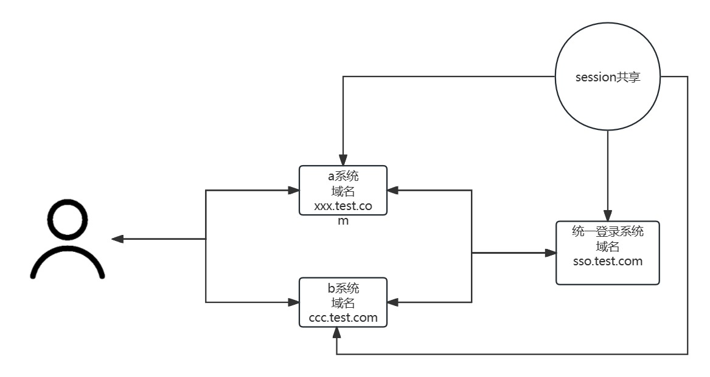
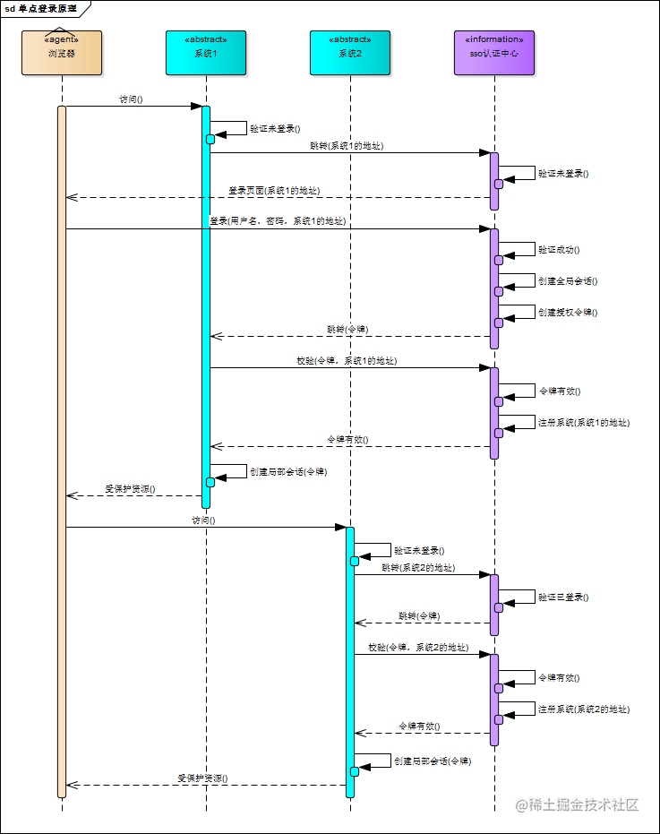

通常在登录系统的时候，服务端会通过设置Cookies来实现用户登录信息的存储

    Set-Cookie: <cookie-name>=<cookie-value>; Expires=<expiration-date>; Path=<path>; Domain=<domain>; Secure; HttpOnly

在用户二次登录的时候，相同域的cookies会随着用户请求发送到服务端，服务端会根据session中保存的信息校验，完成用户对特定资源的访问。在实际系统中，比如同公司的不同子系统如果登录态不能共享，就会造成不好的用户体验，比如你在一个购物app里面，商品页是电商系统，下单支付页是财务系统的。如果在正常下单跳转到下单支付页弹出登录框，那觉得是个P000的问题。所以这就引出了单点登录系统的实现。下面主要从同域名下单点登录和不同域名下的单点登录展开。

## 同域下的单点登录
在设置cookies的时候，我们可以指定cookies的path。那么假设现在有下面的场景。

有两个子系统xxx.test.com和ccc.test.com要实现在登录任何一个系统之后，都不需要再登录就能访问到另外的一个系统。
两个子系统其实不需要维护相关的登录逻辑，只需要将登录代理给统一的域名登录系统sso.test.com来实现即可，在实现子系统间相互登录的时候需要注意:
* 登录系统在设置cookies的时候，可以设置到根域名下，也就是上面的例子设置到test.com上，这样用户访问xxx.test.com和ccc.test.com的时候都能携带上设置的cookies
* 登录的session可以通过一些session共享技术实现

## 不同域下的单点登录
不同域下的单点登录不能使用cookies来实现，因为cookies有域名限制。实现单点登录的方式有CAS(Central Authentication Service),OAuth(主要用于授权第三方登录)，JWT安全令牌等方式，下面主要介绍CAS的实现方式
  
在上图中系统1和系统2是两个独立的系统，在登录系统的时候有如下的步骤:

### 未登录态下登录流程
* 如果系统1中没有登录，会跳转到SSO系统中进行校验，发现SSO系统也没有登录，弹出用户登录页
* 用户填写用户名、密码登录SSO系统，SSO系统写入SSO域的cookies并且在SSO系统保存登录session
* SSO系统返回给系统1一个ST(Service Ticket),跳转到系统1
* 系统1拿到获取到的ST，去向SSO后台进行校验，ST有效则在系统1写入当前登录的session和系统1域下的cookies

### 已登录下流程
用户已经登录SSO系统，此时他尝试登录系统2

* 系统2校验当前用户未登录，跳转到SSO系统
* SSO系统中用户是已登录状态，SSO会跳转回系统2并且携带ST
* 系统2用获取到的ST去SSO系统做令牌校验，ST有效则在系统2中写入当前登录的session和系统2域下的cookies

## 同域名和不同域名下单点登录的差异
* session的状态  在同域名登录下session状态应该是可以共享或者不共享的，不同域名下session状态是不共享的
* 服务端设置cookies的方式 他们都是在sso域下设置cookies，同域名刚好有cookies在同domain下可以共享，所以相对于不同域名下更简单一些。

