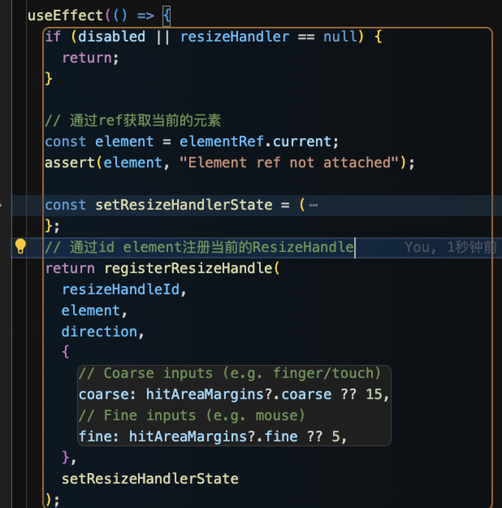
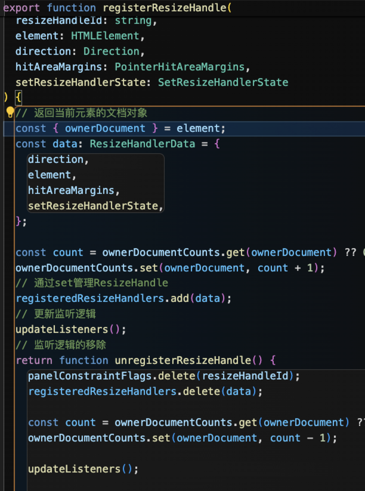
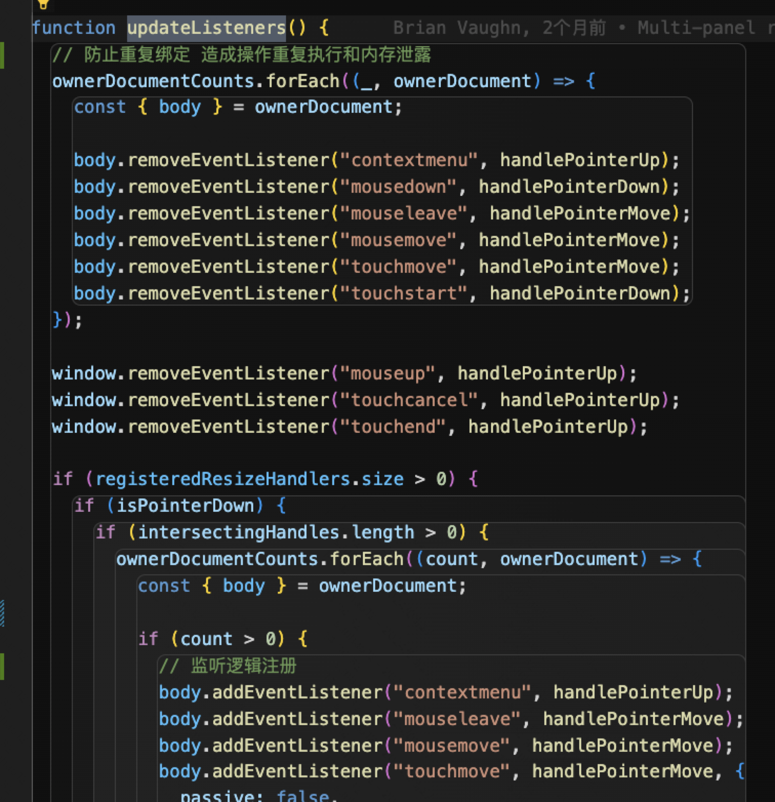
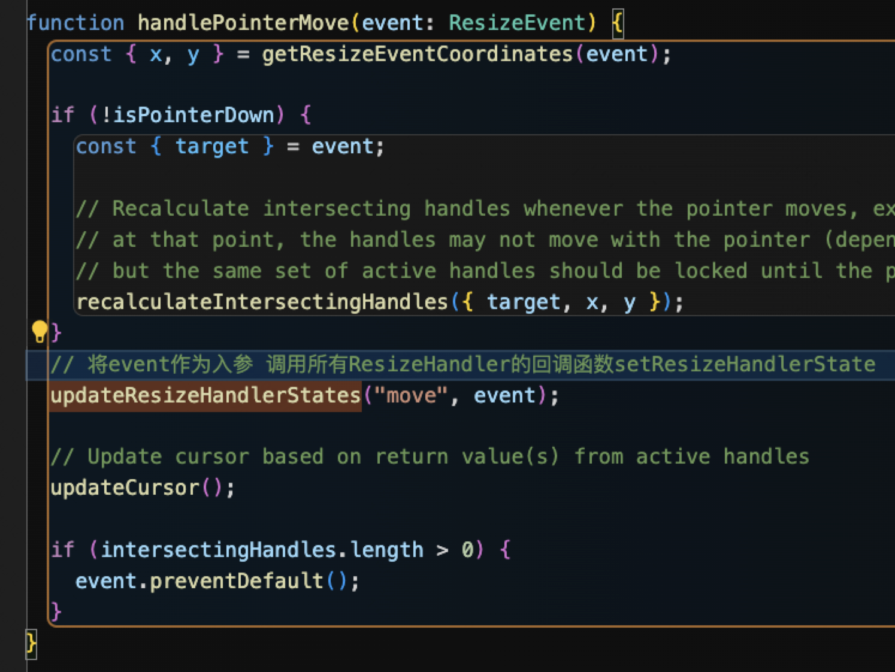

## [unplugin-parcel-macros](https://github.com/devongovett/unplugin-parcel-macros)
parcel的macro宏定义功能可以实现在其他打包工具中的支持了，macros可以定义编译时逻辑，在编译时执行对应的逻辑生成函数或者自定义流程。参考它的一个例子:

        // 代码内容
        import regexgen from 'regexgen' with {type: 'macro'};

        const regex = regexgen(['foobar', 'foobaz', 'foozap', 'fooza']);
        console.log(regex);
        
        // 编译结果
        console.log(/foo(?:zap?|ba[rz])/);  

上面最后的编译结果只在代码中生成一个regexgen生成的正则表达式，剔除了regexgen的内容。可以使用这种宏能力在编译时做一些动态逻辑。

## [wasmer](https://github.com/wasmerio/wasmer)  
wasmer是一个WebAssembly的执行容易，可以实现在不同语言环境中执行WebAssembly。

## [fx](https://fx.wtf/)
一个在命令行浏览和处理json数据的库

## [React Native Skia](https://shopify.github.io/react-native-skia/)
React Native 2D动画库. 提供了图表等能力，开箱即用了。

## [Eloquent JavaScript Goes Fourth ](https://eloquentjavascript.net/)
JavaScript编程精讲第四版

## [wxt](https://github.com/wxt-dev/wxt)
下一代浏览器扩展插件的编写框架，特性如下
* 支持Vue/React/Svelte等语言
* 支持HMR
* 支持远程代码的引入

## 优化工具

### [knip](https://github.com/webpro/knip)  
可以帮助查找代码中无用的文件或者依赖的库，可以定期对代码仓库进行扫描，治理代码

### [million](https://github.com/aidenybai/million)  
一个可以优化React组件性能的库，官网上看可以达到70%的优化，看Star已经15k了，值得关注

### [Dependency cruiser](https://github.com/sverweij/dependency-cruiser)  
可以校验和视图化文件依赖的工具
* 可以自定义校验规则，对代码的引入进行治理
* 视图化代码引入可以生成引入之间的关系，在项目设计上提供一些思路

## 源码解读

## [react-resizable-panels](https://github.com/bvaughn/react-resizable-panels)
react-resizable-panels是一个实现可伸缩容器的库，简单用法如下

        <PanelGroup direction="horizontal">
                <Panel defaultSize={30} minSize={20} style={{ background: 'blue', height: '200px' }} >
                        left
                </Panel>
                <PanelResizeHandle />
                <Panel minSize={30} style={{ background: 'red', height: '200px' }} >
                        middle
                </Panel>
                <PanelResizeHandle />
                <Panel defaultSize={30} minSize={20}  style={{ background: 'green', height: '200px' }}>
                        right
                </Panel>
        </PanelGroup>

* PanelGroup 通过PanelGroup包裹需要伸缩的容器
* Panel 需要伸缩的容器
* PanelResizeHandle 容器件控制伸缩的组件

现在从这三个组件开始梳理react-resizable-panels如何实现容器的伸缩功能的

### Panel 

        // panelDataRef 存在了当前Panel的id和在暴露出来的一些回调函数(onResize/onCollapse等)
        const style = getPanelStyle(panelDataRef.current, defaultSize);
        return createElement(Type, {
                ...rest,
                children,
                className: classNameFromProps,
                id: idFromProps,
                style: {
                // 属性合并逻辑  styleFromProps在这里会应用上 比如设置最大宽度最小宽度等
                ...style,
                ...styleFromProps,
                },
                // CSS selectors
                "data-panel": "",
                "data-panel-collapsible": collapsible || undefined,
                "data-panel-group-id": groupId,
                "data-panel-id": panelId,
                "data-panel-size": parseFloat("" + style.flexGrow).toFixed(1),
        });

panel整体上是通过context上的getPanelStyle方法来确定样式，并且有相应的通知变更能力

### PanelGroup

        const style: CSSProperties = {
                display: "flex",
                // PanelGroup是一个flex容器，在子容器变化的时候，通过Context上的getPanelStyle设置子
                // 容器的flex-basic 
                flexDirection: direction === "horizontal" ? "row" : "column",
                height: "100%",
                overflow: "hidden",
                width: "100%",
        };
        return createElement(
                PanelGroupContext.Provider,
                //  将全局的方法通过Context的方式共享，包括Panel,ResizeHandle的注册逻辑和变更通知接口
                { value: context },
                createElement(Type, {
                ...rest,
                children,
                className: classNameFromProps,
                id: idFromProps,
                ref: panelGroupElementRef,
                style: {
                        // style样式合并
                        ...style,
                        ...styleFromProps,
                },
                // CSS selectors
                "data-panel-group": "",
                "data-panel-group-direction": direction,
                "data-panel-group-id": groupId,
                })
        );

### PanelResizeHandle  
PanelResizeHandle主要实现了容器大小的改变逻辑，主要有相应事件的订阅、通知变更

在PanelResizeHandle里面通过registerResizeHandle注册相应事件的监听函数。
  
在registerResizeHandle内部主要通过Set结构管理ResizeHandle相关的数据(回调函数等)并且完成在body上事件的绑定与移除。
  
  

在对应时间的处理逻辑中，以处理mousemove的handlePointerMove为例

最终走到PanelGroup中的registerResizeHandle方法，根据event动态调整对应panel的样式属性

