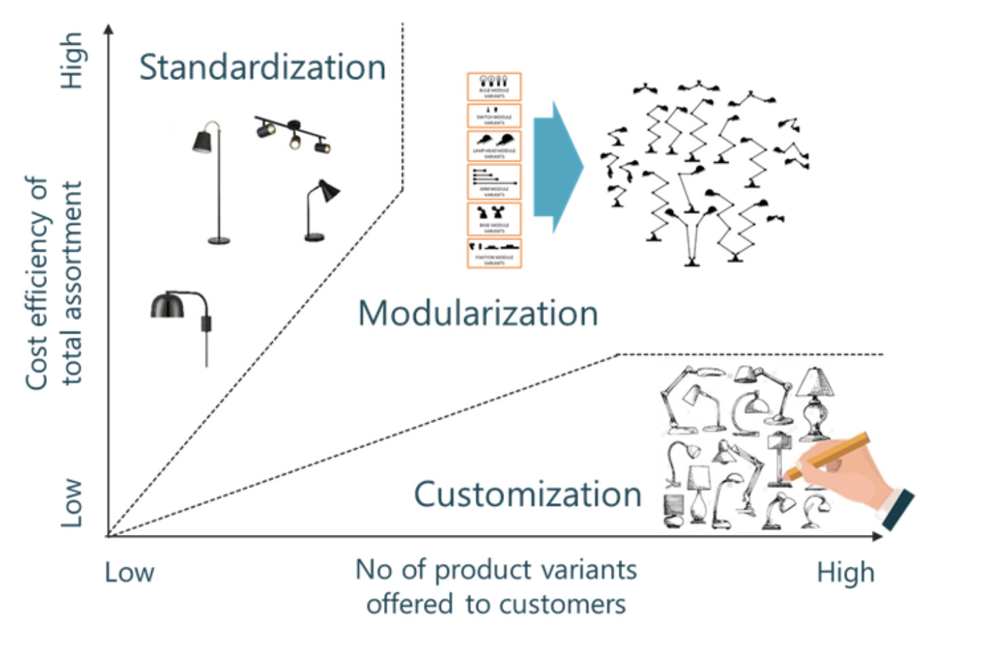

## [Understanding Monorepos](https://monorepo.tools/) 
这篇文章通过对Monorepo/Polyrepo(多仓库模式)、实现Monorepo的工具进行对比，对使用Monorepo模式进行开发有参考价值。
1. Monorepo是什么: Monorepo在主体仓库中组合了多个子仓库并且这些子仓库的功能是相关联的,对应的例子可以参考[react](https://github.com/facebook/react)项目的仓库
2. 为什么使用Monorepo: Monorepo在组织关联业务代码上有优势，能减少代码复用、技术统一、开发调试中的问题 

关于Monorepos和Polyrepo的思考可以参考这篇文章[Monorepo vs Polyrepo](https://earthly.dev/blog/monorepo-vs-polyrepo/)

## [What is a Good Modular System?](https://www.modularmanagement.com/blog/what-is-a-good-modular-system)  
这篇文章介绍了系统设计的思考点
* 模块的功能界定  通过引入模块系统可以降低系统的复杂性，提高系统的灵活性,但是对于引入的模块功能的界定划分需要考量。如果功能没有界限好会导致功能代码从一个位置移动到另一个位置增加了模块维护的复杂度。比如之前的中台概念，需要划分好中台的功能才能更好的实现中台的能力，拆分出模块系统一方面做得更多去帮助系统更好，一方面也要思考如果做得更少去实现最初的目标
* 生命周期 功能的稳定和灵活性能提高模块的生命周期
* 模块收益的衡量标准  
   

通过模块衡量的公式，在进行模块系统设计的时候可以有以下的考虑:
1. 平台的功能边界考量  
    1. 不是越少越好，前期的投入能力后期带来收益
    2. 前期的忽视需要后续弥补，要仔细思考
    3. 用小范围的能力边界限制实现整体的灵活扩展
2. 整体和部分的考量 
    1. 不用一步到位，部分功能提升到独立的系统也能产生比较大的价值，后期再进行统一
    2. 在资源可能的情况下，相关的依赖系统要统一升级
3. 从长期的视角去看系统的模块设计 从现在的能力出发结合系统未来的发展诉求去做系统设计(能力建设)，这个角度的考虑也是在为未来打地基 
对于模块系统的介绍可以参考这篇文章[All You Need to Know About Modularization](https://www.modularmanagement.com/blog/all-you-need-to-know-about-modularization),模块的实现应该在部分能力抽象的情况下实现系统整体的灵活性  

  
模块化系统能带来效率、灵活度、敏捷的特点。
1. 效率 模块的复用/功能的组装  这里可以通过比喻装配式建筑来理解,通过对预制模块在工地快速的组装就快速完成了建筑的装配。
2. 灵活性 基础模块能快速的组装出新的功能模块/通过统一的接口设计能快速的实现模块的功能替换
3. 敏捷性 由于基础模块的拆分，通过基础模块的改变就可以快速地影响整个系统

## [Deep dive into React Native’s New Architecture](https://medium.com/coox-tech/deep-dive-into-react-natives-new-architecture-fb67ae615ccd)  
这篇文章通过React Native前后架构的对比对新旧架构进行了介绍

## [JavaScript to Know for React](https://kentcdodds.com/blog/javascript-to-know-for-react)  
这篇文章介绍了React中JavaScript的一些常用的语法，比如模板字符串、可选链、空值合并预算符等  

## [Some reasons for disliking React hooks](https://blog.bitsrc.io/some-reasons-for-disliking-react-hooks-80f1e18eb9b3)  
这篇文章作者介绍了使用react hooks的优缺点
   * 优点 hooks可以更好实现代码的复用组合/逻辑集中
   * 缺点 hooks的写法上有上手成本和调试成本，容易引发一些bug，还有不要过于过度使用hooks.hooks的调用方式是通过数组的方式调用函数，过多或者依赖关系复杂的hooks会降低页面的性能

## [Build Decoupled React Components with Inversion of Control](https://blog.bitsrc.io/inversion-of-control-with-react-584533e49245)  
这篇通过例子的方式介绍通过反转控制的方式解耦组件的实现来应对未来逻辑的变更
